# BÁO CÁO MÔ TẢ CHI TIẾT CƠ SỞ DỮ LIỆU DỰ ÁN FOXSTYLE FASHION STORE
## Toàn bộ 43 Bảng Dữ liệu Đồng bộ Hệ thống

> **Dự án**: Hệ thống Thương mại Điện tử Thời trang FoxStyle  
> **Hệ quản trị CSDL**: Microsoft SQL Server 2019+ / Spring Data JPA Hibernate  
> **Vị trí tài liệu**: `docs/BAO_CAO_MO_TA_CSDL_FOXSTYLE.md`  
> **Nguồn SQL chính**: `foxstyle_db.sql`  
> **Ngày cập nhật**: 31/07/2026  

---

## I. TỔNG QUAN KIẾN TRÚC CƠ SỞ DỮ LIỆU (43 BẢNG)

Hệ thống cơ sở dữ liệu FoxStyle bao gồm **43 bảng dữ liệu chuẩn hóa** được thiết kế theo chuẩn 3NF (Third Normal Form), phân chia thành **9 nhóm phân hệ nghiệp vụ** đáp ứng toàn bộ chức năng thương mại điện tử từ quản trị kho, bán hàng, thanh toán tự động, CRM đến bảo hành và bảo mật:

```mermaid
erDiagram
    %% Nhóm Tài khoản & Phân quyền
    roles ||--o{ users : "gán vai trò"
    users ||--o{ user_addresses : "sở hữu địa chỉ"
    users ||--o{ otp_verifications : "nhận mã OTP"
    users ||--o{ newsletter_subscriptions : "đăng ký tin"

    %% Nhóm Sản phẩm & Thương hiệu
    brands ||--o{ products : "sản xuất"
    categories ||--o{ products : "phân loại"
    products ||--o{ product_variants : "tạo SKU size/màu"
    products ||--o{ product_images : "thư viện ảnh"
    products ||--o{ product_combo_items : "chứa sản phẩm combo"
    products ||--o{ product_price_audit_logs : "lịch sử giá"

    %% Nhóm Giỏ hàng & Khuyến mãi
    users ||--o{ carts : "sở hữu"
    carts ||--o{ cart_details : "chứa"
    product_variants ||--o{ cart_details : "biến thể được chọn"
    users ||--o{ saved_for_later : "lÆ°u mua sau"
    coupons ||--o{ orders : "áp dụng giảm giá"
    flash_sales ||--o{ flash_sale_products : "chương trình sale"
    products ||--o{ flash_sale_products : "sản phẩm sale"

    %% Nhóm Đơn hàng & Thanh toán
    users ||--o{ orders : "đặt hàng"
    orders ||--o{ order_details : "gồm nhiều chi tiết"
    product_variants ||--o{ order_details : "biến thể chốt bán"
    orders ||--o{ payments : "đối soát thanh toán"
    payments ||--o{ payment_reconciliations : "kết quả đối soát"
    users ||--o{ user_coupons : "sở hữu mã"

    %% Nhóm Tương tác & Hỗ trợ
    users ||--o{ wishlists : "yêu thích"
    products ||--o{ wishlists : "được thích"
    users ||--o{ reviews : "viết đánh giá"
    products ||--o{ reviews : "được đánh giá"
    users ||--o{ chat_messages : "hội thoại CSKH"
    users ||--o{ notifications : "nhận thông báo"

    %% Nhóm Bài viết & Content
    article_topics ||--o{ articles : "chủ đề"
    articles ||--o{ article_products : "gắn sản phẩm"

    %% Nhóm Bảo hành
    warranty_policies ||--o{ warranty_claims : "chính sách bảo hành"
    orders ||--o{ warranty_claims : "yêu cầu bảo hành"
```

---

## II. TỪ ĐIỂN VÀ CHI TIẾT 43 BẢNG CƠ SỞ DỮ LIỆU (`foxstyle_db.sql`)

---

### NHÓM 1: TÀI KHOẢN VÀ ĐỊNH DANH (5 BẢNG)

#### 1. Bảng `roles` (Vai trò người dùng)
- **Mục đích:** Quản lý danh mục vai trò phân quyền (`ROLE_ADMIN`, `ROLE_STAFF`, `ROLE_CUSTOMER`).
- **Cấu trúc:** `role_id` (INT, PK, Identity), `role_name` (VARCHAR(50), UNIQUE), `description` (NVARCHAR(255)).

#### 2. Bảng `users` (Tài khoản người dùng)
- **Mục đích:** Quản lý thông tin tài khoản đăng nhập và hồ sơ cá nhân.
- **Cấu trúc:** `user_id` (INT, PK, Identity), `username` (VARCHAR(50), UNIQUE), `password` (VARCHAR(255) - BCrypt), `full_name` (NVARCHAR(100)), `email` (VARCHAR(100), UNIQUE), `phone` (VARCHAR(20)), `status` (TINYINT: 1=Active, 0=Blocked), `role_id` (INT, FK -> roles), `created_at` (DATETIME2).

#### 3. Bảng `user_addresses` (Sổ địa chỉ giao hàng)
- **Mục đích:** Lưu trữ các địa chỉ nhận hàng của người dùng.
- **Cấu trúc:** `address_id` (INT, PK, Identity), `user_id` (INT, FK -> users), `recipient_name` (NVARCHAR(100)), `phone` (VARCHAR(20)), `province` (NVARCHAR(100)), `district` (NVARCHAR(100)), `ward` (NVARCHAR(100)), `detail_address` (NVARCHAR(255)), `is_default` (BIT).

#### 4. Bảng `otp_verifications` (Xác minh OTP qua Email)
- **Mục đích:** Quản lý mã OTP 6 số phục vụ quên mật khẩu và xác thực tài khoản.
- **Cấu trúc:** `otp_id` (INT, PK, Identity), `user_id` (INT, FK -> users), `otp_code` (VARCHAR(10)), `expiration_time` (DATETIME2), `is_used` (BIT).

#### 5. Bảng `newsletter_subscriptions` (Đăng ký nhận tin)
- **Mục đích:** Lưu trữ danh sách email đăng ký nhận bản tin khuyến mãi.
- **Cấu trúc:** `subscription_id` (INT, PK, Identity), `email` (VARCHAR(100), UNIQUE), `subscribed_at` (DATETIME2), `status` (TINYINT).

---

### NHÓM 2: DANH MỤC VÀ SẢN PHẨM (7 BẢNG)

#### 6. Bảng `brands` (Thương hiệu sản phẩm)
- **Mục đích:** Quản lý các thương hiệu thời trang cung cấp.
- **Cấu trúc:** `brand_id` (INT, PK, Identity), `brand_name` (NVARCHAR(100), UNIQUE), `logo_url` (VARCHAR(255)), `description` (NVARCHAR(500)), `status` (TINYINT).

#### 7. Bảng `categories` (Danh mục thời trang)
- **Mục đích:** Phân loại sản phẩm (Áo thun, Sơ mi, Quần Jeans, Váy...).
- **Cấu trúc:** `category_id` (INT, PK, Identity), `category_name` (NVARCHAR(100), UNIQUE), `description` (NVARCHAR(500)), `status` (TINYINT).

#### 8. Bảng `products` (Thông tin sản phẩm)
- **Mục đích:** Lưu trữ sản phẩm chính hoặc sản phẩm combo thời trang.
- **Cấu trúc:** `product_id` (INT, PK, Identity), `product_name` (NVARCHAR(150)), `category_id` (INT, FK -> categories), `brand_id` (INT, FK -> brands), `price` (DECIMAL(18,2)), `original_price` (DECIMAL(18,2)), `description` (NVARCHAR(MAX)), `is_combo` (BIT), `status` (TINYINT), `created_at` (DATETIME2).

#### 9. Bảng `product_variants` (Biến thể Size/Màu/SKU/Tồn kho)
- **Mục đích:** Quản lý kho chi tiết cho từng biến thể Size và Màu sắc.
- **Cấu trúc:** `variant_id` (INT, PK, Identity), `product_id` (INT, FK -> products), `color` (NVARCHAR(50)), `size` (VARCHAR(20)), `quantity` (INT), `sku` (VARCHAR(100), UNIQUE), `price_override` (DECIMAL(18,2)).

#### 10. Bảng `product_images` (Thư viện ảnh sản phẩm)
- **Mục đích:** Lưu bộ sưu tập ảnh góc phụ và ảnh đại diện chính.
- **Cấu trúc:** `image_id` (INT, PK, Identity), `product_id` (INT, FK -> products), `image_url` (VARCHAR(255)), `is_primary` (BIT), `display_order` (INT).

#### 11. Bảng `product_combo_items` (Sản phẩm thành phần Combo)
- **Mục đích:** Quản lý các sản phẩm con trong 1 gói Combo thời trang.
- **Cấu trúc:** `combo_item_id` (INT, PK, Identity), `parent_product_id` (INT, FK -> products), `child_product_id` (INT, FK -> products), `quantity` (INT).

#### 12. Bảng `product_price_audit_logs` (Nhật ký thay đổi giá)
- **Mục đích:** Lưu lịch sử điều chỉnh giá bán và giá gốc của sản phẩm.
- **Cấu trúc:** `log_id` (INT, PK, Identity), `product_id` (INT, FK -> products), `old_price` (DECIMAL(18,2)), `new_price` (DECIMAL(18,2)), `changed_by` (INT, FK -> users), `changed_at` (DATETIME2).

---

### NHÓM 3: GIỎ HÀNG VÀ KHUYẾN MÃI (6 BẢNG)

#### 13. Bảng `carts` (Giỏ hàng người dùng)
- **Mục đích:** Giỏ hàng hiện hành gắn liền với tài khoản khách hàng.
- **Cấu trúc:** `cart_id` (INT, PK, Identity), `user_id` (INT, FK -> users, UNIQUE), `created_at` (DATETIME2).

#### 14. Bảng `cart_details` (Chi tiết mặt hàng giỏ)
- **Mục đích:** Lưu danh sách biến thể và số lượng đặt trong giỏ.
- **Cấu trúc:** `cart_detail_id` (INT, PK, Identity), `cart_id` (INT, FK -> carts), `variant_id` (INT, FK -> product_variants), `quantity` (INT).

#### 15. Bảng `saved_for_later` (Sản phẩm lưu mua sau)
- **Mục đích:** Lưu mặt hàng chuyển từ giỏ hàng sang danh sách mua sau.
- **Cấu trúc:** `saved_id` (INT, PK, Identity), `user_id` (INT, FK -> users), `variant_id` (INT, FK -> product_variants), `created_at` (DATETIME2).

#### 16. Bảng `coupons` (Mã giảm giá)
- **Mục đích:** Quản lý chương trình ưu đãi mã giảm giá.
- **Cấu trúc:** `coupon_id` (INT, PK, Identity), `code` (VARCHAR(50), UNIQUE), `discount_type` (VARCHAR(20): FIXED/PERCENTAGE), `discount_value` (DECIMAL(18,2)), `max_discount_value` (DECIMAL(18,2)), `min_order_value` (DECIMAL(18,2)), `usage_limit` (INT), `used_count` (INT), `start_date` (DATETIME2), `end_date` (DATETIME2), `status` (TINYINT).

#### 17. Bảng `flash_sales` (Chương trình Flash Sale)
- **Mục đích:** Quản lý các sự kiện giảm giá giờ vàng.
- **Cấu trúc:** `flash_sale_id` (INT, PK, Identity), `title` (NVARCHAR(150)), `start_time` (DATETIME2), `end_time` (DATETIME2), `status` (TINYINT).

#### 18. Bảng `flash_sale_products` (Sản phẩm trong Flash Sale)
- **Mục đích:** Danh sách sản phẩm và giá ưu đãi đặc biệt trong đợt Sale.
- **Cấu trúc:** `flash_sale_product_id` (INT, PK, Identity), `flash_sale_id` (INT, FK -> flash_sales), `product_id` (INT, FK -> products), `sale_price` (DECIMAL(18,2)), `stock_quantity` (INT).

---

### NHÓM 4: ĐƠN HÀNG VÀ THANH TOÁN (5 BẢNG)

#### 19. Bảng `orders` (Thông tin đơn hàng)
- **Mục đích:** Quản lý thông tin đơn đặt hàng, giao nhận và trạng thái.
- **Cấu trúc:** `order_id` (INT, PK, Identity), `order_code` (VARCHAR(50), UNIQUE), `user_id` (INT, FK -> users), `total_amount` (DECIMAL(18,2)), `discount_amount` (DECIMAL(18,2)), `shipping_fee` (DECIMAL(18,2)), `final_amount` (DECIMAL(18,2)), `payment_method` (VARCHAR(30): COD/PAYOS), `payment_status` (VARCHAR(30)), `status` (VARCHAR(30): PENDING/CONFIRMED/SHIPPING/DELIVERED/CANCELLED), `address_id` (INT, FK -> user_addresses), `coupon_id` (INT, FK -> coupons), `created_at` (DATETIME2).

#### 20. Bảng `order_details` (Chi tiết mặt hàng đơn)
- **Mục đích:** Lưu danh sách biến thể, số lượng và snapshot giá tại thời điểm đặt.
- **Cấu trúc:** `order_detail_id` (INT, PK, Identity), `order_id` (INT, FK -> orders), `variant_id` (INT, FK -> product_variants), `quantity` (INT), `unit_price` (DECIMAL(18,2)).

#### 21. Bảng `payments` (Giao dịch thanh toán)
- **Mục đích:** Lưu nhật ký giao dịch ngân hàng / PayOS.
- **Cấu trúc:** `payment_id` (INT, PK, Identity), `order_id` (INT, FK -> orders), `transaction_code` (VARCHAR(100)), `payment_gateway` (VARCHAR(50)), `amount` (DECIMAL(18,2)), `status` (VARCHAR(30)), `paid_at` (DATETIME2).

#### 22. Bảng `payment_reconciliations` (Đối soát thanh toán)
- **Mục đích:** Quản lý kết quả đối soát tự động tiền về tài khoản ngân hàng.
- **Cấu trúc:** `reconciliation_id` (INT, PK, Identity), `payment_id` (INT, FK -> payments), `bank_reference` (VARCHAR(100)), `reconciled_amount` (DECIMAL(18,2)), `status` (VARCHAR(30)), `reconciled_at` (DATETIME2).

#### 23. Bảng `user_coupons` (Lịch sử sử dụng Coupon)
- **Mục đích:** Theo dõi mã giảm giá người dùng đã lưu hoặc sử dụng.
- **Cấu trúc:** `user_id` (INT, FK -> users), `coupon_id` (INT, FK -> coupons), `used_at` (DATETIME2), PK (`user_id`, `coupon_id`).

---

### NHÓM 5: TƯƠNG TÁC KHÁCH HÀNG & HỖ TRỢ (6 BẢNG)

#### 24. Bảng `wishlists` (Sản phẩm yêu thích)
- **Mục đích:** Lưu sản phẩm được khách hàng thả tim.
- **Cấu trúc:** `wishlist_id` (INT, PK, Identity), `user_id` (INT, FK -> users), `product_id` (INT, FK -> products), `created_at` (DATETIME2).

#### 25. Bảng `reviews` (Đánh giá & Chấm sao)
- **Mục đích:** Nhận xét và chấm 1-5 sao sản phẩm từ khách hàng đã mua.
- **Cấu trúc:** `review_id` (INT, PK, Identity), `user_id` (INT, FK -> users), `product_id` (INT, FK -> products), `rating` (INT: 1-5), `comment` (NVARCHAR(1000)), `status` (TINYINT: 1=Approved, 0=Hidden), `created_at` (DATETIME2).

#### 26. Bảng `banners` (Banner quảng cáo trang chủ)
- **Mục đích:** Quản lý ảnh quảng cáo và liên kết điều hướng.
- **Cấu trúc:** `banner_id` (INT, PK, Identity), `title` (NVARCHAR(150)), `image_url` (VARCHAR(255)), `link_url` (VARCHAR(255)), `display_order` (INT), `status` (TINYINT).

#### 27. Bảng `notifications` (Thông báo người dùng)
- **Mục đích:** Gửi thông báo cá nhân hoặc toàn hệ thống.
- **Cấu trúc:** `notification_id` (INT, PK, Identity), `user_id` (INT, FK -> users), `title` (NVARCHAR(150)), `message` (NVARCHAR(500)), `is_read` (BIT), `created_at` (DATETIME2).

#### 28. Bảng `chat_messages` (Hội thoại CSkhách hàng Livechat)
- **Mục đích:** Lưu tin nhắn tư vấn giữa Khách hàng và Nhân viên CSKH.
- **Cấu trúc:** `message_id` (INT, PK, Identity), `sender_id` (INT, FK -> users), `receiver_id` (INT, FK -> users), `message_text` (NVARCHAR(MAX)), `sent_at` (DATETIME2).

#### 29. Bảng `contact_messages` (Nội dung liên hệ)
- **Mục đích:** Lưu thông điệp khách vãng lai gửi qua Form Liên hệ.
- **Cấu trúc:** `contact_id` (INT, PK, Identity), `full_name` (NVARCHAR(100)), `email` (VARCHAR(100)), `phone` (VARCHAR(20)), `subject` (NVARCHAR(200)), `message` (NVARCHAR(MAX)), `status` (TINYINT).

---

### NHÓM 6: NỘI DUNG VÀ BÀI VIẾT (3 BẢNG)

#### 30. Bảng `article_topics` (Chủ đề bài viết Blog)
- **Mục đích:** Phân loại bài viết (Xu hướng thời trang, Hướng dẫn phối đồ...).
- **Cấu trúc:** `topic_id` (INT, PK, Identity), `topic_name` (NVARCHAR(100), UNIQUE), `description` (NVARCHAR(255)).

#### 31. Bảng `articles` (Bài viết blog thời trang)
- **Mục đích:** Đăng bài viết chia sẻ phong cách và tin tức thời trang.
- **Cấu trúc:** `article_id` (INT, PK, Identity), `title` (NVARCHAR(255)), `topic_id` (INT, FK -> article_topics), `author_id` (INT, FK -> users), `thumbnail_url` (VARCHAR(255)), `content` (NVARCHAR(MAX)), `status` (TINYINT: 1=Published, 0=Draft), `published_at` (DATETIME2).

#### 32. Bảng `article_products` (Gắn sản phẩm vào bài viết)
- **Mục đích:** Giới thiệu sản phẩm tương ứng trong bài viết blog.
- **Cấu trúc:** `article_id` (INT, FK -> articles), `product_id` (INT, FK -> products), PK (`article_id`, `product_id`).

---

### NHÓM 7: BẢO HÀNH (2 BẢNG)

#### 33. Bảng `warranty_policies` (Chính sách bảo hành)
- **Mục đích:** Định nghĩa các quy định bảo hành theo từng loại sản phẩm.
- **Cấu trúc:** `policy_id` (INT, PK, Identity), `policy_name` (NVARCHAR(150)), `warranty_months` (INT), `terms_condition` (NVARCHAR(MAX)).

#### 34. Bảng `warranty_claims` (Yêu cầu bảo hành)
- **Mục đích:** Tiếp nhận và xử lý yêu cầu đổi trả/bảo hành từ khách hàng.
- **Cấu trúc:** `claim_id` (INT, PK, Identity), `order_id` (INT, FK -> orders), `product_id` (INT, FK -> products), `issue_description` (NVARCHAR(MAX)), `status` (VARCHAR(30)), `created_at` (DATETIME2).

---

### NHÓM 8: VẬN CHUYỂN VÀ CẤU HÌNH (4 BẢNG)

#### 35. Bảng `districts` (Khu vực & Phí giao hàng)
- **Mục đích:** Quản lý khu vực giao hàng và tính phí ship theo địa bàn.
- **Cấu trúc:** `district_id` (INT, PK, Identity), `district_name` (NVARCHAR(100)), `province_name` (NVARCHAR(100)), `shipping_fee` (DECIMAL(18,2)).

#### 36. Bảng `store_branches` (Chi nhánh cửa hàng)
- **Mục đích:** Quản lý danh sách showroom/cửa hàng vật lý FoxStyle.
- **Cấu trúc:** `branch_id` (INT, PK, Identity), `branch_name` (NVARCHAR(150)), `address` (NVARCHAR(255)), `phone` (VARCHAR(20)), `latitude` (FLOAT), `longitude` (FLOAT).

#### 37. Bảng `shipping_carriers` (Đơn vị vận chuyển)
- **Mục đích:** Danh sách các đối tác giao hàng (GHN, GHTK, Viettel Post...).
- **Cấu trúc:** `carrier_id` (INT, PK, Identity), `carrier_name` (NVARCHAR(100)), `contact_phone` (VARCHAR(20)), `status` (TINYINT).

#### 38. Bảng `settings` (Cấu hình hệ thống Key-Value)
- **Mục đích:** Lưu trữ cấu hình dùng chung (Tên website, hotline, email CSKH, footer text...).
- **Cấu trúc:** `setting_key` (VARCHAR(100), PK), `setting_value` (NVARCHAR(MAX)), `description` (NVARCHAR(255)).

---

### NHÓM 9: BẢO MẬT, NHẬT KÝ VÀ CRM (5 BẢNG)

#### 39. Bảng `blocked_contacts` (Danh sách đen bị chặn)
- **Mục đích:** Chặn email/SĐT rác hoặc tài khoản vi phạm chính sách spam.
- **Cấu trúc:** `blocked_id` (INT, PK, Identity), `contact_value` (VARCHAR(100)), `contact_type` (VARCHAR(20): EMAIL/PHONE), `reason` (NVARCHAR(255)), `blocked_at` (DATETIME2).

#### 40. Bảng `security_events` (Nhật ký sự kiện bảo mật)
- **Mục đích:** Ghi log các hành vi đăng nhập sai, đổi IP lạ, brute force.
- **Cấu trúc:** `event_id` (INT, PK, Identity), `user_id` (INT, FK -> users), `event_type` (VARCHAR(50)), `ip_address` (VARCHAR(50)), `user_agent` (VARCHAR(255)), `created_at` (DATETIME2).

#### 41. Bảng `crm_templates` (Mẫu tin nhắn CRM)
- **Mục đích:** Mẫu Email/SMS/Zalo gửi tự động cho khách hàng.
- **Cấu trúc:** `template_id` (INT, PK, Identity), `template_name` (NVARCHAR(100)), `channel` (VARCHAR(20): EMAIL/SMS/ZALO), `content` (NVARCHAR(MAX)).

#### 42. Bảng `crm_campaigns` (Chiến dịch chăm sóc khách hàng)
- **Mục đích:** Quản lý chiến dịch gửi tin nhắn khuyến mãi/tri ân.
- **Cấu trúc:** `campaign_id` (INT, PK, Identity), `campaign_name` (NVARCHAR(150)), `template_id` (INT, FK -> crm_templates), `scheduled_time` (DATETIME2), `status` (TINYINT).

#### 43. Bảng `crm_message_logs` (Lịch sử gửi tin CRM)
- **Mục đích:** Lưu nhật ký chi tiết từng tin nhắn CRM đã gửi và trạng thái nhận.
- **Cấu trúc:** `log_id` (INT, PK, Identity), `campaign_id` (INT, FK -> crm_campaigns), `recipient_user_id` (INT, FK -> users), `status` (VARCHAR(20): SUCCESS/FAILED), `sent_at` (DATETIME2).

---

## LỜI KẾT

Tài liệu này đã mô tả **đầy đủ 43 bảng dữ liệu chuẩn hóa** có trong script CSDL chính `foxstyle_db.sql`. 

Tài liệu này liên kết và đồng bộ trực tiếp với:
- [Đặc tả Yêu cầu Hệ thống SRS](./yeu_cau_he_thong.md)
- [Sơ đồ & Đặc tả Ca sử dụng Use Case](./so_do_use_case.md)
- [Mô tả Chi tiết Các Chức năng Hệ thống](./mo_ta_chi_tiet_chuc_nang.md)
- [Thiết kế Hạ tầng Mạng & Chính sách Hệ thống](./thiet_ke_ha_tang_mang_va_chinh_sach.md)
