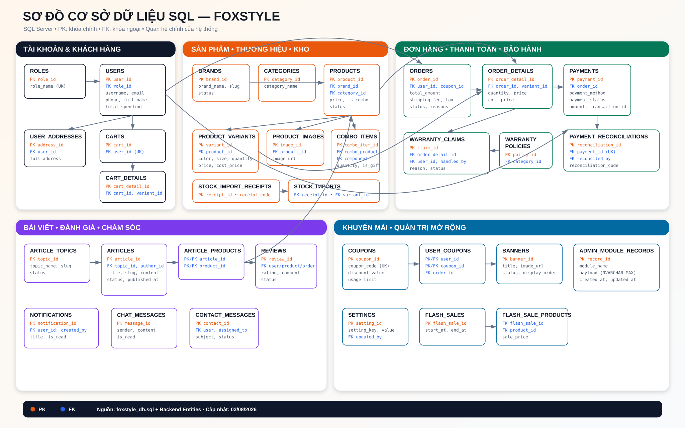
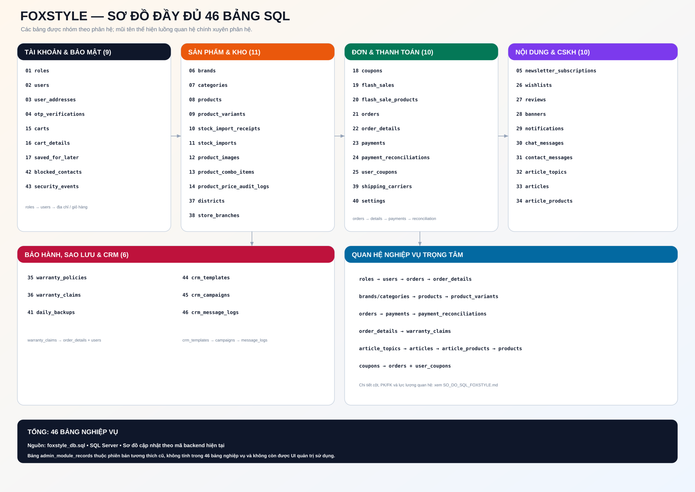
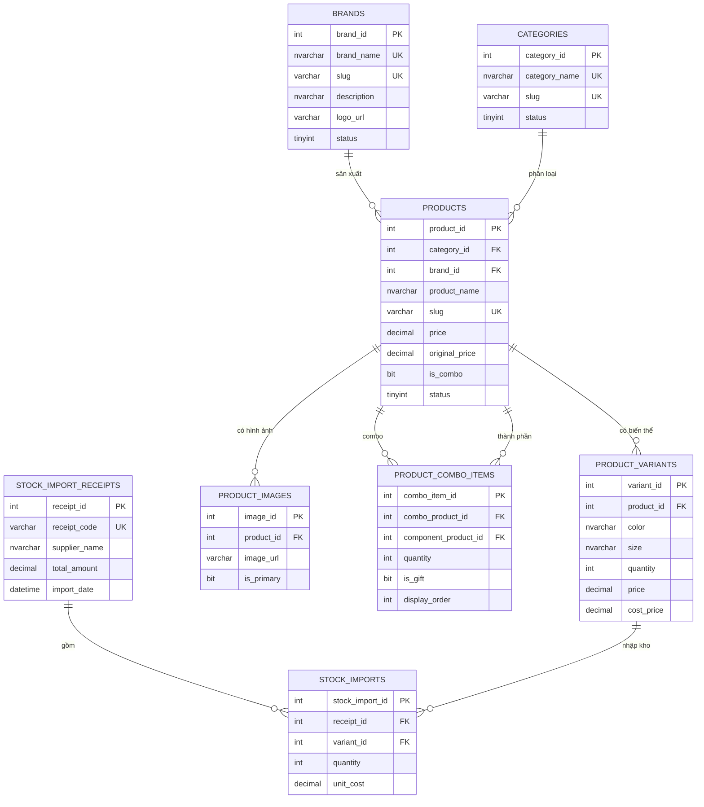
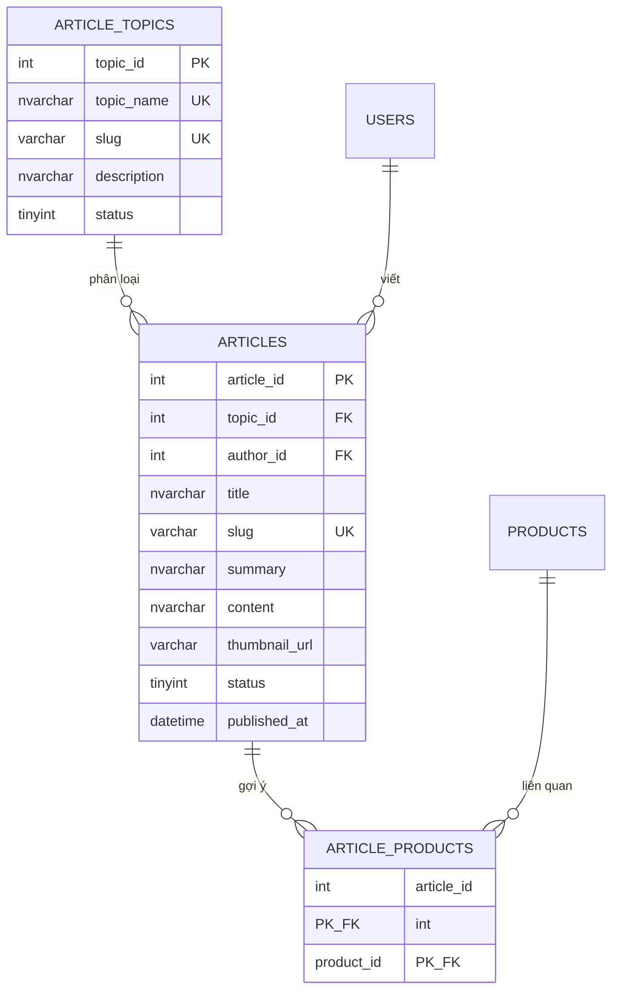
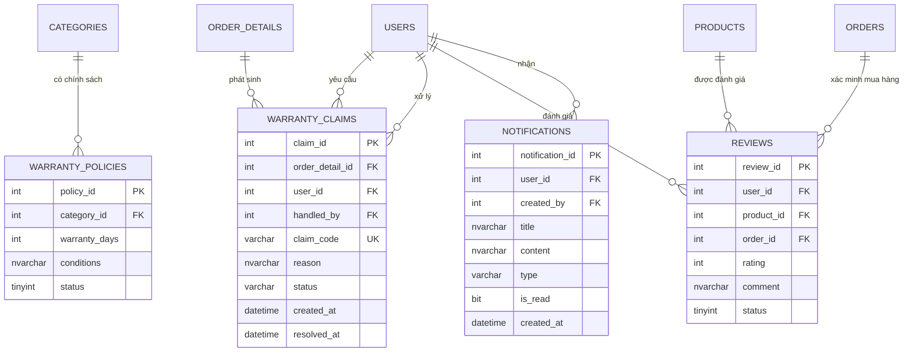
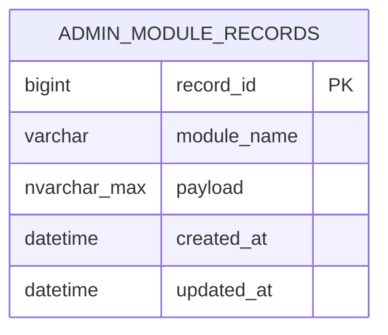
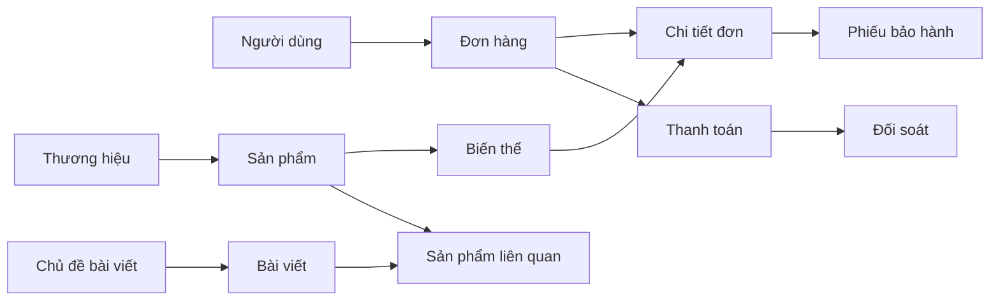

# Sơ đồ cơ sở dữ liệu SQL FoxStyle





Tài liệu này mô tả các bảng và khóa ngoại chính của hệ thống FoxStyle trên SQL Server. Sơ đồ được chia theo phân hệ để dễ đọc; ký hiệu `PK`, `FK` và `UK` lần lượt là khóa chính, khóa ngoại và khóa duy nhất.

## 1. Tài khoản và khách hàng

```mermaid
erDiagram
    ROLES ||--o{ USERS : "phân quyền"
    USERS ||--o{ USER_ADDRESSES : "có"
    USERS ||--|| CARTS : "sở hữu"
    CARTS ||--o{ CART_DETAILS : "chứa"
    PRODUCT_VARIANTS ||--o{ CART_DETAILS : "được chọn"
    USERS ||--o{ WISHLISTS : "yêu thích"
    PRODUCTS ||--o{ WISHLISTS : "được yêu thích"

    ROLES {
        int role_id PK
        nvarchar role_name UK
        nvarchar description
    }
    USERS {
        int user_id PK
        int role_id FK
        varchar username UK
        varchar email UK
        varchar phone
        nvarchar full_name
        tinyint status
        decimal total_spending
    }
    USER_ADDRESSES {
        int address_id PK
        int user_id FK
        nvarchar recipient_name
        varchar recipient_phone
        nvarchar full_address
        bit is_default
    }
    CARTS {
        int cart_id PK
        int user_id FK_UK
        datetime created_at
    }
    CART_DETAILS {
        int cart_detail_id PK
        int cart_id FK
        int variant_id FK
        int quantity
    }
    WISHLISTS {
        int wishlist_id PK
        int user_id FK
        int product_id FK
        datetime created_at
    }
```

## 2. Sản phẩm, thương hiệu, kho và combo



## 3. Đặt hàng, khuyến mãi và thanh toán

```mermaid
erDiagram
    USERS ||--o{ ORDERS : "đặt"
    COUPONS ||--o{ ORDERS : "áp dụng"
    ORDERS ||--|{ ORDER_DETAILS : "gồm"
    PRODUCT_VARIANTS ||--o{ ORDER_DETAILS : "được mua"
    ORDERS ||--o{ PAYMENTS : "thanh toán"
    PAYMENTS ||--o| PAYMENT_RECONCILIATIONS : "đối soát"
    USERS ||--o{ PAYMENT_RECONCILIATIONS : "thực hiện"
    USERS ||--o{ USER_COUPONS : "sử dụng"
    COUPONS ||--o{ USER_COUPONS : "được dùng"
    ORDERS ||--o{ USER_COUPONS : "ghi nhận tại"

    ORDERS {
        int order_id PK
        int user_id FK
        int coupon_id FK
        datetime order_date
        decimal total_amount
        decimal discount_amount
        decimal shipping_fee
        decimal tax_amount
        nvarchar shipping_address
        varchar status
        nvarchar cancellation_reason
        nvarchar return_reason
    }
    ORDER_DETAILS {
        int order_detail_id PK
        int order_id FK
        int variant_id FK
        int quantity
        decimal price
        decimal cost_price
    }
    PAYMENTS {
        int payment_id PK
        int order_id FK
        varchar payment_method
        tinyint payment_status
        varchar transaction_id
        datetime payment_date
        decimal amount
    }
    PAYMENT_RECONCILIATIONS {
        bigint reconciliation_id PK
        int payment_id FK_UK
        int reconciled_by FK
        varchar reconciliation_code UK
        datetime reconciled_at
        varchar status
    }
    COUPONS {
        int coupon_id PK
        varchar coupon_code UK
        tinyint discount_type
        decimal discount_value
        decimal minimum_order
        int usage_limit
        int used_count
    }
    USER_COUPONS {
        int user_id PK_FK
        int coupon_id PK_FK
        int order_id FK
        datetime used_at
    }
```

Quy ước `payment_status`: `0` = chờ thanh toán, `1` = thành công, `2` = thất bại hoặc hoàn tiền.

## 4. Bài viết và sản phẩm liên quan



## 5. Bảo hành, đánh giá và chăm sóc khách hàng



## 6. Dữ liệu quản trị mở rộng

Ba màn hình quản trị có thể đồng bộ dữ liệu JSON vào bảng mở rộng sau. `module_name` nhận một trong các giá trị `brands`, `topics`, `warranties`.



## Quan hệ tổng quát



Nguồn đối chiếu: `foxstyle_db.sql`, các lớp `@Entity` trong backend và bảng mở rộng được khởi tạo bởi `AdminModuleSchemaInitializer`.

## Phụ lục: đầy đủ 46 bảng trong SQL Server

| # | Bảng | Phân hệ | Khóa ngoại chính |
|---:|---|---|---|
| 1 | `roles` | Phân quyền | — |
| 2 | `users` | Tài khoản | `role_id → roles` |
| 3 | `user_addresses` | Tài khoản | `user_id → users` |
| 4 | `otp_verifications` | Xác thực | — |
| 5 | `newsletter_subscriptions` | Marketing | — |
| 6 | `brands` | Sản phẩm | — |
| 7 | `categories` | Sản phẩm | — |
| 8 | `products` | Sản phẩm | `category_id`, `brand_id` |
| 9 | `product_variants` | Sản phẩm | `product_id → products` |
| 10 | `stock_import_receipts` | Kho | — |
| 11 | `stock_imports` | Kho | `receipt_id`, `variant_id` |
| 12 | `product_images` | Sản phẩm | `product_id → products` |
| 13 | `product_combo_items` | Combo | `combo_product_id`, `component_product_id` |
| 14 | `product_price_audit_logs` | Kiểm toán | `product_id`, `changed_by` |
| 15 | `carts` | Giỏ hàng | `user_id → users` |
| 16 | `cart_details` | Giỏ hàng | `cart_id`, `variant_id` |
| 17 | `saved_for_later` | Giỏ hàng | `user_id`, `variant_id` |
| 18 | `coupons` | Khuyến mãi | `category_id → categories` |
| 19 | `flash_sales` | Khuyến mãi | — |
| 20 | `flash_sale_products` | Khuyến mãi | `flash_sale_id`, `product_id` |
| 21 | `orders` | Đơn hàng | `user_id`, `coupon_id` |
| 22 | `order_details` | Đơn hàng | `order_id`, `variant_id` |
| 23 | `payments` | Thanh toán | `order_id → orders` |
| 24 | `payment_reconciliations` | Thanh toán | `payment_id`, `reconciled_by` |
| 25 | `user_coupons` | Khuyến mãi | `user_id`, `coupon_id`, `order_id` |
| 26 | `wishlists` | Yêu thích | `user_id`, `product_id` |
| 27 | `reviews` | Đánh giá | `user_id`, `product_id`, `order_id` |
| 28 | `banners` | Nội dung | — |
| 29 | `notifications` | Thông báo | `user_id`, `created_by` |
| 30 | `chat_messages` | Hỗ trợ | — |
| 31 | `contact_messages` | Liên hệ | `user_id`, `assigned_to` |
| 32 | `article_topics` | Bài viết | — |
| 33 | `articles` | Bài viết | `topic_id`, `author_id` |
| 34 | `article_products` | Bài viết | `article_id`, `product_id` |
| 35 | `warranty_policies` | Bảo hành | `category_id → categories` |
| 36 | `warranty_claims` | Bảo hành | `order_detail_id`, `user_id`, `handled_by` |
| 37 | `districts` | Vận chuyển | — |
| 38 | `store_branches` | Vận chuyển | — |
| 39 | `shipping_carriers` | Vận chuyển | — |
| 40 | `settings` | Cấu hình | `updated_by → users` |
| 41 | `daily_backups` | Sao lưu | — |
| 42 | `blocked_contacts` | Bảo mật | `blocked_by → users` |
| 43 | `security_events` | Bảo mật | `user_id → users` |
| 44 | `crm_templates` | CRM | — |
| 45 | `crm_campaigns` | CRM | `template_id`, `created_by` |
| 46 | `crm_message_logs` | CRM | `campaign_id`, `user_id` |

`admin_module_records` là bảng tương thích của phiên bản cũ và không còn được ba màn hình quản trị sử dụng. Dữ liệu hiện được CRUD trực tiếp tại `brands`, `article_topics` và `warranty_claims`.
