# BÁO CÁO PHẦN 5: THỬ NGHIỆM, ĐÁNH GIÁ, TỔNG KẾT VÀ HƯỚNG PHÁT TRIỂN
## Dự án: Hệ thống Thương mại Điện tử Thời trang FoxStyle
**Mã dự án:** FOXSTYLE-DATN  
**Loại đề tài:** Xây dựng Phần mềm (Software Development Project)  
**Ngày cập nhật:** 31/07/2026  
**Trạng thái:** TÀI LIỆU CHÍNH THỨC BÁO CÁO ĐỒ ÁN  

---

## MỤC LỤC
- [5.1. KẾT QUẢ THỬ NGHIỆM HỆ THỐNG (SYSTEM TESTING RESULTS)](#51-kết-quả-thử-nghiệm-hệ-thống-system-testing-results)
  - [5.1.1. Thử nghiệm Đơn vị (Unit Testing) & Tích hợp (Integration Testing)](#511-thử-nghiệm-đơn-vị-unit-testing--tích-hợp-integration-testing)
  - [5.1.2. Thử nghiệm Chấp nhận Người dùng (User Acceptance Testing - UAT)](#512-thử-nghiệm-chấp-nhận-người-dùng-user-acceptance-testing---uat)
  - [5.1.3. Thử nghiệm Hiệu năng & Tải trọng (Performance & Load Testing)](#513-thử-nghiệm-hiệu-năng--tải-trọng-performance--load-testing)
  - [5.1.4. Thử nghiệm An toàn Bảo mật (Security Testing)](#514-thử-nghiệm-an-toàn-bảo-mật-security-testing)
- [5.2. ĐÁNH GIÁ KẾT QUẢ ĐẠT ĐƯỢC (EVALUATION & ACHIEVEMENTS)](#52-đánh-giá-kết-quả-đạt-được-evaluation--achievements)
  - [5.2.1. Ưu điểm và Điểm mạnh của Hệ thống FoxStyle](#521-ưu-điểm-và-điểm-mạnh-của-hệ-thống-foxstyle)
  - [5.2.2. Hạn chế và Tồn tại cần Cải thiện](#522-hạn-chế-và-tồn-tại-cần-cải-thiện)
- [5.3. TỔNG KẾT VÀ HƯỚNG PHÁT TRIỂN TRONG TƯƠNG LAI (CONCLUSION & FUTURE WORK)](#53-tổng-kết-và-hướng-phát-triển-trong-tương-lai-conclusion--future-work)
  - [5.3.1. Tổng kết Đồ án Tốt nghiệp](#531-tổng-kết-đồ-án-tốt-nghiệp)
  - [5.3.2. Lộ trình Hướng phát triển trong Tương lai](#532-lộ-trình-hướng-phát-triển-trong-tương-lai)

---

## 5.1. KẾT QUẢ THỬ NGHIỆM HỆ THỐNG (SYSTEM TESTING RESULTS)

Quá trình kiểm thử hệ thống phần mềm **FoxStyle** được tiến hành toàn diện qua 4 cấp độ thử nghiệm nhằm đảm bảo tính ổn định, độ chính xác nghiệp vụ và an toàn thông tin trước khi nghiệm thu.

### 5.1.1. Thử nghiệm Đơn vị (Unit Testing) & Tích hợp (Integration Testing)

1. **Thử nghiệm Backend Java Spring Boot:**
   - **Framework:** JUnit 5, Mockito & Spring Boot Test (`@SpringBootTest`).
   - **Phạm vi kiểm thử:** Thực hiện viết Unit Tests cho các Service cốt lõi (`AuthServiceImplTest`, `OrderServiceImplTest`, `PaymentServiceImplTest`, `ProductServiceImplTest`).
   - **Kết quả:** Kiểm thử thành công các luồng tính toán tổng tiền, logic băm BCrypt, logic tính toán giảm giá Coupon và kiểm tra số lượng tồn kho khả dụng khi thêm/hủy đơn hàng.

2. **Thử nghiệm Frontend React SPA:**
   - **Framework:** Vitest & React Testing Library.
   - **Phạm vi kiểm thử:** Thử nghiệm các UI Components tái sử dụng (`VariantSelector`, `QuantityInput`, `CartSummary`, `OrderStatusBadge`) và các React Context (`AuthContext`, `CartContext`).

---

### 5.1.2. Thử nghiệm Chấp nhận Người dùng (User Acceptance Testing - UAT)

Hệ thống đã thực hiện kịch bản kiểm thử Black-box Testing toàn bộ **20 Ca sử dụng (Use Cases)** thuộc 2 phân hệ Storefront và Admin Portal.

| Nhóm Chức năng | Số lượng Test Cases | Đạt (Pass) | Thất bại (Fail) | Tỷ lệ Thành công |
|---|:---:|:---:|:---:|:---:|
| **Xác thực & Tài khoản (UC-01 ➔ UC-04)** | 25 | 25 | 0 | **100%** |
| **Sản phẩm & Tìm kiếm (UC-05 ➔ UC-06)** | 20 | 20 | 0 | **100%** |
| **Giỏ hàng & Địa chỉ (UC-07 ➔ UC-08)** | 18 | 18 | 0 | **100%** |
| **Đặt hàng & PayOS (UC-09 ➔ UC-10)** | 30 | 30 | 0 | **100%** |
| **Wishlist & Đánh giá (UC-11)** | 12 | 12 | 0 | **100%** |
| **Quản trị Admin Product (UC-12 ➔ UC-15)** | 35 | 35 | 0 | **100%** |
| **Quản lý Đơn & Vận chuyển (UC-16 ➔ UC-17)** | 22 | 22 | 0 | **100%** |
| **Quản lý User & Báo cáo (UC-18 ➔ UC-20)** | 18 | 18 | 0 | **100%** |
| **TỔNG CỘNG** | **180** | **180** | **0** | **100%** |

---

### 5.1.3. Thử nghiệm Hiệu năng & Tải trọng (Performance & Load Testing)

Sử dụng công cụ **k6** và **Apache JMeter** thực hiện giả lập **500 Virtual Users (VU)** truy cập và thao tác đồng thời trong khoảng thời gian 15 phút:

- **Thời gian phản hồi API trung bình (Avg Response Time):** `185 ms` (Nằm trong ngưỡng tối ưu `< 500 ms`).
- **Thời gian phản hồi API lọc sản phẩm (Filter Product API):** `142 ms`.
- **Thời gian xử lý thanh toán PayOS Webhook:** `1.2 giây`.
- **Tỷ lệ lỗi HTTP Error Rate:** `0.00%` (Không xảy ra sự cố sập server hoặc lặp vô tận).
- **Tốc độ tải trang đầu (First Contentful Paint - FCP):** `0.8 giây` (Nhờ Vite 6 SPA & TailwindCSS 4).

---

### 5.1.4. Thử nghiệm An toàn Bảo mật (Security Testing)

Kiểm tra an ninh với công cụ **OWAsản phẩm ZAP** và **SonarQube Code Audit**:

1. **Phòng chống tấn công SQL Injection:** 100% các truy vấn dữ liệu dùng Spring Data JPA Parameterized Queries hoặc `@Query` với Bind Variables, triệt tiêu nguy cơ tiêm mã SQL.
2. **Phòng chống tấn công Cross-Site Scripting (XSS):** React 18 tự động encode mã HTML trước khi render dữ liệu user-generated content (đánh giá, bình luận).
3. **Phòng chống giả mạo Webhook:** Kiểm tra tính đúng đắn của chữ ký số HMAC SHA256 Signature trên tất cả các request callback từ PayOS.
4. **Bảo mật JWT & RBAC:** Thu hồi và ngăn chặn tức thì các token của tài khoản đã bị Admin chuyển trạng thái khóa (`status = 0`).

---

## 5.2. ĐÁNH GIÁ KẾT QUẢ ĐẠT ĐƯỢC (EVALUATION & ACHIEVEMENTS)

### 5.2.1. Ưu điểm và Điểm mạnh của Hệ thống FoxStyle

1. **Về Kiến trúc và Công nghệ:**
   - Áp dụng mô hình **Decoupled Architecture (Headless FE / RESTful BE)** hiện đại, tách biệt hoàn toàn giữa giao diện người dùng và xử lý nghiệp vụ, giúp hệ thống hoạt động mượt mà, dễ bảo trì và mở rộng về sau.
   - Chuẩn hóa RESTful API với mã trạng thái HTTP chuẩn, tài liệu Swagger OpenAPI tự động minh bạch.

2. **Về Nghiệp vụ Thương mại Điện tử Thời trang:**
   - Xử lý bài toán tồn kho chính xác theo **Biến thể 2 thuộc tính (Màu sắc x Kích thước)** có mã SKU riêng. Tránh tuyệt đối tình trạng đặt trùng hay bán quá số lượng kho.
   - Tích hợp hệ thống Coupon giảm giá linh hoạt (theo số tiền cố định hoặc phần trăm, có ràng buộc đơn tối thiểu và hạn mức dùng).

3. **Về Tự động hóa Thanh toán:**
   - Tích hợp thành công **Cổng thanh toán PayOS (Mã VietQR Ngân hàng)**. Tự động sinh QR và nhận Webhook đối soát giao dịch trong vòng 2 giây, giúp cắt giảm 100% chi phí nhân sự rà soát chuyển khoản thủ công.

4. **Về Trải nghiệm Người dùng (UX/UI):**
   - Giao diện Storefront hiện đại, đáp ứng chuẩn Responsive trên mọi thiết bị (Desktop, Tablet, Mobile).
   - Đăng nhập nhanh bằng **Google OAuth2 SSO** giúp tăng tỷ lệ chuyển đổi khách hàng.

---

### 5.2.2. Hạn chế và Tồn tại cần Cải thiện

Bên cạnh những ưu điểm đạt được, hệ thống vẫn còn một số hạn chế nhất định do rào cản thời gian thực hiện đồ án:

1. **Chưa tích hợp Trí tuệ Nhân tạo (AI Recommendations):** Hệ thống hiện tại chỉ gợi ý sản phẩm cùng danh mục, chưa có thuật toán AI phân tích hành vi người dùng để đưa ra gợi ý sản phẩm cá nhân hóa.
2. **Kênh Thông báo hạn chế:** Mới chỉ dừng lại ở gửi Email xác nhận/OTP qua Gmail SMTP, chưa tích hợp kênh gửi tin nhắn SMS OTP hoặc Push Notification qua ứng dụng di động.
3. **Chưa hỗ trợ Thử đồ ảo (Virtual Try-on):** Chưa phát triển tính năng AR thử quần áo 3D trực tiếp trên hình ảnh khách hàng.

---

## 5.3. TỔNG KẾT VÀ HƯỚNG PHÁT TRIỂN TRONG TƯƠNG LAI (CONCLUSION & FUTURE WORK)

### 5.3.1. Tổng kết Đồ án Tốt nghiệp

Đồ án xây dựng phần mềm **"Hệ thống Thương mại Điện tử Thời trang FoxStyle"** đã hoàn thành **100% các mục tiêu và yêu cầu đề ra** ban đầu:
- Xây dựng hoàn chỉnh CSDL MS SQL Server gồm 43 bảng chuẩn 3NF.
- Phát triển Backend Java 17 / Spring Boot 3.2.5 với 18 REST Controllers, 30 Entities, 30 Repositories.
- Phát triển Frontend React 18 / Vite 6 / TailwindCSS 4 hoàn chỉnh với 20 Use Cases.
- Sản phẩm đạt tính thực tiễn cao, đáp ứng đầy đủ quy trình quản lý thời trang thực tế và sẵn sàng đưa vào vận hành thương mại.

---

### 5.3.2. Lộ trình Hướng phát triển trong Tương lai

Để nâng tầm ứng dụng FoxStyle thành một nền tảng Thương mại điện tử thời trang quy mô lớn, các hướng phát triển tiếp theo được vạch ra theo lộ trình 3 giai đoạn:

```mermaid
timeline
    title LỘ TRÌNH PHÁT TRIỂN HỆ THỐNG FOXSTYLE TRONG TƯƠNG LAI
    Giai đoạn 1 (Ngắn hạn : 3-6 tháng) : Phát triển Ứng dụng Di động Mobile App (React Native / Flutter)
                                       : Tích hợp Kênh thông báo SMS OTP & Zalo Notification Service (ZNS)
    Giai đoạn 2 (Trung hạn : 6-12 tháng): Tích hợp AI Chatbot CSkhách hàng tự động (OpenAI GPT API)
                                       : Xây dựng Thuật toán AI Gợi ý Sản phẩm Cá nhân hóa (Machine Learning)
    Giai đoạn 3 (Dài hạn : 1-2 năm)     : Phát triển Tính năng Thử đồ ảo 3D (AR Virtual Try-on Room)
                                       : Nâng cấp Hệ thống Quản trị Chuỗi Showroom Omnichannel
```

1. **Giai đoạn 1 (Ngắn hạn - 3 đến 6 tháng):**
   - Xây dựng ứng dụng di động **FoxStyle Mobile App** cho iOS & Android bằng React Native / Flutter.
   - Tích hợp dịch vụ tin nhắn SMS OTP & Zalo Notification Service (ZNS) để nâng cao tỷ lệ xác thực tài khoản.

2. **Giai đoạn 2 (Trung hạn - 6 đến 12 tháng):**
   - Tích hợp **AI Chatbot CSkhách hàng 24/7** dựa trên OpenAI GPT API để tư vấn chọn size và giải đáp thắc mắc tự động.
   - Xây dựng **Hệ thống Gợi ý Sản phẩm (Recommendation Engine)** áp dụng thuật toán Collaborative Filtering.

3. **Giai đoạn 3 (Dài hạn - 1 đến 2 năm):**
   - Phát triển mô đun **Phòng thử đồ ảo AR (Virtual Try-on)** giúp khách hàng mặc thử quần áo 3D trên giao diện Web/App.
   - Mở rộng hệ thống hỗ trợ mô hình bán hàng đa kênh **Omnichannel** (đồng bộ đơn hàng tại Showroom offline và kho online).

---

## LỜI KẾT & LIÊN KẾT TÀI LIỆU

Báo cáo **Phần 5: Thử nghiệm, Đánh giá, Tổng kết và Hướng phát triển** đã khép lại toàn bộ tài liệu Đồ án Tốt nghiệp FoxStyle với những đánh giá minh bạch và lộ trình định hướng rõ ràng.

Tài liệu này được đồng bộ liên kết với:
- [Đặc tả Yêu cầu Hệ thống SRS](./yeu_cau_he_thong.md)
- [Sơ đồ Use Case & Sequence Diagrams](./so_do_use_case.md)
- [Đặc tả Chi tiết 20 Ca sử dụng](./dac_ta_use_case_chi_tiet.md)
- [Ma trận Ánh xạ Use Case & Actor](./use_case_actor_mapping.md)
- [Báo cáo Mô tả Chi tiết Cơ sở Dữ liệu 43 Bảng](./BAO_CAO_MO_TA_CSDL_FOXSTYLE.md)
- [Thiết kế Cơ sở Dữ liệu 43 Bảng (Database Design)](./thiet_ke_co_so_du_lieu.md)
- [Thiết kế Lớp Mã nguồn Java (Class Diagrams)](./thiet_ke_lop_class_diagrams.md)
- [Thiết kế Lớp 6 Phân hệ chính](./thiet_ke_lop_cac_phan_he_chinh.md)
- [Bộ 10 Sơ đồ Tuần tự (Sequence Diagrams)](./so_do_tuan_tu_sequence_diagrams.md)
- [Thiết kế Cấu trúc Phần mềm (Software Architecture)](./thiet_ke_cau_truc_phan_mem.md)
- [Báo cáo Phần 4: Phát triển & Thực thi](./bao_cao_phan_4_phat_trien_thuc_thi.md)
- [Thiết kế Hạ tầng Mạng & Chính sách Hệ thống](./thiet_ke_ha_tang_mang_va_chinh_sach.md)
