# BÁO CÁO PHẦN 6: HƯỚNG PHÁT TRIỂN CỦA ĐỀ TÀI VÀ PHẠM VI ÁP DỤNG THỰC TIỄN
## Dự án: Hệ thống Thương mại Điện tử Thời trang FoxStyle
**Mã dự án:** FOXSTYLE-DATN  
**Loại đề tài:** Xây dựng Phần mềm (Software Development Project)  
**Ngày cập nhật:** 31/07/2026  
**Trạng thái:** TÀI LIỆU CHÍNH THỨC BÁO CÁO ĐỒ ÁN  

---

## MỤC LỤC
- [6.1. HƯỚNG PHÁT TRIỂN TRONG TƯƠNG LAI CỦA ĐỀ TÀI](#61-hướng-phát-triển-trong-tương-lai-của-đề-tài)
  - [6.1.1. Nâng cấp Hạ tầng và Kiến trúc Công nghệ](#611-nâng-cấp-hạ-tầng-và-kiến-trúc-công-nghệ)
  - [6.1.2. Ứng dụng Trí tuệ Nhân tạo (AI) & Xử lý Dữ liệu Lớn (Big Data)](#612-ứng-dụng-trí-tuệ-nhân-tạo-ai--xử-lý-dữ-liệu-lớn-big-data)
  - [6.1.3. Nâng cao Trải nghiệm Đa nền tảng và Đa kênh (Omnichannel)](#613-nâng-cao-trải-nghiệm-đa-nền-tảng-và-đa-kênh-omnichannel)
- [6.2. PHẠM VI ÁP DỤNG KẾT QUẢ DỰ ÁN CHO CÁC NGÀNH NGHỀ VÀ LĨNH VỰC KHÁC](#62-phạm-vi-áp-dụng-kết-quả-dự-án-cho-các-ngành-nghề-và-lĩnh-vực-khác)
  - [6.2.1. Lĩnh vực Bán lẻ Giày dép, Phụ kiện & Trang sức](#621-lĩnh-vực-bán-lẻ-giày-dép-phụ-kiện--trang-sức)
  - [6.2.2. Lĩnh vực Mỹ phẩm, Chăm sóc Cá nhân & Dược phẩm](#622-lĩnh-vực-mỹ-phẩm-chăm-sóc-cá-nhân--dược-phẩm)
  - [6.2.3. Lĩnh vực Bán lẻ Thiết bị Điện tử & Đồ gia dụng](#623-lĩnh-vực-bán-lẻ-thiết-bị-điện-tử--đồ-gia-dụng)
  - [6.2.4. Lĩnh vực Siêu thị Thực phẩm & Dịch vụ F&B Order](#624-lĩnh-vực-siêu-thị-thực-phẩm--dịch-vụ-fb-order)
  - [6.2.5. Lĩnh vực Bán lẻ Nội thất & Trang trí Nhà cửa](#625-lĩnh-vực-bán-lẻ-nội-thất--trang-trí-nhà-cửa)
- [6.3. BẢNG TỔNG HỢP KHẢ NĂNG NHÂN RỘNG HỆ THỐNG (SCALABILITY MATRIX)](#63-bảng-tổng-hợp-khả-năng-nhân-rộng-hệ-thống-scalability-matrix)

---

## 6.1. HƯỚNG PHÁT TRIỂN TRONG TƯƠNG LAI CỦA ĐỀ TÀI

Hệ thống Thương mại điện tử thời trang **FoxStyle** được thiết kế trên mô hình Decoupled Architecture hiện đại có tính mở cao. Trong tương lai, đề tài có thể tiếp tục mở rộng và phát triển theo các định hướng chính sau:

### 6.1.1. Nâng cấp Hạ tầng và Kiến trúc Công nghệ
1. **Chuyển đổi sang Kiến trúc Microservices:**
   - Khi quy mô người dùng tăng trưởng vượt mức 100,000 lượt giao dịch/ngày, hệ thống có thể dễ dàng tách các phân hệ cốt lõi (`Auth Service`, `Product Service`, `Order Service`, `Payment Service`) thành các Microservices độc lập quản lý bởi **Spring Cloud / Kubernetes / Service Mesh**.
2. **Triển khai Tầng Lưu trữ Đệm Redis Cache:**
   - Tích hợp **Redis In-Memory Cache** cho các truy vấn tra cứu danh mục sản phẩm, biến thể kho và phiên làm việc JWT Token, giúp giảm tải 80% cho CSDL SQL Server và tối ưu thời gian phản hồi API xuống dưới `50 ms`.
3. **Phân tán CSDL (Database Sharding & Read/Write Replicas):**
   - Triển khai mô hình SQL Server Master-Slave (1 Node Ghi master, nhiều Node Đọc read-only replicas) để tối ưu khả năng đọc dữ liệu khi có các chương trình Flash Sale quy mô lớn.

---

### 6.1.2. Ứng dụng Trí tuệ Nhân tạo (AI) & Xử lý Dữ liệu Lớn (Big Data)

```mermaid
graph TD
    subgraph Integrated AI Engine
        UserBehavior["Dữ liệu Lịch sử Xem / Mua / Thả tim"]
        AIPipeline["🤖 TRÍ TUỆ NHÂN TẠO & MACHINE LEARNING"]
        
        Outfits["💡 Gợi ý Phối đồ Thông minh (Outfit Matching)"]
        Recommender["🎯 Gợi ý Sản phẩm Cá nhân hóa"]
        StockForecast["📊 Dự báo Tồn kho Khả dụng Theo mùa"]
    end

    UserBehavior --> AIPipeline
    AIPipeline --> Outfits
    AIPipeline --> Recommender
    AIPipeline --> StockForecast
```

1. **Trợ lý AI Tư vấn CSkhách hàng & Phối đồ (Generative AI Shopping Assistant):**
   - Tích hợp các mô hình ngôn ngữ lớn (LLM) như **OpenAI GPT-4o** hoặc **Google Gemini API** để xây dựng Chatbot thông minh. Chatbot có khả năng tư vấn chọn Size chính xác dựa trên chiều cao/cân nặng, gợi ý phối đồ theo phong cách cá nhân và tự động trả lời các thắc mắc về đơn hàng 24/7.
2. **Hệ thống Gợi ý Sản phẩm Cá nhân hóa (Personalized Recommendation Engine):**
   - Xây dựng mô hình học máy áp dụng thuật toán **Collaborative Filtering** và **Content-based Filtering** phân tích lịch sử duyệt web, sản phẩm yêu thích để hiển thị danh sách sản phẩm gợi ý "Có thể bạn cũng thích" ngay tại trang chủ và giỏ hàng.
3. **Dự báo Nhu cầu Tồn kho (Demand Forecasting):**
   - Phân tích dữ liệu lớn (Big Data Analytics) về xu hướng thời trang theo mùa để đưa ra dự báo nhu cầu thị trường, gợi ý số lượng nhập kho tối ưu cho từng biến thể Size/Màu, giảm thiểu tối đa tỷ lệ đọng hàng tồn kho.

---

### 6.1.3. Nâng cao Trải nghiệm Đa nền tảng và Đa kênh (Omnichannel)

1. **Phòng Thử đồ Ảo AR (AR Virtual Try-on Room):**
   - Tích hợp công nghệ Thực tế tăng cường (Augmented Reality) cho phép khách hàng đưa camera hoặc hình ảnh cá nhân lên hệ thống để ướm thử mô hình quần áo 3D trực tiếp trước khi quyết định đặt mua.
2. **Hệ thống Quản trị Đa kênh Omnichannel:**
   - Kết nối đồng bộ CSDL giữa hệ thống thương mại điện tử Website FoxStyle với **Mobile App (iOS/Android)** và **Hệ thống máy tính tiền POS** tại các Showroom cửa hàng vật lý. Khách hàng có thể tích điểm thành viên và sử dụng mã giảm giá chung trên mọi kênh mua sắm.

---

## 6.2. PHẠM VI ÁP DỤNG KẾT QUẢ DỰ ÁN CHO CÁC NGÀNH NGHỀ VÀ LĨNH VỰC KHÁC

Do hệ thống được thiết kế theo mô hình mô-đun hóa chuẩn và có tính đóng gói cao (High Reusability & Modularity), toàn bộ khung giải pháp mã nguồn và CSDL của đề tài **có thể tùy biến và áp dụng hiệu quả cho nhiều ngành nghề kinh doanh bán lẻ khác**:

```mermaid
mindmap
  root((HỆ THỐNG FOXSTYLE))
    Bán lẻ Thời trang & May mặc
    Giày đép & Phụ kiện Trang sức
    Mỹ phẩm & Dược phẩm
    Thiết bị Điện tử & Gia dụng
    Siêu thị Thực phẩm & F&B Order
    Nội thất & Trang trí Nhà cửa
```

### 6.2.1. Lĩnh vực Bán lẻ Giày dép, Phụ kiện & Trang sức
- **Tính tương thích:** 100% phù hợp.
- **Khả năng ứng dụng:** Cấu trúc quản lý kho theo Biến thể (`product_variants`) cực kỳ thích hợp để quản lý Size giày (từ size 35 đến 44), chất liệu vàng/bạc/da và màu sắc của phụ kiện túi xách, trang sức.

### 6.2.2. Lĩnh vực Mỹ phẩm, Chăm sóc Cá nhân & Dược phẩm
- **Tính tương thích:** 95% phù hợp.
- **Khả năng ứng dụng:** Dễ dàng chuyển đổi cấu trúc thuộc tính biến thể thành Dung tích (30ml, 50ml, 100ml), Mùi hương hoặc Loại da (Da dầu, Da khô). Tái sử dụng toàn bộ module Đánh giá chấm sao, Mã giảm giá Coupon và Tự động hóa thanh toán mã VietQR PayOS.

### 6.2.3. Lĩnh vực Bán lẻ Thiết bị Điện tử & Đồ gia dụng
- **Tính tương thích:** 90% phù hợp.
- **Khả năng ứng dụng:** Cấu trúc danh mục đa cấp (`categories`), thương hiệu (`brands`), thư viện ảnh phụ (`product_images`) và module đính kèm bài viết tin tức tư vấn (`articles`) phù hợp với các chuỗi bán lẻ máy tính, điện thoại, điện máy. Phân hệ Bảo hành (`warranty_policies` & `warranty_claims`) áp dụng trực tiếp để quản lý bảo hành thiết bị.

### 6.2.4. Lĩnh vực Siêu thị Thực phẩm & Dịch vụ F&B Order
- **Tính tương thích:** 85% phù hợp.
- **Khả năng ứng dụng:** Tái sử dụng tính năng Sản phẩm Combo (`product_combo_items`) để bán các Set thực phẩm gia đình hoặc Gói quà tặng. Phân hệ Sổ địa chỉ giao hàng (`user_addresses`) và tính phí vận chuyển theo Quận/Huyện (`districts`) phục vụ giao hàng thực phẩm nhanh trong ngày.

### 6.2.5. Lĩnh vực Bán lẻ Nội thất & Trang trí Nhà cửa
- **Tính tương thích:** 90% phù hợp.
- **Khả năng ứng dụng:** Áp dụng quản lý biến thể sản phẩm bàn ghế, sofa theo Kích thước (Dài x Rộng x Cao), Chất liệu (Gỗ sồi, Gỗ nát, Vải Nỉ) và Màu sắc sơn.

---

## 6.3. BẢNG TỔNG HỢP KHẢ NĂNG NHÂN RỘNG HỆ THỐNG (SCALABILITY MATRIX)

Bảng dưới đây tổng hợp đánh giá khả năng tái sử dụng các mô-đun mã nguồn của dự án cho các lĩnh vực bán lẻ khác:

| Mô-đun Hệ thống (System Module) | Tỷ lệ Mã nguồn Tái sử dụng | Khả năng Tùy biến Mở rộng | Lĩnh vực Áp dụng Tiêu biểu |
|---|:---:|---|---|
| **Module An ninh, Auth & JWT Session** | **100%** | Dùng nguyên vẹn không cần sửa code | Tất cả các hệ thống Web / App |
| **Module Thanh toán PayOS VietQR Webhook** | **100%** | Dùng nguyên vẹn không cần sửa code | Tất cả các hệ thống Bán lẻ & Dịch vụ |
| **Module Biến thể Kho (Size/Màu/SKU)** | **90%** | Đổi tên thuộc tính biến thể | Thời trang, Giày dép, Mỹ phẩm, Nội thất |
| **Module Đặt hàng & Transaction (`orders`)** | **95%** | Tùy biến thêm trường phí lắp đặt/giao nhanh | Thương mại điện tử, F&B, Bán lẻ |
| **Module Coupon & Khuyến mãi (`coupons`)** | **100%** | Dùng nguyên vẹn không cần sửa code | Tất cả các hệ thống Bán lẻ |
| **Module Quản lý Bảo hành (`warranties`)** | **100%** | Dùng nguyên vẹn không cần sửa code | Đồ điện tử, Gia dụng, Xe máy/Ô tô |
| **Module Đánh giá & Wishlist (`reviews`)** | **100%** | Dùng nguyên vẹn không cần sửa code | Tất cả các trang bán hàng E-commerce |

---

## LỜI KẾT & LIÊN KẾT TÀI LIỆU

Tài liệu **Phần 6: Hướng phát triển của Đề tài và Phạm vi Áp dụng Thực tiễn** đã làm rõ định hướng nâng tầm công nghệ và khẳng định giá trị ứng dụng rộng rãi của sản phẩm phần mềm FoxStyle trong thực tế.

Tài liệu này được đồng bộ liên kết với:
- [Đặc tả Yêu cầu Hệ thống SRS](./yeu_cau_he_thong.md)
- [Sơ đồ Use Case & Sequence Diagrams](./so_do_use_case.md)
- [Đặc tả Chi tiết 20 Ca sử dụng](./dac_ta_use_case_chi_tiet.md)
- [Ma trận Ánh xạ Use Case & Actor](./use_case_actor_mapping.md)
- [Báo cáo Mô tả Chi tiết Cơ sở Dữ liệu 43 Bảng](./BAO_CAO_MO_TA_CSDL_FOXSTYLE.md)
- [Thiết kế Cơ sở Dữ liệu 43 Bảng (Database Design)](./thiet_ke_co_so_du_lieu.md)
- [Thiết kế Lớp Mã nguồn Java (Class Diagrams)](./thiet_ke_lop_class_diagrams.md)
- [Thiết kế Lớp 6 Phân hệ chính](./thiet_ke_lop_cac_phan_he_chinh.md)
- [Bộ 10 Sơ đồ Tuần tự (Sequence Diagrams)](./so_do_tuan_tu_sequence_diagrams.md)
- [Thiết kế Cấu trúc Phần mềm (Software Architecture)](./thiet_ke_cau_truc_phan_mem.md)
- [Báo cáo Phần 4: Phát triển & Thực thi](./bao_cao_phan_4_phat_trien_thuc_thi.md)
- [Báo cáo Phần 5: Thử nghiệm, Đánh giá & Hướng phát triển](./bao_cao_phan_5_tong_ket_danh_gia_huong_phat_trien.md)
- [Thiết kế Hạ tầng Mạng & Chính sách Hệ thống](./thiet_ke_ha_tang_mang_va_chinh_sach.md)
