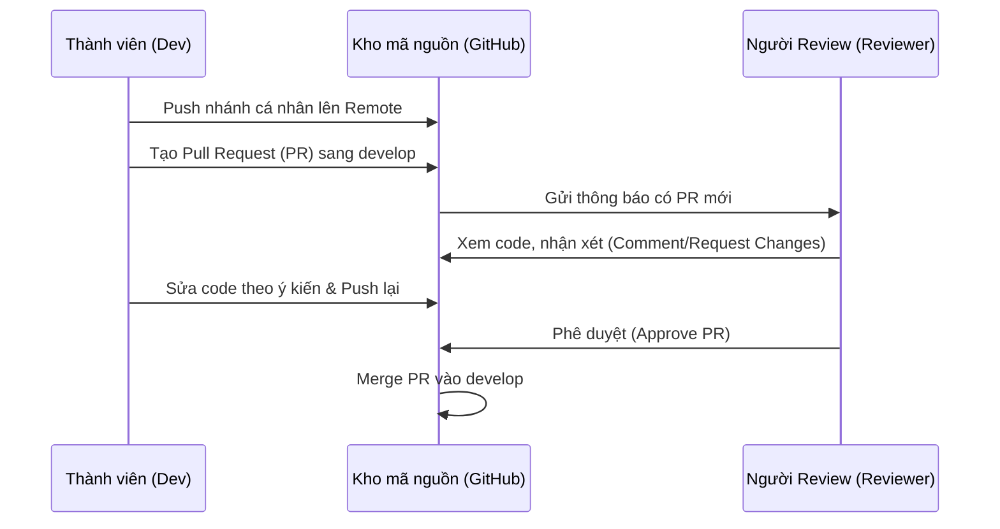

# HƯỚNG DẪN SỬ DỤNG GIT CHO NHÓM PHÁT TRIỂN (GIT COLLABORATION GUIDE)
## Dự án Thương mại Điện tử Thời trang FoxStyle

Tài liệu này cung cấp hướng dẫn chi tiết và quy chuẩn về quy trình làm việc với Git trong nhóm phát triển dự án FoxStyle. Mục tiêu là giúp các thành viên phối hợp nhịp nhàng, tối ưu lịch sử commit, hạn chế tối đa xung đột mã nguồn (conflict) và nâng cao chất lượng code thông qua quy trình Code Review chuyên nghiệp.

---

## 1. MÔ HÌNH PHÂN NHÁNH VÀ QUY TẮC TẠO NHÁNH (BRANCHING STRATEGY)

Để đảm bảo nhánh chính luôn ổn định và các thành viên có thể làm việc độc lập mà không can thiệp vào công việc của nhau, nhóm tuân thủ mô hình phân nhánh và quy tắc tạo nhánh dưới đây:

### 1.1. Các nhánh chính cố định (Long-lived Branches)
*   **`main`**: Nhánh chứa mã nguồn chạy thực tế (Production-ready). Code trên nhánh này bắt buộc phải chạy ổn định, không lỗi. Chỉ được merge từ nhánh `develop` thông qua Pull Request (PR) chính thức. **Tuyệt đối không commit trực tiếp lên `main`.**
*   **`develop`**: Nhánh tích hợp chính của nhóm phát triển. Các tính năng mới sau khi hoàn thành sẽ được gộp về đây để chạy thử nghiệm và kiểm thử tích hợp. **Tuyệt đối không commit trực tiếp lên `develop`.**

### 1.2. Nhánh tính năng cá nhân (Short-lived / Personal Feature Branches)
> **Quy tắc cốt lõi:** Mỗi thành viên khi phát triển một tính năng hoặc sửa một lỗi đều phải tạo một nhánh riêng từ `develop`. Một người tuyệt đối không commit lên nhánh của người khác trừ khi được sự đồng ý hoặc phối hợp đặc biệt.

#### Quy tắc đặt tên nhánh (Branch Naming Convention):
Tên nhánh được đặt theo cấu trúc:
`[loại-nhánh]/[tên-thành-viên]/[tên-ngắn-gọn-tính-năng]`

*   **Các loại nhánh (`type`):**
    *   `feature/`: Phát triển tính năng mới.
    *   `bugfix/`: Sửa lỗi thông thường trong quá trình test.
    *   `hotfix/`: Sửa lỗi nghiêm trọng khẩn cấp trên Production (nhánh này tạo từ `main`).
    *   `docs/`: Viết tài liệu hướng dẫn.
    *   `refactor/`: Tối ưu hóa cấu trúc mã nguồn.
*   **Tên thành viên (`username`):** Viết thường không dấu (ví dụ: `chien`, `huy`, `linh`, `an`).
*   **Tên ngắn gọn tính năng (`task-name`):** Các từ nối với nhau bằng dấu gạch ngang `-`, viết thường không dấu, mô tả đúng nhiệm vụ.

**Ví dụ cụ thể:**
*   `feature/chien/login-page`: Nhánh của Chiến viết giao diện đăng nhập.
*   `feature/huy/payos-integration`: Nhánh của Huy tích hợp thanh toán PayOS.
*   `bugfix/linh/cart-total-price`: Nhánh của Linh sửa lỗi tính tổng tiền giỏ hàng.
*   `refactor/an/database-indexes`: Nhánh của An tối ưu chỉ mục cơ sở dữ liệu.

---

## 2. QUY TẮC VIẾT THÔNG ĐIỆP COMMIT (COMMIT MESSAGES)

Thông điệp commit rõ ràng giúp nhóm dễ dàng tra cứu lịch sử, tìm ra nguyên nhân gây lỗi và tự động tạo changelog khi cần thiết. Nhóm thống nhất sử dụng chuẩn **Conventional Commits**.

### 2.1. Cấu trúc một Commit Message tiêu chuẩn
```text
<loại>(<phạm-vi-áp-dụng>): <mô tả ngắn bằng tiếng Việt hoặc tiếng Anh>

[Mô tả chi tiết hơn nếu cần thiết - tùy chọn]

[Mã số Task/Issue liên quan (ví dụ: Closes #12) - tùy chọn]
```

### 2.2. Các loại Commit (`type`) được chấp nhận
| Loại | Ý nghĩa | Ví dụ |
| :--- | :--- | :--- |
| **`feat`** | Thêm tính năng mới cho dự án | `feat(auth): tích hợp đăng nhập bằng Google` |
| **`fix`** | Sửa một lỗi (bug) | `fix(cart): sửa lỗi tăng số lượng quá tồn kho` |
| **`docs`** | Cập nhật tài liệu, hướng dẫn cài đặt | `docs: viết hướng dẫn sử dụng git nhóm` |
| **`style`** | Thay đổi giao diện hoặc định dạng code (CSS, khoảng trắng, dấu chấm phẩy) không đổi logic | `style(product-card): căn chỉnh lại viền button mua ngay` |
| **`refactor`** | Tái cấu trúc, tối ưu hóa code để dễ đọc/chạy nhanh hơn nhưng không đổi tính năng | `refactor(order): tối ưu hàm tính tổng tiền đơn hàng` |
| **`perf`** | Cải thiện hiệu suất hệ thống | `perf(image): tối ưu hóa cơ chế tải ảnh sản phẩm` |
| **`test`** | Viết thêm Unit Test hoặc kịch bản kiểm thử | `test(auth): viết unit test cho api login` |
| **`chore`** | Các thay đổi cấu hình, cập nhật thư viện phụ thuộc (package.json, pom.xml) | `chore(deps): nâng cấp axios lên phiên bản mới nhất` |

### 2.3. Một số nguyên tắc khi viết commit
1.  **Mô tả ngắn gọn:** Giới hạn dòng tiêu đề dưới 50 ký tự. Không kết thúc bằng dấu chấm (`.`).
2.  **Chia nhỏ commit (Atomic Commits):** Mỗi commit chỉ nên giải quyết một vấn đề nhỏ độc lập. Tránh gom toàn bộ code viết trong 3 ngày vào một commit duy nhất có tên `update code`.
3.  **Sử dụng thì hiện tại ở thể mệnh lệnh (nếu viết bằng tiếng Anh):** Dùng `add` thay vì `added`, `fix` thay vì `fixed`.

*   **Commit TỐT:** `feat(checkout): tích hợp cổng thanh toán PayOS`
*   **Commit XẤU:** `sửa xong lỗi thanh toán và sửa giao diện linh tinh`

---

## 3. QUY TRÌNH PULL REQUEST (PR) VÀ CODE REVIEW

Pull Request là bước trung gian bắt buộc trước khi code ở nhánh cá nhân được tích hợp vào nhánh `develop` hoặc `main`. Quy trình này giúp kiểm soát chất lượng code và chia sẻ kiến thức giữa các thành viên.



### 3.1. Các bước thực hiện gửi Pull Request
1.  **Tự kiểm tra (Self-review):** Trước khi tạo PR, chạy ứng dụng cục bộ để đảm bảo dự án chạy bình thường, không bị lỗi cú pháp hoặc cảnh báo (eslint, compile error).
2.  **Tạo PR trên GitHub:**
    *   **Base branch (Nhánh đích):** Chọn `develop`.
    *   **Compare branch (Nhánh nguồn):** Chọn nhánh cá nhân của bạn (ví dụ: `feature/chien/login-page`).
    *   **Title (Tiêu đề PR):** Viết rõ ràng nhiệm vụ được hoàn thành (ví dụ: `[Feature] Giao diện đăng nhập và validate form đăng ký`).
    *   **Description (Mô tả PR):** Mô tả ngắn những gì đã làm, ảnh chụp màn hình UI thay đổi (nếu có) và hướng dẫn cách tester chạy thử.
3.  **Chỉ định Người Review (Reviewer):** Chọn ít nhất 1 thành viên khác trong nhóm để review code.
4.  **Chờ phản hồi & Chỉnh sửa:**
    *   Nếu reviewer yêu cầu chỉnh sửa (**Request Changes**): Hãy sửa code trực tiếp trên nhánh đó ở local, sau đó commit và push tiếp lên. PR trên GitHub sẽ tự động cập nhật.
    *   Khi code đạt yêu cầu, reviewer sẽ phê duyệt (**Approve**). PR lúc này mới đủ điều kiện để Merge.

---

## 4. QUY TRÌNH SỬ DỤNG GIT REBASE (KEEP HISTORY CLEAN)

> [!IMPORTANT]
> Nhóm thống nhất sử dụng **`git rebase`** thay vì `git merge` khi cần đồng bộ code mới nhất từ nhánh `develop` về nhánh tính năng cá nhân.

### 4.1. Tại sao dùng Rebase thay vì Merge?
*   **Git Merge:** Tạo ra một commit merge tự động (ví dụ: *"Merge branch 'develop' into feature/..."*). Nếu nhiều người cùng merge liên tục, cây thư mục Git sẽ bị rối mắt và xuất hiện rất nhiều nhánh đan chéo phức tạp.
*   **Git Rebase:** Đưa toàn bộ các commit của bạn tạm thời ra ngoài, cập nhật các commit mới nhất từ `develop` vào nhánh của bạn, sau đó đặt các commit của bạn lên trên cùng. Lịch sử commit sẽ là một **đường thẳng tắp (linear history)**, cực kỳ sạch sẽ và dễ theo dõi.

| Git Merge (Lịch sử bị rối) | Git Rebase (Lịch sử dạng đường thẳng) |
| :--- | :--- |
|  |  |

*(Ảnh minh họa cơ chế hoạt động của Rebase so với Merge)*

### 4.2. Quy tắc vàng khi Rebase (The Golden Rule of Rebase)
> [!CAUTION]
> **Tuyệt đối không Rebase trên các nhánh công khai/nhánh chung (như `main` hoặc `develop`).**
> Chỉ được Rebase nhánh cá nhân của bạn (`feature/username/...`) trước khi tạo Pull Request hoặc đẩy code lên remote.

### 4.3. Các bước thực hiện Rebase chi tiết
Giả sử bạn đang code trên nhánh `feature/chien/login-page` và nhánh `develop` trên GitHub vừa có code mới của thành viên khác merge vào. Bạn cần đồng bộ code mới đó về nhánh của mình:

#### Bước 1: Cập nhật nhánh `develop` ở máy cá nhân (Local)
Chuyển về nhánh `develop`, kéo code mới nhất từ internet về:
```bash
git checkout develop
git pull origin develop
```

#### Bước 2: Thực hiện Rebase nhánh tính năng trên develop
Chuyển lại về nhánh tính năng của bạn và chạy lệnh rebase:
```bash
git checkout feature/chien/login-page
git rebase develop
```

#### Bước 3: Xử lý xung đột (Resolve Conflicts) - Nếu có
Nếu code của bạn và code mới trên `develop` cùng sửa chung một dòng code, Git sẽ tạm dừng tiến trình rebase và báo lỗi xung đột. Hãy bình tĩnh xử lý theo các bước:
1.  Mở VS Code hoặc công cụ soạn thảo, tìm các tệp có ký hiệu màu đỏ (Conflict).
2.  VS Code sẽ hiển thị các lựa chọn:
    *   *Accept Current Change*: Giữ code của bạn.
    *   *Accept Incoming Change*: Lấy code mới từ `develop`.
    *   *Accept Both Changes*: Lấy cả hai.
    *   Hoặc bạn có thể tự tay sửa lại dòng code cho hợp lý nhất.
3.  Sau khi sửa xong file xung đột, lưu lại và đánh dấu file đã sửa bằng lệnh:
    ```bash
    git add <đường-dẫn-file-vừa-sửa>
    # Ví dụ: git add src/app/pages/AccountPage.jsx
    ```
4.  **Tuyệt đối không dùng lệnh `git commit` lúc này.**
5.  Tiếp tục quá trình rebase bằng lệnh:
    ```bash
    git rebase --continue
    ```
6.  Nếu còn xung đột ở các commit tiếp theo, lặp lại các bước 1, 2, 3, 5.
7.  Nếu muốn hủy bỏ hoàn toàn quá trình rebase quay lại trạng thái ban đầu trước khi rebase, gõ:
    ```bash
    git rebase --abort
    ```

#### Bước 4: Đẩy code đã rebase lên GitHub (Push to Remote)
Sau khi rebase thành công ở local, lịch sử nhánh của bạn đã bị thay đổi (viết lại lịch sử). Khi bạn đẩy code lên GitHub bằng lệnh push thông thường, GitHub sẽ từ chối. Bạn bắt buộc phải đẩy cưỡng bức an toàn bằng lệnh:
```bash
git push origin feature/chien/login-page --force-with-lease
```
> [!TIP]
> Sử dụng `--force-with-lease` thay vì `-f` (hoặc `--force`). Lệnh `--force-with-lease` chỉ ghi đè nếu không có ai khác đẩy code mới lên nhánh của bạn trên remote. Điều này giúp tránh việc vô tình ghi đè đè mất code của đồng nghiệp nếu hai người làm chung một nhánh.

---

## 5. QUY TRÌNH LÀM VIỆC HÀNG NGÀY MẪU (DAILY WORKFLOW CHEAT SHEET)

Dưới đây là chuỗi lệnh mẫu mà một lập trình viên trong nhóm FoxStyle sẽ thực hiện mỗi ngày để bắt đầu và hoàn thành công việc:

### Bắt đầu ngày làm việc / Nhận Task mới
```bash
# 1. Chuyển về nhánh develop chính
git checkout develop

# 2. Cập nhật code mới nhất từ nhóm
git pull origin develop

# 3. Tạo nhánh tính năng mới cho riêng mình
git checkout -b feature/chien/register-validation
```

### Trong quá trình lập trình (Lặp đi lặp lại)
```bash
# 4. Kiểm tra trạng thái các file thay đổi
git status

# 5. Thêm các file thay đổi vào staging area
git add .

# 6. Commit các thay đổi nhỏ với thông điệp rõ ràng
git commit -m "feat(register): thêm validate định dạng email và mật khẩu mạnh"
```

### Trước khi đẩy code lên để tạo Pull Request (Đồng bộ bằng Rebase)
```bash
# 7. Lấy code mới nhất của người khác trên develop về local trước
git checkout develop
git pull origin develop

# 8. Trở lại nhánh của mình và tiến hành rebase
git checkout feature/chien/register-validation
git rebase develop

# 9. (Xử lý xung đột nếu có, sau đó chạy 'git rebase --continue')

# 10. Đẩy code lên GitHub bằng force-with-lease
git push origin feature/chien/register-validation --force-with-lease
```

### Tạo Pull Request trên GitHub
*   Lên giao diện GitHub của dự án.
*   Nhấn nút **Compare & pull request**.
*   Đặt tiêu đề chuẩn, chọn Reviewer và mô tả thay đổi.
*   Chờ được duyệt và Merge vào `develop`.
*   Sau khi PR được merge thành công, xóa nhánh local để dọn dẹp bộ nhớ:
    ```bash
    git checkout develop
    git pull origin develop
    git branch -d feature/chien/register-validation
    ```

---

*Tài liệu này được áp dụng chung cho tất cả các thành viên phát triển dự án FoxStyle. Mọi thắc mắc hoặc cần sửa đổi quy trình, vui lòng thảo luận trực tiếp trong các buổi họp nhóm.*
