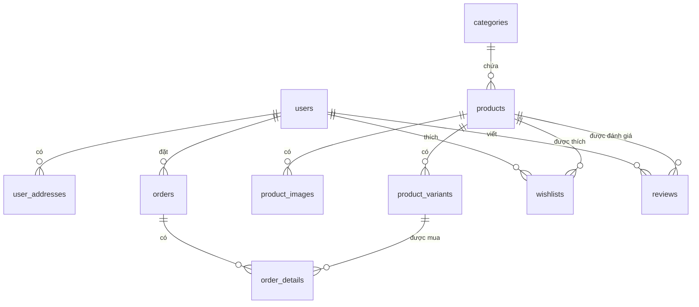

# Báo cáo Phân tích Hệ thống FOXSTYLE (Database & Frontend)

Bản báo cáo này đánh giá chi tiết cấu trúc cơ sở dữ liệu vật lý (SQL Server) và cấu trúc mã nguồn Frontend (React/Vite) hiện tại để xác định mức độ tương thích, những thành phần còn thiếu và đề xuất hướng cải tiến tối ưu cho website bán quần áo **FoxStyle**.

---

## 1. Phân tích Cấu trúc Cơ sở Dữ liệu (Database Schema)

Cơ sở dữ liệu của bạn đã thiết kế khá đầy đủ các tính năng cơ bản của một trang thương mại điện tử (Phân quyền, Giỏ hàng, Đơn hàng, Đánh giá, Coupon, Thanh toán, Yêu thích, Banner). Tuy nhiên, đối với một web bán quần áo (Thời trang), có một số điểm quan trọng cần tối ưu và bổ sung:

### 1.1. Những điểm cần tối ưu & bổ sung trong Cơ sở dữ liệu

> [!IMPORTANT]
> **Thiếu bảng quản lý Biến thể Sản phẩm (Product Variants)**
> *   **Hiện tại:** Bảng `products` lưu màu sắc (`color` NVARCHAR(50)) và kích thước (`size` VARCHAR(20)) dưới dạng chuỗi (ví dụ: "Đen, Trắng", "S, M, L"). Số lượng tồn kho `quantity` lưu trực tiếp trên bảng `products`.
> *   **Vấn đề:** Bạn không thể quản lý tồn kho chi tiết (ví dụ: Áo thun trắng size M còn 5 cái, nhưng size L đã hết hàng). Khách hàng vẫn có thể đặt hàng các size/màu đã hết.
> *   **Giải pháp:** Tách thành bảng `product_variants` để lưu trữ chi tiết cho từng cặp thuộc tính.

> [!WARNING]
> **Quản lý nhiều địa chỉ giao hàng (Shipping Addresses)**
> *   **Hiện tại:** Bảng `users` chỉ có một cột `address NVARCHAR(255)`.
> *   **Vấn đề:** Khách hàng thường có nhu cầu giao hàng đến nhiều địa chỉ khác nhau (Nhà riêng, công ty, quà tặng bạn bè).
> *   **Giải pháp:** Tách thành bảng `user_addresses` liên kết 1-nhiều với `users`.

> [!NOTE]
> **Quản lý Hình ảnh phụ chi tiết của Sản phẩm (Product Images)**
> *   **Hiện tại:** Cột `more_images NVARCHAR(MAX)` trong bảng `products` dùng để lưu các link ảnh phụ (phân cách bằng dấu phẩy hoặc dạng JSON).
> *   **Vấn đề:** Khó thực hiện các thao tác thêm, xóa, sửa hoặc thay đổi thứ tự hiển thị của các ảnh phụ từ trang Admin.
> *   **Giải pháp:** Tách thành bảng `product_images`.

> [!NOTE]
> **Giới hạn số lần sử dụng Coupon trên mỗi khách hàng**
> *   **Hiện tại:** Bảng `coupons` chỉ quản lý giới hạn dùng chung (`usage_limit`, `used_count`).
> *   **Vấn đề:** Một khách hàng có thể dùng đi dùng lại 1 mã giảm giá nhiều lần nếu mã đó chưa đạt giới hạn chung.
> *   **Giải pháp:** Cần kiểm tra lịch sử sử dụng coupon của từng user.

---

### 1.2. Đề xuất SQL sửa đổi/bổ sung cấu trúc dữ liệu

Dưới đây là sơ đồ cấu trúc cơ sở dữ liệu tối ưu và các câu lệnh SQL bổ sung:



#### SQL bổ sung bảng Biến thể Sản phẩm & Hình ảnh phụ:
```sql
-- Tạo bảng quản lý hình ảnh phụ chuyên nghiệp
CREATE TABLE product_images (
    image_id INT IDENTITY(1,1) NOT NULL,
    product_id INT NOT NULL,
    image_url VARCHAR(255) NOT NULL,
    is_primary BIT NOT NULL CONSTRAINT DF_product_images_primary DEFAULT 0, -- 1 là ảnh chính, 0 là ảnh phụ
    display_order INT NOT NULL CONSTRAINT DF_product_images_order DEFAULT 1,
    CONSTRAINT PK_product_images PRIMARY KEY (image_id),
    CONSTRAINT FK_product_images_products FOREIGN KEY (product_id) REFERENCES products(product_id) ON DELETE CASCADE
);
GO

-- Tạo bảng quản lý biến thể chi tiết (Size + Màu -> Số lượng cụ thể)
CREATE TABLE product_variants (
    variant_id INT IDENTITY(1,1) NOT NULL,
    product_id INT NOT NULL,
    color NVARCHAR(50) NOT NULL,
    size VARCHAR(20) NOT NULL,
    quantity INT NOT NULL CONSTRAINT DF_variants_qty DEFAULT 0,
    sku VARCHAR(100) NULL, -- Mã ký hiệu sản phẩm dễ quản lý kho
    CONSTRAINT PK_product_variants PRIMARY KEY (variant_id),
    CONSTRAINT UK_product_color_size UNIQUE (product_id, color, size),
    CONSTRAINT FK_product_variants_products FOREIGN KEY (product_id) REFERENCES products(product_id) ON DELETE CASCADE,
    CONSTRAINT CHK_variant_qty CHECK (quantity >= 0)
);
GO

-- Tạo bảng địa chỉ nhận hàng của người dùng
CREATE TABLE user_addresses (
    address_id INT IDENTITY(1,1) NOT NULL,
    user_id INT NOT NULL,
    recipient_name NVARCHAR(100) NOT NULL,
    phone VARCHAR(15) NOT NULL,
    province NVARCHAR(100) NOT NULL, -- Tỉnh/Thành phố
    district NVARCHAR(100) NOT NULL, -- Quận/Huyện
    ward NVARCHAR(100) NOT NULL,     -- Phường/Xã
    detail_address NVARCHAR(255) NOT NULL, -- Địa chỉ chi tiết (số nhà, ngõ...)
    is_default BIT NOT NULL CONSTRAINT DF_address_default DEFAULT 0,
    CONSTRAINT PK_user_addresses PRIMARY KEY (address_id),
    CONSTRAINT FK_user_addresses_users FOREIGN KEY (user_id) REFERENCES users(user_id) ON DELETE CASCADE
);
GO

-- Tạo bảng lưu lịch sử sử dụng Coupon của người dùng (Tránh việc 1 user dùng 1 mã nhiều lần)
CREATE TABLE user_coupons (
    user_id INT NOT NULL,
    coupon_id INT NOT NULL,
    used_at DATETIME NOT NULL CONSTRAINT DF_user_coupons_date DEFAULT GETDATE(),
    order_id INT NOT NULL,
    CONSTRAINT PK_user_coupons PRIMARY KEY (user_id, coupon_id),
    CONSTRAINT FK_user_coupons_users FOREIGN KEY (user_id) REFERENCES users(user_id),
    CONSTRAINT FK_user_coupons_coupons FOREIGN KEY (coupon_id) REFERENCES coupons(coupon_id),
    CONSTRAINT FK_user_coupons_orders FOREIGN KEY (order_id) REFERENCES orders(order_id)
);
GO
```

---

## 2. Phân tích Cấu trúc & Chức năng Frontend (React/Vite)

Dự án Frontend hiện tại đã có cấu trúc cơ bản tốt, sử dụng **React Router v7**, các trang được tổ chức rõ ràng trong `src/app/pages/` và giao diện hiện đại với **TailwindCSS** kết hợp **Radix UI** (hướng tới shadcn).

Tuy nhiên, so sánh với cấu trúc dữ liệu và các nghiệp vụ bán hàng thực tế, Frontend hiện tại đang thiếu các phần sau:

### 2.1. Các trang/chức năng Frontend bị thiếu hoàn toàn

1.  **Chức năng Xác thực & Quản lý Tài khoản (Authentication & Authorization):**
    *   **Hiện tại:** Chưa có trang Đăng nhập (`/login`), Đăng ký (`/register`), Quên mật khẩu.
    *   **Thiếu sót:** Chưa có cơ chế bảo vệ Route (Route Guard/Protected Routes) để ngăn khách hàng vào trang Admin (`/admin/*`) hoặc ngăn khách vãng lai vào trang cá nhân (`/account`, `/orders`).
2.  **Trang danh sách Yêu thích (Wishlist Page):**
    *   **Hiện tại:** Bảng `wishlists` có trong DB, và nút Thả tim ở trang chi tiết sản phẩm đã có, nhưng chưa có trang hiển thị danh sách các sản phẩm yêu thích (`/wishlist`).
3.  **Tương tác Đánh giá (Reviews):**
    *   **Hiện tại:** Trang chi tiết sản phẩm hiển thị đánh giá tĩnh.
    *   **Thiếu sót:** Chưa có Form viết đánh giá kèm chọn số sao (1-5) để lưu vào bảng `reviews`. Admin cũng thiếu trang kiểm duyệt hoặc xóa đánh giá xấu/spam.
4.  **Tích hợp Mã giảm giá (Coupons) trên giao diện:**
    *   **Hiện tại:** Trang `CheckoutPage` chưa có ô nhập Mã giảm giá và logic tính toán lại tổng tiền khi áp dụng mã thành công.
5.  **Quản lý Banners (Slide quảng cáo trang chủ):**
    *   **Hiện tại:** Chưa có giao diện trang Admin để thực hiện CRUD hình ảnh banner chạy slide ở trang chủ.

---

### 2.2. Điểm yếu về Kiến trúc code hiện tại

*   **Dữ liệu tĩnh (Mock Data):** Toàn bộ dữ liệu sản phẩm đang được đọc trực tiếp từ file cứng `src/app/data/products.ts`.
*   **Thiếu lớp API kết nối Backend:** Chưa cấu hình Axios hoặc Fetch API để tương tác với Backend.
*   **Thiếu State Management toàn cục:** Chưa có các công cụ quản lý State như **Zustand**, **Redux Toolkit** hoặc **React Context** để chia sẻ trạng thái Giỏ hàng (Cart State) và trạng thái Đăng nhập (Auth State) giữa các trang độc lập (ví dụ: thêm sản phẩm ở trang chi tiết thì icon giỏ hàng trên Header phải tự động cập nhật số lượng).

---

## 3. Bản đồ Đề xuất cấu trúc thư mục Frontend cải tiến

Để hệ thống hoàn chỉnh và sẵn sàng kết nối Backend, bạn nên bổ sung cấu trúc thư mục như sau:

```
src/
├── app/
│   ├── api/                   <-- [MỚI] Nơi định nghĩa các hàm gọi API (axios client, endpoints)
│   │   ├── auth.ts
│   │   ├── products.ts
│   │   ├── orders.ts
│   │   └── coupons.ts
│   ├── context/               <-- [MỚI] Quản lý state toàn cục đơn giản (Auth, Cart, Wishlist)
│   │   ├── AuthContext.tsx
│   │   └── CartContext.tsx
│   ├── components/
│   │   ├── ui/                <-- Các thành phần UI nguyên bản (Button, Dialog, Badge...)
│   │   ├── Header.tsx
│   │   ├── Footer.tsx
│   │   └── ProtectedRoute.tsx <-- [MỚI] Bảo vệ các trang Admin/Account yêu cầu đăng nhập
│   ├── pages/
│   │   ├── HomePage.tsx
│   │   ├── ProductsPage.tsx
│   │   ├── ProductDetailPage.tsx
│   │   ├── CartPage.tsx
│   │   ├── CheckoutPage.tsx
│   │   ├── AccountPage.tsx
│   │   ├── OrdersPage.tsx
│   │   ├── WishlistPage.tsx   <-- [MỚI] Trang sản phẩm yêu thích của khách hàng
│   │   ├── LoginPage.tsx      <-- [MỚI] Trang đăng nhập tài khoản
│   │   ├── RegisterPage.tsx   <-- [MỚI] Trang đăng ký tài khoản
│   │   └── admin/
│   │       ├── AdminDashboard.tsx
│   │       ├── AdminProducts.tsx
│   │       ├── AdminCategories.tsx
│   │       ├── AdminOrders.tsx
│   │       ├── AdminCustomers.tsx
│   │       ├── AdminPromotions.tsx
│   │       ├── AdminStats.tsx
│   │       └── AdminReviews.tsx   <-- [MỚI] Trang quản trị/kiểm duyệt đánh giá của khách hàng
│   ├── routes.tsx             <-- Cấu hình router điều hướng (cập nhật thêm route mới)
│   └── App.tsx
```

---

## 4. Kế hoạch hành động khuyến nghị (Next Steps)

1.  **Cập nhật Database:** Chạy thêm script SQL bổ sung (đặc biệt là bảng `product_variants` để tối ưu hóa việc phân loại quần áo theo Size/Color).
2.  **Tạo trang Auth & Route Guard:** Cài đặt các trang `/login`, `/register` và viết component `ProtectedRoute` để kiểm soát quyền truy cập Admin.
3.  **Thiết lập State Management:** Sử dụng Context API (hoặc Zustand) để liên kết logic Giỏ hàng và Trạng thái người dùng đăng nhập giữa Header, Chi tiết sản phẩm, Giỏ hàng và Thanh toán.
4.  **Tích hợp API:** Thay thế việc import từ `products.ts` bằng các lệnh gọi API thực tế tới Backend của bạn.
