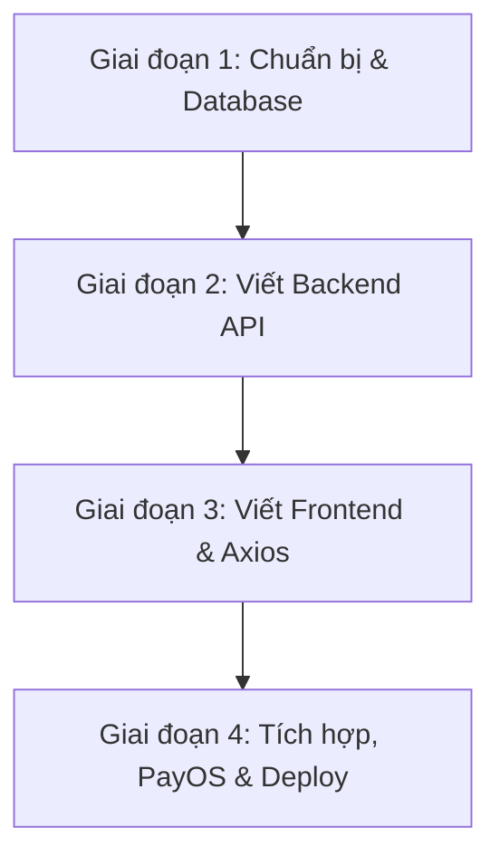
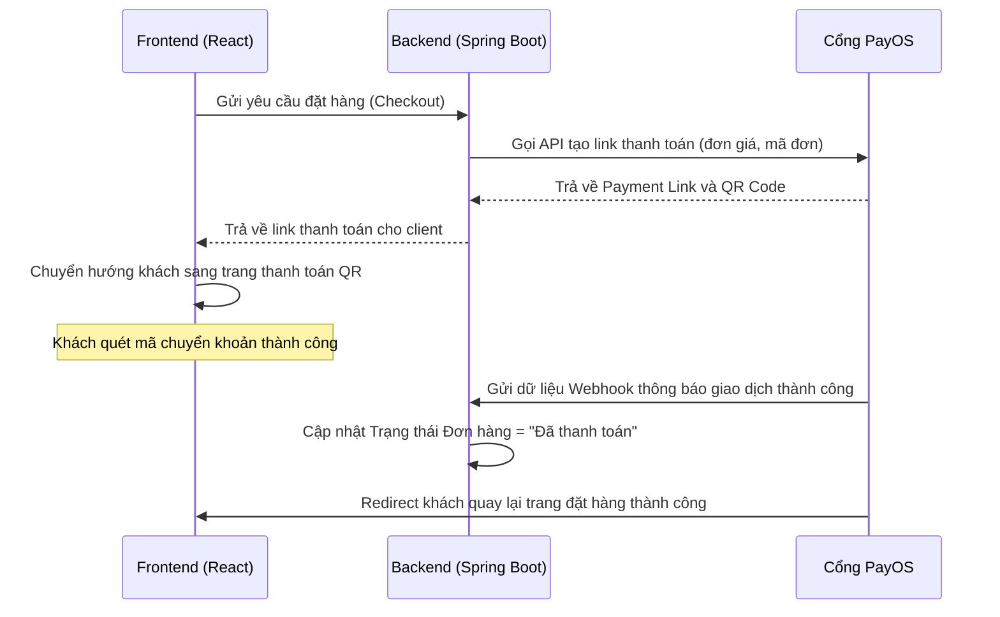

# TÀI LIỆU HƯỚNG DẪN PHÁT TRIỂN HỆ THỐNG FOXSTYLE
## Phân tích Dự án, Lộ trình Triển khai & Hướng dẫn Kỹ thuật Spring Boot + React (Axios)

Tài liệu này cung cấp hướng dẫn chi tiết từ A-Z để phát triển và hoàn thiện hệ thống website thời trang **FoxStyle** dùng làm Đồ án tốt nghiệp (DATN). Nội dung bao gồm lộ trình phát triển, kiến trúc Backend (Spring Boot), cấu trúc Frontend (React), cách triển khai bảo mật (JWT, Google 2FA), gửi thông báo (Email, SMS), tích hợp cổng thanh toán **PayOS** và thiết lập môi trường.

---

## PHẦN 1: LỘ TRÌNH VÀ CÁCH THỨC TIẾN HÀNH DỰ ÁN

Quy trình phát triển phần mềm chuẩn cho đồ án tốt nghiệp gồm 4 giai đoạn chính:



### 1.1. Giai đoạn 1: Chuẩn bị và Thiết lập Cơ sở dữ liệu
*   Khởi chạy kịch bản SQL tại [foxstyle_db.sql](file:///e:/PROJECT/CHIEN/fe-DATN/foxstyle_db.sql) trong SQL Server để có cấu trúc các bảng hoàn thiện.
*   Cài đặt môi trường phát triển (JDK 17+, Node.js, IDE như IntelliJ IDEA và VS Code).

### 1.2. Giai đoạn 2: Phát triển Backend (Spring Boot Web API)
*   Tạo khung dự án Spring Boot sử dụng Spring Initializr với các dependency: *Spring Web, Spring Data JPA, Spring Security, MS SQL Server Driver, Lombok, Validation*.
*   Thiết lập mô hình hóa các bảng thành Entity Class trong Java.
*   Xây dựng tầng Security (JWT Token, Filter, BCrypt mã hóa mật khẩu).
*   Viết các API nghiệp vụ chính (Products, Categories, Cart, Checkout, Coupons, Banners).

### 1.3. Giai đoạn 3: Phát triển Frontend (React)
*   Sử dụng khung giao diện hiện có của bạn, cài đặt thêm **Axios** để gọi API.
*   Xây dựng **AuthContext** toàn cục lưu trữ JWT token, thông tin user đăng nhập và trạng thái giỏ hàng.
*   Chuyển các trang đang dùng dữ liệu mock tĩnh (dữ liệu cứng) sang gọi API động.

### 1.4. Giai đoạn 4: Tích hợp dịch vụ bên thứ ba & Kiểm thử
*   Tích hợp thanh toán QR Code động qua **PayOS**.
*   Tích hợp gửi OTP xác minh số điện thoại qua SMS (Twilio/SpeedSMS) và gửi hóa đơn/email chào mừng qua **EmailJS** (ở FE) hoặc **JavaMailSender** (ở BE).
*   Kiểm thử bảo mật (phân quyền Admin/Customer) và kiểm thử luồng mua hàng trọn vẹn từ giỏ hàng đến thanh toán thành công.

---

## PHẦN 2: HƯỚNG DẪN PHÁT TRIỂN BACKEND (SPRING BOOT WEB API)

### 2.1. Cấu trúc thư mục dự án Backend khuyến nghị
Bạn nên tổ chức code Spring Boot theo cấu trúc phân tầng (Layered Architecture) chuẩn:

```
com.foxstyle.api/
│
├── config/                 # Các class cấu hình hệ thống (Security, Cors, PayOS)
│   ├── SecurityConfig.java
│   └── PayOSConfig.java
│
├── security/               # Quản lý bảo mật JWT và OAuth2
│   ├── JwtTokenProvider.java
│   ├── JwtAuthenticationFilter.java
│   └── UserPrincipal.java  # Custom UserDetails
│
├── entity/                 # Lớp ánh xạ trực tiếp cơ sở dữ liệu (JPA Entities)
│   ├── User.java
│   ├── Product.java
│   ├── ProductVariant.java
│   └── Order.java
│
├── repository/             # Giao tiếp trực tiếp với Database (Spring Data JPA)
│   ├── UserRepository.java
│   ├── ProductRepository.java
│   └── OrderRepository.java
│
├── dto/                    # Data Transfer Object (Dữ liệu truyền nhận giữa BE và FE)
│   ├── request/            # Chứa các Class dữ liệu gửi lên (LoginRequest, RegisterRequest)
│   └── response/           # Chứa các Class dữ liệu trả về (JwtResponse, ApiResponse)
│
├── service/                # Nơi xử lý logic nghiệp vụ chính (Business Logic)
│   ├── UserService.java
│   ├── ProductService.java
│   ├── OrderService.java
│   └── SmsService.java
│
├── controller/             # Tiếp nhận request HTTP, định nghĩa Endpoint API
│   ├── AuthController.java
│   ├── ProductController.java
│   └── OrderController.java
│
└── exception/              # Xử lý lỗi tập trung (Global Exception Handler)
    └── GlobalExceptionHandler.java
```

---

### 2.2. Spring Security & Xác thực JWT (JSON Web Token)

#### Nguyên lý hoạt động:
1.  Người dùng gửi tài khoản/mật khẩu lên `/api/auth/login`.
2.  Backend xác thực thông tin, nếu đúng sẽ tạo một chuỗi mã hóa **JWT Token** chứa: `user_id, username, roles` và thời gian hết hạn.
3.  Backend trả Token về cho Frontend.
4.  Frontend lưu Token vào `localStorage` hoặc `Cookie`.
5.  Mỗi lần gửi request tiếp theo (ví dụ: lấy thông tin giỏ hàng, đặt hàng), Frontend đính kèm Token vào Header: `Authorization: Bearer <Token>`.
6.  `JwtAuthenticationFilter` ở Backend chặn request, giải mã Token, nếu hợp lệ sẽ cấp quyền cho request đi tiếp vào Controller.

#### Đoạn code mẫu cấu hình Security (`SecurityConfig.java`):
```java
@Configuration
@EnableWebSecurity
@EnableMethodSecurity
public class SecurityConfig {

    @Autowired
    private JwtAuthenticationFilter jwtAuthFilter;

    @Bean
    public SecurityFilterChain securityFilterChain(HttpSecurity http) throws Exception {
        http
            .csrf(csrf -> csrf.disable()) // Tắt CSRF vì sử dụng Stateless API (JWT)
            .cors(cors -> cors.configure(http)) // Kích hoạt CORS để Frontend gọi được API
            .sessionManagement(session -> session.sessionCreationPolicy(SessionCreationPolicy.STATELESS))
            .authorizeHttpRequests(auth -> auth
                // Cho phép truy cập công khai các API này
                .requestMatchers("/api/auth/**", "/api/products/**", "/api/categories/**", "/api/banners/**").permitAll()
                // Yêu cầu quyền ADMIN đối với các API quản trị
                .requestMatchers("/api/admin/**").hasRole("ADMIN")
                // Các request còn lại phải đăng nhập
                .anyRequest().authenticated()
            );
        
        // Thêm Filter JWT trước UsernamePasswordAuthenticationFilter mặc định
        http.addFilterBefore(jwtAuthFilter, UsernamePasswordAuthenticationFilter.class);
        
        return http.build();
    }

    @Bean
    public PasswordEncoder passwordEncoder() {
        return new BCryptPasswordEncoder(); // Mã hóa mật khẩu an toàn
    }
}
```

---

### 2.3. Xác thực Đăng nhập Google (OAuth2) & Google 2FA (Xác thực 2 yếu tố)

#### A. Đăng nhập nhanh bằng Google (Google OAuth2)
*   **Cách thức thực hiện đơn giản nhất (Frontend làm chính):**
    1.  Frontend tích hợp nút đăng nhập Google bằng thư viện `@react-oauth/google`.
    2.  Khi đăng nhập thành công, Google trả về cho FE một chuỗi Token (`credential`).
    3.  Frontend gửi Token này về API Backend `/api/auth/google`.
    4.  Backend dùng thư viện của Google (`google-api-client`) để verify Token này, lấy ra Email, Họ tên.
    5.  Backend kiểm tra nếu Email này chưa có trong DB thì tự tạo tài khoản mới (mật khẩu ngẫu nhiên), sau đó phát hành JWT Token của FoxStyle để trả về cho Frontend tương tự như login thường.

#### B. Xác thực 2 yếu tố (Google Authenticator 2FA)
Dành cho tài khoản Quản trị viên (Admin) hoặc Nhân viên (Staff) để bảo mật cao độ:
1.  Khi Admin bật tính năng 2FA trong tài khoản, Backend tạo ra một khóa bí mật ngẫu nhiên (Secret Key) dạng Base32 và sinh ra mã QR chứa link: `otpauth://totp/FoxStyle:admin@email.com?secret=SECRET_KEY&issuer=FoxStyle`.
2.  Admin dùng ứng dụng Google Authenticator trên điện thoại quét mã QR này để đồng bộ mã OTP 6 số (thay đổi mỗi 30 giây).
3.  Mỗi lần đăng nhập, sau khi nhập đúng Mật khẩu thông thường, hệ thống yêu cầu nhập thêm mã 6 số từ ứng dụng Google Authenticator. Backend verify bằng thuật toán TOTP.

---

### 2.4. Tích hợp gửi SMS OTP & EmailJS / JavaMailSender

#### A. Gửi SMS OTP (Xác thực số điện thoại)
Để kích hoạt tài khoản hoặc xác thực giao dịch, bạn tích hợp với cổng SMS (ví dụ: Twilio, SpeedSMS, Vietguys...):
*   **Đoạn code Spring Boot tích hợp Twilio gửi SMS:**
```java
import com.twilio.Twilio;
import com.twilio.rest.api.v2010.account.Message;
import com.twilio.type.PhoneNumber;

@Service
public class SmsService {
    // Các thông số cấu hình từ trang chủ Twilio
    private final String ACCOUNT_SID = "YOUR_TWILIO_ACCOUNT_SID";
    private final String AUTH_TOKEN = "YOUR_TWILIO_AUTH_TOKEN";
    private final String FROM_PHONE = "+1234567890"; // Số điện thoại Twilio cấp

    public void sendOtpSms(String toPhone, String otpCode) {
        Twilio.init(ACCOUNT_SID, AUTH_TOKEN);
        String messageBody = "[FoxStyle] Ma OTP xac minh cua ban la: " + otpCode + ". Ma co hieu luc trong 5 phut.";
        Message.creator(
            new PhoneNumber(toPhone), // Số nhận (VD: +84334455667)
            new PhoneNumber(FROM_PHONE),
            messageBody
        ).create();
    }
}
```

#### B. Gửi Email (Hóa đơn, Khuyến mãi)
*   **EmailJS (FE):** Ưu điểm là Frontend có thể gửi email trực tiếp qua tài khoản Gmail/Outlook cá nhân mà không cần Backend. Thích hợp cho gửi email liên hệ, thông báo đặt hàng cơ bản.
*   **JavaMailSender (BE):** Tốt hơn cho đồ án lớn. Backend tự động gửi email hóa đơn chi tiết dạng HTML chuyên nghiệp khi đơn hàng được chuyển trạng thái "Đã duyệt" hoặc "Đã giao".

---

### 2.5. Tích hợp Cổng thanh toán tự động PayOS (Mã QR động chuyển khoản ngân hàng)

PayOS là giải pháp thanh toán miễn phí phí giao dịch cực kỳ phổ biến hiện nay tại Việt Nam. Nó cho phép tạo link thanh toán chứa mã VietQR động để khách quét mã và tự động nhận kết quả thanh toán ngay lập tức qua Webhook.

#### Quy trình tích hợp PayOS:



#### Code mẫu cấu hình & Tạo giao dịch PayOS (`OrderService.java`):
```java
import vn.payos.PayOS;
import vn.payos.type.PaymentData;
import vn.payos.type.CheckoutResponseData;

@Service
public class OrderService {

    @Autowired
    private PayOS payOS; // Đã bean cấu hình bằng Client ID, Api Key, Checksum Key từ PayOS

    public String createPaymentUrl(Order order) throws Exception {
        // Tạo các tham số thanh toán theo yêu cầu của PayOS
        long orderCode = order.getOrderId(); // Mã đơn hàng dạng số nguyên
        int amount = order.getTotalAmount().intValue();
        String description = "Thanh toan don hang #" + orderCode;
        String returnUrl = "http://localhost:5173/orders"; // URL chuyển hướng khách về sau khi thanh toán xong
        String cancelUrl = "http://localhost:5173/checkout"; // URL nếu khách hủy thanh toán

        PaymentData paymentData = PaymentData.builder()
            .orderCode(orderCode)
            .amount(amount)
            .description(description)
            .returnUrl(returnUrl)
            .cancelUrl(cancelUrl)
            .build();

        // Gọi SDK PayOS tạo giao dịch
        CheckoutResponseData data = payOS.createPaymentLink(paymentData);
        
        // Trả về Link thanh toán chứa mã QR
        return data.getCheckoutUrl(); 
    }
}
```

---

## PHẦN 3: HƯỚNG DẪN VIẾT FRONTEND (REACT - DÙNG AXIOS & STATE MANAGEMENT)

### 3.1. Thiết lập Axios Client (`src/app/api/axiosClient.ts`)
Tập trung hóa các yêu cầu gọi API, tự động đính kèm mã JWT Token vào Header của mọi request:

```typescript
import axios from "axios";

const axiosClient = axios.create({
  baseURL: "http://localhost:8080/api", // Địa chỉ cổng Backend chạy Spring Boot
  headers: {
    "Content-Type": "application/json",
  },
});

// Interceptor tự động thêm Token vào Header trước khi gửi request đi
axiosClient.interceptors.request.use(
  (config) => {
    const token = localStorage.getItem("access_token");
    if (token && config.headers) {
      config.headers.Authorization = `Bearer ${token}`;
    }
    return config;
  },
  (error) => {
    return Promise.reject(error);
  }
);

// Interceptor xử lý lỗi tập trung khi nhận kết quả trả về
axiosClient.interceptors.response.use(
  (response) => {
    return response.data;
  },
  (error) => {
    if (error.response && error.response.status === 401) {
      // Token hết hạn hoặc không hợp lệ -> Xóa token và chuyển về trang Login
      localStorage.removeItem("access_token");
      window.location.href = "/login";
    }
    return Promise.reject(error);
  }
);

export default axiosClient;
```

---

### 3.2. Quản lý trạng thái toàn cục (Auth & Cart Context)
Tạo `AuthContext.tsx` để quản lý trạng thái đăng nhập của người dùng, phân quyền truy cập trang Admin:

```tsx
import React, { createContext, useContext, useState, useEffect } from "react";

interface UserInfo {
  userId: number;
  username: string;
  fullName: string;
  role: string;
}

interface AuthContextType {
  user: UserInfo | null;
  login: (token: string, userInfo: UserInfo) => void;
  logout: () => void;
  isAuthenticated: boolean;
  isAdmin: boolean;
}

const AuthContext = createContext<AuthContextType | null>(null);

export const AuthProvider: React.FC<{ children: React.ReactNode }> = ({ children }) => {
  const [user, setUser] = useState<UserInfo | null>(null);

  useEffect(() => {
    const storedUser = localStorage.getItem("user_info");
    if (storedUser) {
      setUser(JSON.parse(storedUser));
    }
  }, []);

  const login = (token: string, userInfo: UserInfo) => {
    localStorage.setItem("access_token", token);
    localStorage.setItem("user_info", JSON.stringify(userInfo));
    setUser(userInfo);
  };

  const logout = () => {
    localStorage.removeItem("access_token");
    localStorage.removeItem("user_info");
    setUser(null);
    window.location.href = "/";
  };

  const isAuthenticated = !!user;
  const isAdmin = user?.role === "ROLE_ADMIN";

  return (
    <AuthContext.Provider value={{ user, login, logout, isAuthenticated, isAdmin }}>
      {children}
    </AuthContext.Provider>
  );
};

export const useAuth = () => {
  const context = useContext(AuthContext);
  if (!context) throw new Error("useAuth must be used within an AuthProvider");
  return context;
};
```

---

## PHẦN 4: NGUYÊN TẮC THIẾT KẾ REST API CHUẨN (RESTFUL API DESIGN)

Để Backend và Frontend làm việc ăn khớp, bạn cần tuân thủ thiết kế REST API:

### 4.1. Quy ước đặt tên URL (Endpoints)
*   **Sử dụng danh từ số nhiều** và viết thường (kebab-case):
    *   Lấy toàn bộ sản phẩm: `GET /api/products`
    *   Lấy chi tiết 1 sản phẩm: `GET /api/products/{id}`
    *   Thêm mới 1 sản phẩm: `POST /api/products`
    *   Cập nhật sản phẩm: `PUT /api/products/{id}`
    *   Xóa sản phẩm: `DELETE /api/products/{id}`

### 4.2. Quy ước sử dụng mã HTTP Status Code
| Mã Code | Ý nghĩa | Thời điểm sử dụng |
|---|---|---|
| **200 OK** | Thành công | Gửi yêu cầu lấy dữ liệu (GET), cập nhật (PUT) thành công |
| **201 Created** | Tạo mới thành công | Đăng ký thành công, tạo mới đơn hàng thành công (POST) |
| **400 Bad Request** | Lỗi dữ liệu gửi lên | Dữ liệu đăng ký thiếu email, mật khẩu quá ngắn... |
| **401 Unauthorized** | Chưa đăng nhập | Truy cập trang yêu cầu đăng nhập nhưng không gửi Token |
| **403 Forbidden** | Không đủ quyền | Tài khoản khách hàng cố tình gọi API `/api/admin/stats` của Admin |
| **404 Not Found** | Không tìm thấy tài nguyên | Truy vấn sản phẩm ID không tồn tại trong Database |
| **500 Internal Server Error**| Lỗi hệ thống Backend | Lỗi kết nối DB, null pointer exception ở code Java |

---

## PHẦN 5: THIẾT LẬP MÔI TRƯỜNG & CHẠY DỰ ÁN

### 5.1. Yêu cầu cài đặt môi trường
1.  **Java Development Kit (JDK):** Cài đặt bản JDK 17 hoặc JDK 21 (khuyên dùng Eclipse Temurin hoặc Oracle OpenJDK).
2.  **Node.js:** Bản LTS mới nhất (v18 trở lên) để chạy Frontend.
3.  **Hệ quản trị CSDL:** Microsoft SQL Server (2019 trở lên) và SQL Server Management Studio (SSMS).
4.  **IDE:** IntelliJ IDEA (cho Backend Spring Boot) và VS Code (cho Frontend React).

---

### 5.2. File cấu hình môi trường mẫu

#### A. Backend: `application.properties` (hoặc `application.yml`)
Đặt trong thư mục `src/main/resources/` của Spring Boot:
```properties
# Cấu hình Cổng chạy Backend
server.port=8080

# Cấu hình kết nối SQL Server
spring.datasource.url=jdbc:sqlserver://localhost:1433;databaseName=foxstyle_db;encrypt=true;trustServerCertificate=true
spring.datasource.username=sa
spring.datasource.password=your_sql_password
spring.datasource.driver-class-name=com.microsoft.sqlserver.jdbc.SQLServerDriver

# Cấu hình Hibernate tự động đồng bộ hóa DB (để validate, không dùng update nếu đã chạy script SQL thủ công)
spring.jpa.hibernate.ddl-auto=validate
spring.jpa.show-sql=true
spring.jpa.properties.hibernate.format_sql=true

# Cấu hình khóa bí mật tạo chuỗi mã hóa JWT (Độ dài tối thiểu 256-bit)
jwt.secret=FoxStyleSuperSecretKeyForJWTokenGeneration2026MustBeLongEnough
jwt.expiration-ms=86400000

# Cấu hình API PayOS
payos.client-id=YOUR_PAYOS_CLIENT_ID
payos.api-key=YOUR_PAYOS_API_KEY
payos.checksum-key=YOUR_PAYOS_CHECKSUM_KEY
```

#### B. Frontend: `.env`
Đặt ở thư mục gốc của dự án React/Vite:
```env
# Địa chỉ API của Backend Spring Boot
VITE_API_URL=http://localhost:8080/api

# Cấu hình tích hợp EmailJS
VITE_EMAILJS_SERVICE_ID=your_service_id
VITE_EMAILJS_TEMPLATE_ID=your_template_id
VITE_EMAILJS_PUBLIC_KEY=your_public_key
```

---

### 5.3. Hướng dẫn Khởi chạy dự án

#### Bước 1: Khởi chạy Database
Chạy script trong file [foxstyle_db.sql](file:///e:/PROJECT/CHIEN/fe-DATN/foxstyle_db.sql) để tạo bảng và chèn dữ liệu mẫu vào SQL Server.

#### Bước 2: Khởi chạy Backend (Spring Boot)
Mở dự án bằng IntelliJ IDEA, đợi Maven tải xong các thư viện dependency, mở file chính `ApiApplication.java` (hoặc tương tự) và bấm **Run**.
Hoặc chạy lệnh sau ở terminal của Backend:
```bash
mvn clean spring-boot:run
```

#### Bước 3: Khởi chạy Frontend (React)
Mở terminal tại thư mục gốc dự án FE (`e:/PROJECT/CHIEN/fe-DATN`) và chạy các lệnh:
```bash
# Cài đặt thư viện (nếu chưa có hoặc mới cấu hình)
npm install

# Khởi động máy chủ phát triển Frontend
npm run dev
```
Trình duyệt sẽ tự động mở trang web ở địa chỉ `http://localhost:5173`. Bạn có thể tiến hành test đăng nhập bằng tài khoản mẫu có sẵn trong Database.
