# TÀI LIỆU THIẾT KẾ SƠ ĐỒ TUẦN TỰ (UML SEQUENCE DIAGRAM SPECIFICATION)
## Dự án: Hệ thống Thương mại Điện tử Thời trang FoxStyle
**Mã dự án:** FOXSTYLE-DATN  
**Ngày cập nhật:** 31/07/2026  
**Trạng thái:** TÀI LIỆU CHÍNH THỨC  

---

## MỤC LỤC
- [CHƯƠNG 1: QUY CHUẨN NGUYÊN TẮC MÔ HÌNH HÓA SƠ ĐỒ TUẦN TỰ](#chương-1-quy-chuẩn-nguyên-tắc-mô-hình-hóa-sơ-đồ-tuần-tự)
- [CHƯƠNG 2: BỘ 10 SƠ ĐỒ TUẦN TỰ TRỌNG TÂM CÁC LUỒNG NGHIỆP VỤ (MERMAID SEQUENCE DIAGRAMS)](#chương-2-bộ-10-sơ-đồ-tuần-tự-trọng-tâm-các-luồng-nghiệp-vụ-mermaid-sequence-diagrams)
  - [SD-01: Sơ đồ Tuần tự Đăng ký Tài khoản Khách hàng Mới (Local Register)](#sd-01-sơ-đồ-tuần-tự-đăng-ký-tài-khoản-khách-hàng-mới-local-register)
  - [SD-02: Sơ đồ Tuần tự Đăng nhập Nội bộ & Cấp mã JWT Token](#sd-02-sơ-đồ-tuần-tự-đăng-nhập-nội-bộ--cấp-mã-jwt-token)
  - [SD-03: Sơ đồ Tuần tự Đăng nhập Nhanh với Google OAuth2 (SSO)](#sd-03-sơ-đồ-tuần-tự-đăng-nhập-nhanh-với-google-oauth2-sso)
  - [SD-04: Sơ đồ Tuần tự Khôi phục Mật khẩu qua Email OTP 6 Số](#sd-04-sơ-đồ-tuần-tự-khôi-phục-mật-khẩu-qua-email-otp-6-số)
  - [SD-05: Sơ đồ Tuần tự Lọc & Tìm kiếm Sản phẩm Đa tiêu chí](#sd-05-sơ-đồ-tuần-tự-lọc--tìm-kiếm-sản-phẩm-đa-tiêu-chí)
  - [SD-06: Sơ đồ Tuần tự Chọn Biến thể (Size/Màu) & Thêm vào Giỏ hàng](#sd-06-sơ-đồ-tuần-tự-chọn-biến-thể-sizemàu--thêm-vào-giỏ-hàng)
  - [SD-07: Sơ đồ Tuần tự Đặt hàng & Thanh toán Tự động PayOS QR Code](#sd-07-sơ-đồ-tuần-tự-đặt-hàng--thanh-toán-tự-động-payos-qr-code)
  - [SD-08: Sơ đồ Tuần tự Hủy Đơn hàng & Hoàn trả Số lượng Tồn kho](#sd-08-sơ-đồ-tuần-tự-hủy-đơn-hàng--hoàn-trả-số-lượng-tồn-kho)
  - [SD-09: Sơ đồ Tuần tự Admin Thêm Sản phẩm kèm Ảnh phụ & Biến thể Kho](#sd-09-sơ-đồ-tuần-tự-admin-thêm-sản-phẩm-kèm-ảnh-phụ--biến-thể-kho)
  - [SD-10: Sơ đồ Tuần tự Duyệt & Cập nhật Tiến trình Vận chuyển Đơn hàng](#sd-10-sơ-đồ-tuần-tự-duyệt--cập-nhat-tiến-trình-vận-chuyển-đơn-hàng)

---

## CHƯƠNG 1: QUY CHUẨN NGUYÊN TẮC MÔ HÌNH HÓA SƠ ĐỒ TUẦN TỰ

Sơ đồ tuần tự (Sequence Diagram) thể hiện thứ tự luân chuyển thông điệp (Messages) theo thời gian giữa các đối tượng trong hệ thống:
- **Lifelines (Đường sống đối tượng):** `Actor` ➔ `React Frontend` ➔ `Spring Security Filter` ➔ `REST Controller` ➔ `Service Implementation` ➔ `JPA Repository` ➔ `MS SQL Server` ➔ `External Services (PayOS / Google / SMTP)`.
- **Synchronous Messages (`->>`):** Thông điệp gọi đồng bộ yêu cầu chờ phản hồi.
- **Asynchronous Messages (`-->>`):** Thông điệp gửi bất đồng bộ qua `@Async` ThreadPool.
- **Alt / Opt Blocks:** Thể hiện luồng rẽ nhánh điều kiện và luồng ngoại lệ.

---

## CHƯƠNG 2: BỘ 10 SƠ ĐỒ TUẦN TỰ TRỌNG TÂM CÁC LUỒNG NGHIỆP VỤ (MERMAID SEQUENCE DIAGRAMS)

### SD-01: Sơ đồ Tuần tự Đăng ký Tài khoản Khách hàng Mới (Local Register)

```mermaid
sequenceDiagram
    autonumber
    actor Guest as Khách vãng lai
    participant FE as React Frontend
    participant Filter as Security Filter Chain
    participant AuthCtrl as AuthController
    participant AuthSvc as AuthServiceImpl
    participant UserRepo as UserRepository
    participant DB as MS SQL Server

    Guest->>FE: Nhập Form Đăng ký (Username, Email, Pass, FullName)
    FE->>FE: Client-side Validation
    FE->>Filter: POST /api/v1/auth/register (RegisterRequest DTO)
    Filter->>AuthCtrl: Pass Filter (Public PermitAll)
    AuthCtrl->>AuthSvc: registerUser(RegisterRequest request)
    AuthSvc->>UserRepo: existsByUsername(username)
    UserRepo->>DB: SELECT COUNT(*) FROM users WHERE username=?
    DB-->>UserRepo: count = 0
    AuthSvc->>UserRepo: existsByEmail(email)
    UserRepo->>DB: SELECT COUNT(*) FROM users WHERE email=?
    DB-->>UserRepo: count = 0

    AuthSvc->>AuthSvc: BCryptPasswordEncoder.encode(rawPassword)
    AuthSvc->>UserRepo: save(User entity with ROLE_CUSTOMER)
    UserRepo->>DB: INSERT INTO users (...) VALUES (...)
    DB-->>UserRepo: User entity created (userId=105)
    UserRepo-->>AuthSvc: User Object
    AuthSvc-->>AuthCtrl: User Object
    AuthCtrl-->>FE: HTTP 201 Created ("Đăng ký tài khoản thành công")
    FE-->>Guest: Hiển thị Toast thông báo & Chuyển hướng trang Đăng nhập
```

---

### SD-02: Sơ đồ Tuần tự Đăng nhập Nội bộ & Cấp mã JWT Token

```mermaid
sequenceDiagram
    autonumber
    actor User as Người dùng
    participant FE as React Frontend
    participant AuthCtrl as AuthController
    participant AuthMgr as AuthenticationManager
    participant JwtProv as JwtTokenProvider
    participant DB as MS SQL Server

    User->>FE: Nhập Username/Email & Password ➔ Bấm "Đăng nhập"
    FE->>AuthCtrl: POST /api/v1/auth/login (LoginRequest DTO)
    AuthCtrl->>AuthMgr: authenticate(UsernamePasswordAuthenticationToken)
    AuthMgr->>DB: SELECT u.*, r.role_name FROM users u JOIN roles r ON...
    DB-->>AuthMgr: User Record (Encoded BCrypt Password)
    AuthMgr->>AuthMgr: Verify BCrypt Password match
    alt Sai mật khẩu / Tài khoản bị khóa (status=0)
        AuthMgr-->>AuthCtrl: Throw BadCredentialsException / BlockedException
        AuthCtrl-->>FE: HTTP 400 Bad Request ("Tài khoản/Mật khẩu sai hoặc bị khóa")
        FE-->>User: Hiển thị thông báo lỗi
    else Xác thực thành công
        AuthMgr-->>AuthCtrl: Authentication Object
        AuthCtrl->>JwtProv: generateToken(Authentication authentication)
        JwtProv->>JwtProv: Sign HMAC-SHA512 (UserId, Email, Roles, Expiration 24h)
        JwtProv-->>AuthCtrl: Token string ("eyJhbGciOi...")
        AuthCtrl-->>FE: HTTP 200 OK + JwtResponse (token, userInfo)
        FE->>FE: localStorage.setItem("token", token)
        FE-->>User: Đăng nhập thành công! Cập nhật State & Header Avatar
    end
```

---

### SD-03: Sơ đồ Tuần tự Đăng nhập Nhanh với Google OAuth2 (SSO)

```mermaid
sequenceDiagram
    autonumber
    actor User as Người dùng
    participant FE as React Frontend
    participant GoogleSDK as Google OAuth2 API
    participant AuthCtrl as AuthController
    participant AuthSvc as AuthServiceImpl
    participant UserRepo as UserRepository
    participant JwtProv as JwtTokenProvider
    participant DB as MS SQL Server

    User->>FE: Bấm "Đăng nhập với Google"
    FE->>GoogleSDK: Khởi tạo Google Sign-In Popup
    User->>GoogleSDK: Chọn tài khoản Google & Xác nhận
    GoogleSDK-->>FE: Trả về Google ID Token
    FE->>AuthCtrl: POST /api/v1/auth/google (GoogleLoginRequest DTO)
    AuthCtrl->>AuthSvc: processGoogleLogin(idToken)
    AuthSvc->>GoogleSDK: Verify ID Token vá»›i Google Verify Server
    GoogleSDK-->>AuthSvc: Return Profile Payload (Email, Name, Avatar)
    AuthSvc->>UserRepo: findByEmail(email)
    UserRepo->>DB: SELECT * FROM users WHERE email=?
    alt Chưa có trong CSDL
        DB-->>UserRepo: Optional.empty()
        AuthSvc->>UserRepo: save(New User with ROLE_CUSTOMER, status=1)
        UserRepo->>DB: INSERT INTO users (...)
        DB-->>UserRepo: Created User
    else Đã có tài khoản
        DB-->>UserRepo: Existing User Record
    end
    UserRepo-->>AuthSvc: User Object
    AuthSvc->>JwtProv: generateTokenForUser(user)
    JwtProv-->>AuthSvc: System JWT Token
    AuthSvc-->>AuthCtrl: JWT Token String
    AuthCtrl-->>FE: HTTP 200 OK + JwtResponse
    FE->>FE: Save JWT Token to localStorage
    FE-->>User: Đăng nhập thành công! Chuyển hướng Trang chủ
```

---

### SD-04: Sơ đồ Tuần tự Khôi phục Mật khẩu qua Email OTP 6 Số

```mermaid
sequenceDiagram
    autonumber
    actor Customer as Khách hàng
    participant FE as React Frontend
    participant AuthCtrl as AuthController
    participant AuthSvc as AuthServiceImpl
    participant OtpRepo as OtpVerificationRepository
    participant MailSvc as Asynchronous MailService
    participant SMTP as Gmail SMTP Server
    participant DB as MS SQL Server

    Customer->>FE: Nhập Email ➔ Bấm "Gửi mã OTP"
    FE->>AuthCtrl: POST /api/v1/auth/forgot-password (Email)
    AuthCtrl->>AuthSvc: processForgotPassword(email)
    AuthSvc->>AuthSvc: Generate 6-digit random OTP (hạn 5 phút)
    AuthSvc->>OtpRepo: save(OtpVerification entity)
    OtpRepo->>DB: INSERT INTO otp_verifications (...)
    DB-->>OtpRepo: Saved OTP Record
    AuthSvc->>MailSvc: sendOtpEmailAsync(email, otpCode) [@Async]
    AuthSvc-->>AuthCtrl: Return Success Status
    AuthCtrl-->>FE: HTTP 200 OK ("Đã gửi mã OTP đến Email của bạn")
    MailSvc-->>SMTP: Send TLS HTML Email (Port 587)
    SMTP-->>Customer: Hộp thư Email nhận mã OTP 6 số

    Customer->>FE: Nhập mã OTP & Mật khẩu mới ➔ Bấm "Xác nhận đổi"
    FE->>AuthCtrl: POST /api/v1/auth/reset-password (Email, OTP, NewPassword)
    AuthCtrl->>AuthSvc: resetPassword(email, otp, newPassword)
    AuthSvc->>OtpRepo: findTopByEmailAndIsUsedFalseOrderByExpirationTimeDesc()
    OtpRepo->>DB: SELECT * FROM otp_verifications WHERE...
    DB-->>OtpRepo: OTP Record
    alt OTP đúng & chưa hết hạn
        AuthSvc->>AuthSvc: BCrypt.encode(newPassword)
        AuthSvc->>DB: UPDATE users SET password=? WHERE email=?
        AuthSvc->>DB: UPDATE otp_verifications SET is_used=1 WHERE id=?
        AuthSvc-->>AuthCtrl: Success
        AuthCtrl-->>FE: HTTP 200 OK ("Đổi mật khẩu mới thành công!")
        FE-->>Customer: Chuyển hướng sang Đăng nhập
    else OTP sai / Hết hạn
        AuthSvc-->>AuthCtrl: Throw InvalidOtpException
        AuthCtrl-->>FE: HTTP 400 Bad Request ("Mã OTP sai hoặc hết hạn")
        FE-->>Customer: Thông báo lỗi
    end
```

---

### SD-05: Sơ đồ Tuần tự Lọc & Tìm kiếm Sản phẩm Đa tiêu chí

```mermaid
sequenceDiagram
    autonumber
    actor Customer as Khách vãng lai / Khách hàng
    participant FE as React Frontend
    participant ProdCtrl as ProductController
    participant ProdSvc as ProductServiceImpl
    participant ProdRepo as ProductRepository
    participant DB as MS SQL Server

    Customer->>FE: Nhập từ khóa "Sơ mi", chọn Category "Áo", Size "M", Giá 200k-500k
    FE->>ProdCtrl: GET /api/v1/products?search=SÆ¡ mi&categoryId=1&size=M&minPrice=200000...
    ProdCtrl->>ProdSvc: filterProducts(ProductFilterCriteria criteria)
    ProdSvc->>ProdRepo: findAll(Specification<Product> spec, Pageable pageable)
    ProdRepo->>DB: SELECT p.*, v.*, c.* FROM products p JOIN product_variants v ON...
    DB-->>ProdRepo: ResultSet (Page 1 of Products & Variants)
    ProdRepo-->>ProdSvc: Page~Product~ Entity
    ProdSvc->>ProdSvc: Map Product Entities to ProductListDto
    ProdSvc-->>ProdCtrl: Page~ProductListDto~
    ProdCtrl-->>FE: HTTP 200 OK + Paginated JSON Data
    FE-->>Customer: Render danh sách sản phẩm động mượt mà không tải lại trang
```

---

### SD-06: Sơ đồ Tuần tự Chọn Biến thể (Size/Màu) & Thêm vào Giỏ hàng

```mermaid
sequenceDiagram
    autonumber
    actor Customer as Khách hàng
    participant FE as React Frontend
    participant CartCtrl as CartController
    participant CartSvc as CartServiceImpl
    participant VarRepo as ProductVariantRepository
    participant CartRepo as CartRepository
    participant DB as MS SQL Server

    Customer->>FE: Bấm chọn Màu "Đen" & Size "L" trên trang Chi tiết
    FE->>VarRepo: GET /api/v1/products/10/variants?color=Black&size=L
    VarRepo->>DB: SELECT * FROM product_variants WHERE product_id=10 AND color='Black' AND size='L'
    DB-->>VarRepo: Variant Record (quantity = 12)
    FE-->>Customer: Cập nhật giao diện: Hiển thị "Còn 12 sản phẩm trong kho"

    Customer->>FE: Chọn Số lượng = 2 ➔ Bấm "Thêm vào giỏ hàng"
    FE->>CartCtrl: POST /api/v1/cart/items (Authorization JWT, variantId=102, qty=2)
    CartCtrl->>CartCtrl: Extract UserId from JWT Token
    CartCtrl->>CartSvc: addItemToCart(userId, variantId=102, qty=2)
    CartSvc->>VarRepo: findById(102)
    VarRepo->>DB: SELECT * FROM product_variants WHERE variant_id=102
    DB-->>VarRepo: Variant Entity (quantity = 12)
    alt Requested Qty (2) <= Stock Qty (12)
        CartSvc->>CartRepo: findByUserId(userId)
        CartRepo->>DB: SELECT * FROM carts WHERE user_id=?
        DB-->>CartRepo: Cart Entity
        CartSvc->>DB: INSERT / UPDATE cart_details SET quantity = quantity + 2
        DB-->>CartSvc: Success
        CartSvc-->>CartCtrl: Updated CartDto
        CartCtrl-->>FE: HTTP 200 OK + CartSummaryDto
        FE-->>Customer: Sonner Toast: "Đã thêm sản phẩm vào giỏ hàng thành công!"
    else Out of Stock
        CartSvc-->>CartCtrl: Throw OutOfStockException
        CartCtrl-->>FE: HTTP 400 Bad Request ("Số lượng mua vượt quá tồn kho")
        FE-->>Customer: Toast thông báo lỗi
    end
```

---

### SD-07: Sơ đồ Tuần tự Đặt hàng & Thanh toán Tự động PayOS QR Code

```mermaid
sequenceDiagram
    autonumber
    actor Customer as Khách hàng
    participant FE as React Frontend
    participant OrderCtrl as OrderController
    participant OrderSvc as OrderServiceImpl
    participant PayOSClient as PayOS Payment SDK
    participant PayOSGateway as PayOS Server
    participant PayOSWebhk as PaymentController (Webhook Endpoint)
    participant DB as MS SQL Server

    Customer->>FE: Bấm "Thanh toán QR PayOS" tại trang Checkout
    FE->>OrderCtrl: POST /api/v1/orders (OrderRequest DTO, paymentMethod="PAYOS")
    OrderCtrl->>OrderSvc: placeOrder(user, request)
    OrderSvc->>DB: BEGIN TRANSACTION
    OrderSvc->>DB: Check & Deduct product_variants stock
    OrderSvc->>DB: INSERT INTO orders & order_details (status="PENDING", payment_status="UNPAID")
    OrderSvc->>PayOSClient: createPaymentLink(OrderCode, FinalAmount, Description)
    PayOSClient->>PayOSGateway: POST /v2/payment-requests
    PayOSGateway-->>PayOSClient: Return { qrCode: "000201...", checkoutUrl: "..." }
    PayOSClient-->>OrderSvc: PaymentLinkResponse
    OrderSvc->>DB: COMMIT TRANSACTION
    OrderSvc-->>OrderCtrl: OrderResponseDto + VietQR Code
    OrderCtrl-->>FE: HTTP 200 OK + OrderInfo & VietQR
    FE-->>Customer: Hiển thị Modal quét mã VietQR Banking

    Customer->>PayOSGateway: Quét mã QR & Chuyển tiền qua App Ngân hàng
    PayOSGateway->>PayOSWebhk: POST /api/v1/payments/payos-webhook (Data, Signature)
    PayOSWebhk->>PayOSWebhk: Verify HMAC SHA256 Signature
    PayOSWebhk->>DB: UPDATE orders SET payment_status='PAID', status='PROCESSING'
    PayOSWebhk->>DB: INSERT INTO payments (transaction_code, amount, status)
    PayOSWebhk-->>PayOSGateway: HTTP 200 OK Response
    FE->>OrderCtrl: Long Polling GET /api/v1/orders/{orderId}/status
    OrderCtrl-->>FE: paymentStatus = "PAID"
    FE-->>Customer: Tự động chuyển hướng màn hình "Thanh toán Đơn hàng Thành công!"
```

---

### SD-08: Sơ đồ Tuần tự Hủy Đơn hàng & Hoàn trả Số lượng Tồn kho

```mermaid
sequenceDiagram
    autonumber
    actor Customer as Khách hàng
    participant FE as React Frontend
    participant OrderCtrl as OrderController
    participant OrderSvc as OrderServiceImpl
    participant OrderRepo as OrderRepository
    participant VarRepo as ProductVariantRepository
    participant DB as MS SQL Server

    Customer->>FE: Bấm "Hủy đơn hàng" tại danh sách Lịch sử đơn
    FE->>OrderCtrl: POST /api/v1/orders/{orderId}/cancel (Reason)
    OrderCtrl->>OrderSvc: cancelOrder(orderId, currentUser)
    OrderSvc->>OrderRepo: findById(orderId)
    OrderRepo->>DB: SELECT * FROM orders WHERE order_id=?
    DB-->>OrderRepo: Order Entity (status="PENDING")
    alt Order Status == 'PENDING'
        OrderSvc->>DB: BEGIN TRANSACTION
        OrderSvc->>DB: UPDATE orders SET status='CANCELLED', cancel_reason=?
        loop Đối với từng OrderDetail trong đơn
            OrderSvc->>VarRepo: restockQuantity(variantId, quantity)
            VarRepo->>DB: UPDATE product_variants SET quantity = quantity + orderQty WHERE variant_id=?
        end
        OrderSvc->>DB: COMMIT TRANSACTION
        OrderSvc-->>OrderCtrl: Success
        OrderCtrl-->>FE: HTTP 200 OK ("Hủy đơn hàng thành công và đã hoàn kho")
        FE-->>Customer: Cập nhật giao diện: Badge đơn chuyển "Đã hủy"
    else Status != 'PENDING' (Đã duyệt/Đang giao)
        OrderSvc-->>OrderCtrl: Throw IllegalOrderStateException
        OrderCtrl-->>FE: HTTP 400 Bad Request ("Đơn hàng đã được duyệt, không thể hủy")
        FE-->>Customer: Thông báo lỗi
    end
```

---

### SD-09: Sơ đồ Tuần tự Admin Thêm Sản phẩm kèm Ảnh phụ & Biến thể Kho

```mermaid
sequenceDiagram
    autonumber
    actor Admin as Quản trị viên
    participant FE as Admin React Portal
    participant Cloudinary as Cloudinary Media Cloud
    participant ProdCtrl as ProductController
    participant ProdSvc as ProductServiceImpl
    participant DB as MS SQL Server

    Admin->>FE: Bấm "Thêm sản phẩm mới" ➔ Nhập thông tin & Upload 3 Ảnh góc phụ
    FE->>Cloudinary: POST Multi-part Image Files
    Cloudinary-->>FE: Return Secure Image URLs [url1, url2, url3]
    Admin->>FE: Cấu hình danh sách Biến thể Size/Màu & Số lượng kho ➔ Bấm "Lưu"
    FE->>ProdCtrl: POST /api/v1/admin/products (ProductDto Payload)
    ProdCtrl->>ProdCtrl: Verify Spring Security @PreAuthorize("hasRole('ADMIN')")
    ProdCtrl->>ProdSvc: saveProductWithVariants(ProductDto dto)
    ProdSvc->>DB: BEGIN TRANSACTION
    ProdSvc->>DB: INSERT INTO products (product_name, price, category_id, status...)
    DB-->>ProdSvc: Inserted product_id = 201
    loop Thêm từng Ảnh phụ vào product_images
        ProdSvc->>DB: INSERT INTO product_images (product_id=201, image_url, is_primary)
    end
    loop Thêm từng Biến thể vào product_variants
        ProdSvc->>DB: INSERT INTO product_variants (product_id=201, color, size, quantity, sku)
    end
    ProdSvc->>DB: COMMIT TRANSACTION
    ProdSvc-->>ProdCtrl: ProductDetailDto
    ProdCtrl-->>FE: HTTP 201 Created + Product JSON
    FE-->>Admin: Hiển thị Toast "Tạo sản phẩm và biến thể kho thành công!"
```

---

### SD-10: Sơ đồ Tuần tự Duyệt & Cập nhật Tiến trình Vận chuyển Đơn hàng

```mermaid
sequenceDiagram
    autonumber
    actor Staff as Nhân viên Staff / Admin
    participant FE as Admin React Portal
    participant OrderCtrl as OrderController
    participant OrderSvc as OrderServiceImpl
    participant MailSvc as Asynchronous MailService
    participant DB as MS SQL Server

    Staff->>FE: Xem danh sách đơn "PENDING" ➔ Bấm nút "Duyệt đơn"
    FE->>OrderCtrl: PATCH /api/v1/admin/orders/{orderId}/status (status="CONFIRMED")
    OrderCtrl->>OrderCtrl: Verify Role @PreAuthorize("hasAnyRole('STAFF','ADMIN')")
    OrderCtrl->>OrderSvc: updateStatus(orderId, "CONFIRMED")
    OrderSvc->>DB: UPDATE orders SET status='CONFIRMED' WHERE order_id=?
    DB-->>OrderSvc: OK
    OrderSvc->>MailSvc: sendOrderStatusEmailAsync(orderId, "CONFIRMED") [@Async]
    OrderSvc-->>OrderCtrl: Updated OrderDto
    OrderCtrl-->>FE: HTTP 200 OK + Updated Order JSON
    FE-->>Staff: Cập nhật giao diện: Badge chuyển "Đã duyệt / Xác nhận"

    Staff->>FE: Bàn giao giao vận ➔ Bấm "Giao hàng"
    FE->>OrderCtrl: PATCH /api/v1/admin/orders/{orderId}/status (status="SHIPPING")
    OrderCtrl->>OrderSvc: updateStatus(orderId, "SHIPPING")
    OrderSvc->>DB: UPDATE orders SET status='SHIPPING' WHERE order_id=?
    OrderSvc-->>OrderCtrl: Updated OrderDto
    OrderCtrl-->>FE: HTTP 200 OK (Badge chuyển "Đang giao")
```

---

## LỜI KẾT & LIÊN KẾT TÀI LIỆU

Tài liệu **Thiết kế Sơ đồ Tuần tự UML (Sequence Diagram Specification)** đã chi tiết hóa 10 luồng giao dịch nghiệp vụ quan trọng nhất của hệ thống FoxStyle.

Tài liệu này được đồng bộ liên kết với:
- [Đặc tả Yêu cầu Hệ thống SRS](./yeu_cau_he_thong.md)
- [Sơ đồ Use Case & Sequence Diagrams](./so_do_use_case.md)
- [Đặc tả Chi tiết 20 Ca sử dụng](./dac_ta_use_case_chi_tiet.md)
- [Ma trận Ánh xạ Use Case & Actor](./use_case_actor_mapping.md)
- [Báo cáo Mô tả Chi tiết Cơ sở Dữ liệu 43 Bảng](./BAO_CAO_MO_TA_CSDL_FOXSTYLE.md)
- [Thiết kế Cơ sở Dữ liệu 43 Bảng (Database Design)](./thiet_ke_co_so_du_lieu.md)
- [Thiết kế Lớp Mã nguồn Java (Class Diagrams)](./thiet_ke_lop_class_diagrams.md)
- [Thiết kế Lớp 6 Phân hệ chính](./thiet_ke_lop_cac_phan_he_chinh.md)
- [Thiết kế Cấu trúc Phần mềm (Software Architecture)](./thiet_ke_cau_truc_phan_mem.md)
- [Thiết kế Hạ tầng Mạng & Chính sách Hệ thống](./thiet_ke_ha_tang_mang_va_chinh_sach.md)
