# TÀI LIỆU SƠ ĐỒ VÀ ĐẶC TẢ CA SỬ DỤNG (USE CASE SPECIFICATION)
## Dự án: Hệ thống Thương mại Điện tử Thời trang FoxStyle
**Mã dự án:** FOXSTYLE-DATN  
**Ngày cập nhật:** 31/07/2026  
**Trạng thái:** TÀI LIỆU CHÍNH THỨC  

---

## MỤC LỤC
- [CHƯƠNG 1: TỔNG QUAN TÁC NHÂN (ACTORS) & PHÂN RÃ CA SỬ DỤNG](#chương-1-tổng-quan-tác-nhân-actors--phân-rã-ca-sử-dụng)
- [CHƯƠNG 2: SƠ ĐỒ CA SỬ DỤNG TỔNG QUÁT & THEO PHÂN HỆ](#chương-2-sơ-đồ-ca-sử-dụng-tổng-quát--theo-phân-hệ)
  - [2.1. Sơ đồ Use Case Tổng quát Hệ thống](#21-sơ-đồ-use-case-tổng-quát-hệ-thống)
  - [2.2. Sơ đồ Use Case Phân hệ Khách hàng (Storefront)](#22-sơ-đồ-use-case-phân-hệ-khách-hàng-storefront)
  - [2.3. Sơ đồ Use Case Phân hệ Quản trị (Admin & Staff Portal)](#23-sơ-đồ-use-case-phân-hệ-quản-trị-admin--staff-portal)
  - [2.4. Sơ đồ Quan hệ Mối liên kết Use Case (Include & Extend)](#24-sơ-đồ-quan-hệ-mối-liên-kết-use-case-include--extend)
  - [2.5. Sơ đồ Trạng thái Vòng đời Đơn hàng (Order State Machine)](#25-sơ-đồ-trạng-thái-vòng-đời-đơn-hàng-order-state-machine)
- [CHƯƠNG 3: ĐẶC TẢ CHI TIẾT CÁC CA SỬ DỤNG CHÍNH & SƠ ĐỒ TUẦN TỰ (SEQUENCE DIAGRAMS)](#chương-3-đặc-tả-chi-tiết-các-ca-sử-dụng-chính--sơ-đồ-tuần-tự-sequence-diagrams)
  - [UC-01: Đăng ký & Đăng nhập Tài khoản (Local & Google OAuth2)](#uc-01-đăng-ký--đăng-nhập-tài-khoản-local--google-oauth2)
  - [UC-02: Tìm kiếm & Lọc Sản phẩm Đa tiêu chí](#uc-02-tìm-kiếm--lọc-sản-phẩm-đa-tiêu-chí)
  - [UC-03: Chọn Biến thể (Size/Màu) & Quản lý Giỏ hàng](#uc-03-chọn-biến-thể-sizemàu--quản-lý-giỏ-hàng)
  - [UC-04: Đặt hàng & Thanh toán Tự động PayOS QR Code](#uc-04-đặt-hàng--thanh-toán-tự-động-payos-qr-code)
  - [UC-05: Áp dụng Mã giảm giá (Coupon Code)](#uc-05-áp-dụng-mã-giảm-giá-coupon-code)
  - [UC-06: Quản lý Sổ địa chỉ Giao hàng (`user_addresses`)](#uc-06-quản-lý-sổ-địa-chỉ-giao-hàng-user_addresses)
  - [UC-07: Viết Đánh giá & Chấm sao Sản phẩm](#uc-07-viết-đánh-giá--chấm-sao-sản-phẩm)
  - [UC-08: Quản lý Sản phẩm, Thư viện Ảnh & Biến thể (Admin)](#uc-08-quản-lý-sản-phẩm-thư-viện-ảnh--biến-thể-admin)
  - [UC-09: Quản lý & Cập nhật Tiến trình Đơn hàng (Admin/Staff)](#uc-09-quản-lý--cập-nhat-tiến-trình-đơn-hàng-adminstaff)
  - [UC-10: Xem Báo cáo & Thống kê Doanh thu (Admin)](#uc-10-xem-báo-cáo--thống-kê-doanh-thu-admin)

---

## CHƯƠNG 1: TỔNG QUAN TÁC NHÂN (ACTORS) & PHÂN RÃ CA SỬ DỤNG

### 1.1. Danh mục Tác nhân (Actors)

Hệ thống FoxStyle bao gồm 4 tác nhân con người và 3 tác nhân hệ thống bên ngoài:

```mermaid
graph TD
    subgraph Human Actors
        Guest[Khách vãng lai]
        Customer[Khách hàng]
        Staff[Nhân viên]
        Admin[Quản trị viên]
    end

    subgraph External System Actors
        PayOS[PayOS Payment Gateway]
        Google[Google OAuth2 Service]
        SMTP[SMTP Mail Server]
    end

    Guest <|-- Customer
    Staff <|-- Admin
```

1. **Khách vãng lai (Guest):** Người dùng truy cập hệ thống chưa thực hiện đăng nhập.
2. **Khách hàng (Customer):** Người dùng đã có tài khoản và đăng nhập thành công. Thừa hưởng toàn bộ quyền của Khách vãng lai và có thêm quyền thực hiện giao dịch mua sắm.
3. **Nhân viên (Staff):** Tài khoản ban vận hành cửa hàng (`ROLE_STAFF`). Quản lý đơn hàng, theo dõi tồn kho và hỗ trợ khách hàng.
4. **Quản trị viên (Admin):** Người điều hành toàn quyền (`ROLE_ADMIN`). Thừa hưởng quyền của Nhân viên và có toàn quyền quản lý sản phẩm, biến thể, mã giảm giá, banner, tài khoản và doanh thu.
5. **PayOS Gateway:** Hệ thống cổng thanh toán bên thứ ba xử lý giao dịch quét mã QR ngân hàng và phản hồi Webhook callback.
6. **Google OAuth2 Service:** Dịch vụ xác thực tài khoản Google nhanh.
7. **SMTP Mail Server:** Dịch vụ gửi email thông báo tự động.

---

## CHƯƠNG 2: SƠ ĐỒ CA SỬ DỤNG TỔNG QUÁT & THEO PHÂN HỆ

### 2.1. Sơ đồ Use Case Tổng quát Hệ thống (Đầy đủ 4 Tác nhân)

Sơ đồ Use Case dưới đây thể hiện toàn bộ các chức năng nghiệp vụ của hệ thống **FoxStyle**, phân định rõ thẩm quyền tương tác của **4 Tác nhân (Actors) chính**:
1. 👤 **Khách vãng lai (Guest):** Người dùng truy cập hệ thống nhưng **chưa có tài khoản / chưa đăng nhập**.
2. 👤 **Khách hàng (Customer):** Người dùng **đã đăng ký tài khoản** và đăng nhập thành công.
3. 👔 **Nhân viên (Staff):** Nhân viên vận hành cửa hàng (`ROLE_STAFF`) xử lý đơn hàng và theo dõi tồn kho.
4. 👑 **Quản trị viên (Admin):** Người quản trị toàn quyền hệ thống (`ROLE_ADMIN`).

```mermaid
graph LR
    subgraph TÁC NHÂN CON NGƯỜI
        Guest["👤 Khách vãng lai<br>(Chưa có tài khoản)"]
        Customer["👤 Khách hàng<br>(Đã có tài khoản)"]
        Staff["👔 Nhân viên (Staff)"]
        Admin["👑 Quản trị viên (Admin)"]
    end

    subgraph Phân hệ Khách hàng (Storefront)
        UC_ViewProd([Xem danh sách & Chi tiết sản phẩm])
        UC_Search([Tìm kiếm & Lọc sản phẩm Size/Màu/Giá])
        UC_AddToCart([Chọn biến thể & Thêm giỏ hàng])
        UC_Register([Đăng ký tài khoản mới])
        UC_Login([Đăng nhập Thường / Google OAuth2])
        UC_Profile([Quản lý Hồ sơ & Sổ địa chỉ])
        UC_Checkout([Đặt hàng & Thanh toán PayOS / COD])
        UC_Coupon([Áp dụng Mã giảm giá])
        UC_OrderHistory([Xem Lịch sử Đơn hàng & Hủy đơn])
        UC_Wishlist([Quản lý Sản phẩm yêu thích])
        UC_Review([Viết Đánh giá & Chấm sao])
    end

    subgraph Phân hệ Quản trị & Vận hành (Admin & Staff Portal)
        UC_ManageOrders([Xem danh sách & Tìm kiếm Đơn hàng])
        UC_UpdateOrderStatus([Duyệt & Cập nhật Trạng thái Vận chuyển])
        UC_CheckInventory([Kiểm tra Tồn kho biến thể])
        UC_ManageProducts([Quản lý Sản phẩm & Thư viện Ảnh phụ])
        UC_ManageVariants([Quản lý Biến thể Size/Màu/SKU/Quantity])
        UC_ManageCategories([Quản lý Danh mục & Banner trang chủ])
        UC_ManageCoupons([Quản lý Mã giảm giá Coupon])
        UC_ManageUsers([Quản lý & Khóa/Mở tài khoản Khách hàng])
        UC_Dashboard([Xem Biểu đồ Báo cáo Doanh thu Recharts])
    end

    %% Mối quan hệ Kế thừa giữa Tác nhân
    Guest <|-- Customer
    Staff <|-- Admin

    %% Kết nối Khách vãng lai (Chưa có tài khoản)
    Guest --> UC_ViewProd
    Guest --> UC_Search
    Guest --> UC_AddToCart
    Guest --> UC_Register
    Guest --> UC_Login

    %% Kết nối Khách hàng (Đã có tài khoản)
    Customer --> UC_Profile
    Customer --> UC_Checkout
    Customer --> UC_Coupon
    Customer --> UC_OrderHistory
    Customer --> UC_Wishlist
    Customer --> UC_Review

    %% Kết nối Nhân viên (Staff)
    Staff --> UC_ManageOrders
    Staff --> UC_UpdateOrderStatus
    Staff --> UC_CheckInventory

    %% Kết nối Quản trị viên (Admin)
    Admin --> UC_ManageProducts
    Admin --> UC_ManageVariants
    Admin --> UC_ManageCategories
    Admin --> UC_ManageCoupons
    Admin --> UC_ManageUsers
    Admin --> UC_Dashboard
```

---

### 2.2. Sơ đồ Use Case Phân hệ Khách hàng (Storefront)

```mermaid
graph LR
    actorGuest((Khách vãng lai))
    actorCustomer((Khách hàng))
    actorPayOS((PayOS Payment))

    subgraph Phân hệ Khách hàng Storefront
        UC01(UC-01: Đăng ký & Đăng nhập)
        UC02(UC-02: Tìm kiếm & Lọc sản phẩm)
        UC03(UC-03: Chọn Biến thể & Thêm Giỏ hàng)
        UC04(UC-04: Quản lý Sổ địa chỉ)
        UC05(UC-05: Áp dụng Mã giảm giá)
        UC06(UC-06: Đặt hàng & Thanh toán PayOS/COD)
        UC07(UC-07: Xem Lịch sử Đơn & Hủy đơn)
        UC08(UC-08: Viết Đánh giá & Chấm sao)
        UC09(UC-09: Quản lý Yêu thích Wishlist)
    end

    actorGuest --> UC01
    actorGuest --> UC02
    actorGuest --> UC03

    actorCustomer --> UC01
    actorCustomer --> UC02
    actorCustomer --> UC03
    actorCustomer --> UC04
    actorCustomer --> UC05
    actorCustomer --> UC06
    actorCustomer --> UC07
    actorCustomer --> UC08
    actorCustomer --> UC09

    UC06 <--> actorPayOS
```

---

### 2.3. Sơ đồ Use Case Phân hệ Quản trị (Admin & Staff Portal)

```mermaid
graph LR
    actorStaff((Nhân viên Staff))
    actorAdmin((Quản trị viên Admin))

    subgraph Phân hệ Quản trị & Vận hành
        UC10(UC-10: Xem danh sách Đơn hàng)
        UC11(UC-11: Duyệt & Cập nhật Trạng thái Đơn)
        UC12(UC-12: Quản lý Sản phẩm & Ảnh phụ)
        UC13(UC-13: Quản lý Biến thể & Tồn kho)
        UC14(UC-14: Quản lý Danh mục & Banner)
        UC15(UC-15: Quản lý Mã giảm giá Coupon)
        UC16(UC-16: Quản lý & Khóa Tài khoản)
        UC17(UC-17: Xem Báo cáo Doanh thu)
    end

    actorStaff --> UC10
    actorStaff --> UC11

    actorAdmin --> UC10
    actorAdmin --> UC11
    actorAdmin --> UC12
    actorAdmin --> UC13
    actorAdmin --> UC14
    actorAdmin --> UC15
    actorAdmin --> UC16
    actorAdmin --> UC17
```

---

### 2.4. Sơ đồ Quan hệ Mối liên kết Use Case (Include & Extend)

```mermaid
graph TD
    actorCustomer((Khách hàng))
    actorAdmin((Admin / Staff))

    subgraph Base Use Cases
        UC_Checkout([UC-04: Đặt hàng & Thanh toán])
        UC_AddToCart([UC-03: Chọn Biến thể & Giỏ hàng])
        UC_Login([UC-01: Đăng nhập Tài khoản])
        UC_ProdMgmt([UC-08: Quản lý Sản phẩm])
    end

    subgraph Sub / Relational Use Cases
        UC_Address([UC-06: Chọn Sổ địa chỉ])
        UC_Coupon([UC-05: Áp dụng Mã Coupon])
        UC_StockCheck([Kiểm tra Tồn kho Biến thể])
        UC_JWTAuth([Xác thực Mã Token JWT])
        UC_PayOS([Thanh toán QR Code PayOS])
        UC_COD([Thanh toán COD])
        UC_OAuth2([Đăng nhập Google OAuth2])
        UC_Images([Quản lý Thư viện Ảnh phụ])
        UC_Variants([Quản lý Biến thể Size/Màu])
    end

    actorCustomer --> UC_Checkout
    actorCustomer --> UC_AddToCart
    actorCustomer --> UC_Login
    actorAdmin --> UC_ProdMgmt

    UC_Checkout -. "<<include>>" .-> UC_Address
    UC_Checkout -. "<<include>>" .-> UC_StockCheck
    UC_Checkout -. "<<include>>" .-> UC_JWTAuth
    UC_Checkout -. "<<include>>" .-> UC_Coupon

    UC_AddToCart -. "<<include>>" .-> UC_StockCheck

    UC_ProdMgmt -. "<<include>>" .-> UC_Images
    UC_ProdMgmt -. "<<include>>" .-> UC_Variants

    UC_PayOS -. "<<extend>>" .-> UC_Checkout
    UC_COD -. "<<extend>>" .-> UC_Checkout
    UC_OAuth2 -. "<<extend>>" .-> UC_Login
```



---

### 2.5. Sơ đồ Trạng thái Vòng đời Đơn hàng (Order State Machine)

```mermaid
stateDiagram-v2
    [*] --> PENDING: Khởi tạo Đặt hàng (COD / PayOS QR)
    
    state PENDING {
        [*] --> WaitingPayment: Chọn phương thức PayOS QR
        [*] --> WaitingApproval: Chọn phương thức COD
    }

    WaitingPayment --> PAID: PayOS Webhook xác thực chuyển khoản thành công
    WaitingApproval --> CONFIRMED: Admin/Staff duyệt đơn COD
    
    PENDING --> CANCELLED: Khách hàng bấm Hủy đơn / Quá hạn thanh toán (15 phút)

    PAID --> PROCESSING: Đóng gói sản phẩm & Chuẩn bị đơn
    CONFIRMED --> PROCESSING: Đóng gói sản phẩm & Chuẩn bị đơn

    PROCESSING --> SHIPPING: Bàn giao đơn vị vận chuyển
    SHIPPING --> DELIVERED: Đơn vị vận chuyển xác nhận giao thành công
    SHIPPING --> CANCELLED: Khách từ chối nhận hàng / Hoàn đơn

    DELIVERED --> [*]: Khách hàng viết Đánh giá sản phẩm
    CANCELLED --> [*]: Hoàn trả Tồn kho Biến thể
```



---

## CHƯƠNG 3: ĐẶC TẢ CHI TIẾT CÁC CA SỬ DỤNG CHÍNH & SƠ ĐỒ TUẦN TỰ (SEQUENCE DIAGRAMS)

### UC-01: Đăng ký & Đăng nhập Tài khoản (Local & Google OAuth2)

| Thuộc tính | Chi tiết đặc tả |
| :--- | :--- |
| **Mã Use Case** | `UC-01` |
| **Tên Use Case** | Đăng ký & Đăng nhập Tài khoản |
| **Tác nhân chính** | Khách vãng lai, Khách hàng, Google OAuth2 Service |
| **Mô tả ngắn** | Cho phép người dùng đăng ký tài khoản mới hoặc đăng nhập vào hệ thống bằng Username/Password hoặc qua tài khoản Google. |
| **Tiền điều kiện** | Người dùng truy cập vào trang Web FoxStyle. |
| **Hậu điều kiện** | Hệ thống xác thực thành công, cấp mã **JWT Token** lưu tại Client và chuyển trạng thái người dùng thành đã đăng nhập. |
| **Luồng sự kiện chính (Basic Flow)** | 1. Người dùng bấm **"Đăng nhập"** trên Header.<br>2. Form đăng nhập xuất hiện. Người dùng chọn phương thức: Đăng nhập nội bộ hoặc Đăng nhập Google.<br>3. **Nếu chọn Đăng nhập nội bộ:** Nhập Username/Email và Password -> Bấm "Đăng nhập" -> API xác thực mật khẩu băm BCrypt trong CSDL -> Trả về JWT Token.<br>4. **Nếu chọn Google OAuth2:** Click nút "Đăng nhập với Google" -> Hộp thoại Google OAuth xuất hiện -> Xác nhận tài khoản -> API nhận ID Token -> Tự động tạo user mới nếu chưa tồn tại -> Trả về JWT Token.<br>5. Frontend lưu JWT Token vào `localStorage` và cập nhật giao diện người dùng. |
| **Luồng rẽ nhánh & Ngoại lệ** | * **3a. Sai thông tin:** Nhập sai mật khẩu -> Báo lỗi "Tài khoản hoặc mật khẩu không chính xác".<br>* **3b. Tài khoản bị khóa:** Cột `status = 0` -> Báo lỗi "Tài khoản của bạn đã bị khóa. Vui lòng liên hệ hỗ trợ". |

#### Sơ đồ Tuần tự (Sequence Diagram) - Đăng nhập Google OAuth2:

```mermaid
sequenceDiagram
    autonumber
    actor User as Người dùng
    participant FE as React Frontend
    participant Google as Google OAuth2 API
    participant BE as Spring Boot API
    participant DB as MS SQL Server

    User->>FE: Bấm "Đăng nhập với Google"
    FE->>Google: Khởi tạo luồng Google SDK Popup
    User->>Google: Nhập Email & Mật khẩu Google
    Google-->>FE: Trả về Google ID Token
    FE->>BE: POST /api/v1/auth/google (ID Token)
    BE->>Google: Verify ID Token vá»›i Google Servers
    Google-->>BE: Trả về thông tin Profile (Email, Name, Avatar)
    BE->>DB: Truy vấn SELECT * FROM users WHERE email = ?
    alt Chưa tồn tại tài khoản
        BE->>DB: INSERT INTO users (email, full_name, role, status)
    end
    BE->>BE: Sinh mã JWT Token (UserId, Email, Role)
    BE-->>FE: Trả về HTTP 200 OK + JWT Token
    FE->>FE: Lưu JWT Token vào localStorage
    FE-->>User: Đăng nhập thành công! Cập nhật Header Avatar
```



---

### UC-02: Tìm kiếm & Lọc Sản phẩm Đa tiêu chí

| Thuộc tính | Chi tiết đặc tả |
| :--- | :--- |
| **Mã Use Case** | `UC-02` |
| **Tên Use Case** | Tìm kiếm & Lọc Sản phẩm Đa tiêu chí |
| **Tác nhân chính** | Khách vãng lai, Khách hàng |
| **Mô tả ngắn** | Khách hàng tìm kiếm sản phẩm theo từ khóa và lọc danh sách sản phẩm theo danh mục, size, màu sắc, khoảng giá mà không cần tải lại trang. |
| **Tiền điều kiện** | Hệ thống đã có dữ liệu danh mục và sản phẩm đang hoạt động. |
| **Hậu điều kiện** | Danh sách sản phẩm hiển thị đúng theo tiêu chí lọc được chọn. |
| **Luồng sự kiện chính (Basic Flow)** | 1. Khách hàng nhập từ khóa vào ô tìm kiếm (ví dụ: "Áo sơ mi") hoặc truy cập trang Sản phẩm.<br>2. Khách chọn các bộ lọc mong muốn ở thanh bên (Sidebar Filter): Danh mục Áo, Kích thước M, Màu Đen, Mức giá từ 200.000đ - 500.000đ.<br>3. Frontend gửi request API `GET /api/v1/products?search=...&categoryId=...&size=M&color=Black&minPrice=200000&maxPrice=500000`.<br>4. Backend truy vấn JPA Repository kèm bộ lọc tương ứng.<br>5. Hiển thị danh sách sản phẩm khớp điều kiện kèm phân trang mượt mà. |

---

### UC-03: Chọn Biến thể (Size/Màu) & Quản lý Giỏ hàng

| Thuộc tính | Chi tiết đặc tả |
| :--- | :--- |
| **Mã Use Case** | `UC-03` |
| **Tên Use Case** | Chọn Biến thể Sản phẩm & Quản lý Giỏ hàng |
| **Tác nhân chính** | Khách vãng lai, Khách hàng |
| **Mô tả ngắn** | Chọn màu sắc, kích cỡ, kiểm tra tồn kho biến thể và thêm/sửa/xóa sản phẩm trong giỏ hàng. |
| **Tiền điều kiện** | Khách hàng đang ở màn hình Chi tiết sản phẩm. |
| **Hậu điều kiện** | Giỏ hàng được cập nhật sản phẩm biến thể đã chọn và tính toán tổng tiền. |
| **Luồng sự kiện chính (Basic Flow)** | 1. Khách hàng xem trang Chi tiết sản phẩm.<br>2. Khách bấm chọn nút **Màu sắc** (Đen) và **Kích thước** (Size L).<br>3. Hệ thống gửi yêu cầu kiểm tra bảng `product_variants` để lấy số lượng tồn kho khả dụng (`quantity`).<br>4. Nếu tồn kho > 0: Khởi tạo nút "Thêm vào giỏ" và cho phép chọn số lượng. Khách bấm **"Thêm vào giỏ hàng"**.<br>5. Hệ thống cộng dồn sản phẩm biến thể này vào Giỏ hàng và hiển thị thông báo Toast thành công. |
| **Luồng ngoại lệ** | * **3a. Biến thể hết hàng:** Tồn kho `quantity = 0` -> Nút đổi thành "Hết hàng" (Vô hiệu hóa click). |

#### Sơ đồ Tuần tự (Sequence Diagram) - Chọn Biến thể & Thêm vào Giỏ:

```mermaid
sequenceDiagram
    autonumber
    actor Customer as Khách hàng
    participant FE as React Frontend
    participant BE as Spring Boot API
    participant DB as MS SQL Server

    Customer->>FE: Bấm chọn Màu "Đen" & Size "L"
    FE->>BE: GET /api/v1/products/{id}/variants?color=Black&size=L
    BE->>DB: SELECT * FROM product_variants WHERE product_id=? AND color=? AND size=?
    DB-->>BE: Trả về variantRecord (quantity = 15)
    BE-->>FE: Trả về { variantId: 102, quantity: 15, inStock: true }
    FE-->>Customer: Cập nhật giao diện: Hiển thị "Còn 15 sản phẩm"
    
    Customer->>FE: Chọn số lượng = 2 & Bấm "Thêm vào giỏ hàng"
    FE->>BE: POST /api/v1/cart/items (Authorization JWT, variantId=102, quantity=2)
    BE->>BE: Verify JWT Token
    BE->>DB: INSERT / UPDATE cart_items SET quantity = quantity + 2
    DB-->>BE: OK
    BE-->>FE: Trả về CartSummary DTO (Tổng tiền mới, danh sách mục giỏ)
    FE-->>Customer: Sonner Toast: "Đã thêm sản phẩm vào giỏ hàng!"
```



---

### UC-04: Đặt hàng & Thanh toán Tự động PayOS QR Code

| Thuộc tính | Chi tiết đặc tả |
| :--- | :--- |
| **Mã Use Case** | `UC-04` |
| **Tên Use Case** | Đặt hàng & Thanh toán Tự động qua Cổng PayOS |
| **Tác nhân chính** | Khách hàng, Cổng thanh toán PayOS |
| **Mô tả ngắn** | Đặt đơn hàng và thực hiện chuyển khoản ngân hàng tự động qua quét mã QR PayOS. |
| **Tiền điều kiện** | 1. Khách hàng đã đăng nhập.<br>2. Giỏ hàng có ít nhất 1 sản phẩm hợp lệ. |
| **Hậu điều kiện** | 1. Đơn hàng tạo thành công với trạng thái `PAID` / `PROCESSING`.<br>2. Tồn kho biến thể tương ứng bị trừ.<br>3. Giỏ hàng hiện tại bị xóa sạch. |
| **Luồng sự kiện chính (Basic Flow)** | 1. Khách hàng bấm **"Thanh toán"** tại Giỏ hàng.<br>2. Chọn Địa chỉ giao hàng từ Sổ địa chỉ (`user_addresses`).<br>3. Chọn phương thức **"Thanh toán Chuyển khoản QR (PayOS)"** và bấm **"Đặt hàng"**.<br>4. Backend mở Transaction: Đặt đơn `PENDING`, trừ tạm tồn kho biến thể, gọi PayOS API tạo Payment Link.<br>5. Backend trả về thông tin đơn + Mã QR Code VietQR.<br>6. Khách quét mã QR bằng App Ngân hàng và thực hiện chuyển tiền.<br>7. PayOS gửi Webhook callback sang API Backend (`POST /api/v1/payments/payos-webhook`).<br>8. Backend verify `HMAC SHA256 Signature` -> Cập nhật trạng thái đơn thành `PAID` -> Gửi Email xác nhận đơn hàng.<br>9. Giao diện Frontend nhận tín hiệu cập nhật thành công và chuyển hướng đến trang Hoàn tất Đơn hàng. |
| **Luồng ngoại lệ** | * **4a. Sản phẩm hết hàng đột ngột:** Báo lỗi sản phẩm đã hết hàng trong kho, Rollback transaction.<br>* **7a. Khách hủy thanh toán:** Trạng thái giữ nguyên `PENDING`, sau 15 phút không chuyển tiền tự động hủy đơn và hoàn trả tồn kho. |

#### Sơ đồ Tuần tự (Sequence Diagram) - Đặt hàng PayOS QR Code:

```mermaid
sequenceDiagram
    autonumber
    actor Customer as Khách hàng
    participant FE as React Frontend
    participant BE as Spring Boot API
    participant DB as MS SQL Server
    participant PayOS as PayOS Payment Gateway

    Customer->>FE: Bấm "Thanh toán QR PayOS"
    FE->>BE: POST /api/v1/orders (addressId, couponCode, paymentMethod="PAYOS")
    BE->>DB: BEGIN TRANSACTION: Check & Deduct product_variants stock
    BE->>DB: INSERT INTO orders & order_details (status="PENDING")
    BE->>PayOS: POST /v2/payment-requests (OrderCode, Amount, Description)
    PayOS-->>BE: Trả về { qrCode: "000201...", checkoutUrl: "..." }
    BE->>DB: COMMIT TRANSACTION
    BE-->>FE: HTTP 200 OK + qrCode
    FE-->>Customer: Hiển thị Modal Quét mã VietQR

    Customer->>PayOS: Quét mã QR & Chuyển khoản trên App Ngân hàng
    PayOS->>BE: Webhook HTTP POST /api/v1/payments/payos-webhook (Data, Signature)
    BE->>BE: Verify HMAC SHA256 Signature
    BE->>DB: UPDATE orders SET payment_status="PAID", status="PROCESSING"
    BE-->>PayOS: HTTP 200 OK Response
    FE->>BE: Long Polling GET /api/v1/orders/{id}/status
    BE-->>FE: status = "PAID"
    FE-->>Customer: Hiển thị màn hình "Thanh toán Thành công!"
```



---

### UC-05: Áp dụng Mã giảm giá (Coupon Code)

| Thuộc tính | Chi tiết đặc tả |
| :--- | :--- |
| **Mã Use Case** | `UC-05` |
| **Tên Use Case** | Áp dụng Mã giảm giá (Apply Coupon) |
| **Tác nhân chính** | Khách hàng |
| **Mô tả ngắn** | Nhập mã coupon để nhận ưu đãi giảm giá trực tiếp vào hóa đơn checkout. |
| **Tiền điều kiện** | Đang ở màn hình Thanh toán Checkout. |
| **Hậu điều kiện** | Tổng giá trị hóa đơn được giảm một khoản tiền tương ứng quy định coupon. |
| **Luồng sự kiện chính (Basic Flow)** | 1. Khách nhập mã giảm giá (ví dụ: `FOXSTYLE100`) và bấm **"Áp dụng"**.<br>2. Backend kiểm tra mã trong bảng `coupons` (xem trạng thái `status = 1`, hạn sử dụng `start_date` & `end_date`).<br>3. Backend kiểm tra tổng giá trị đơn hàng >= `min_order_value`.<br>4. Backend kiểm tra giới hạn lượt dùng chung (`usage_limit > used_count`).<br>5. Backend tính tiền giảm (cố định hoặc % có giới hạn `max_discount_value`) và trừ vào tổng hóa đơn. |
| **Luồng ngoại lệ** | * **2a. Mã không hợp lệ / Hết hạn / Đã hết lượt:** Báo lỗi chi tiết lý do mã không được chấp nhận. |

---

### UC-06: Quản lý Sổ địa chỉ Giao hàng (`user_addresses`)

| Thuộc tính | Chi tiết đặc tả |
| :--- | :--- |
| **Mã Use Case** | `UC-06` |
| **Tên Use Case** | Quản lý Sổ địa chỉ Giao hàng |
| **Tác nhân chính** | Khách hàng |
| **Mô tả ngắn** | Thêm mới, chỉnh sửa, xóa và thiết lập địa chỉ mặc định để nhận hàng mua sắm. |
| **Tiền điều kiện** | Khách hàng đã đăng nhập tài khoản. |
| **Hậu điều kiện** | Danh sách địa chỉ trong bảng `user_addresses` được cập nhật chính xác. |
| **Luồng sự kiện chính (Basic Flow)** | 1. Khách truy cập mục **"Sổ địa chỉ"** trong Trang cá nhân.<br>2. Click **"Thêm địa chỉ mới"**.<br>3. Nhập Họ tên người nhận, Số điện thoại, Tỉnh/Thành, Quận/Huyện, Xã/Phường, Địa chỉ nhà.<br>4. Đánh dấu tích **"Đặt làm địa chỉ mặc định"** (`is_default = 1`).<br>5. Bấm **"Lưu"** -> Hệ thống tự động bỏ mặc định các địa chỉ cũ và lưu địa chỉ mới làm mặc định. |

---

### UC-07: Viết Đánh giá & Chấm sao Sản phẩm

| Thuộc tính | Chi tiết đặc tả |
| :--- | :--- |
| **Mã Use Case** | `UC-07` |
| **Tên Use Case** | Viết Đánh giá & Chấm sao Sản phẩm |
| **Tác nhân chính** | Khách hàng |
| **Mô tả ngắn** | Khách hàng viết bình luận và chấm 1-5 sao cho sản phẩm đã mua thành công. |
| **Tiền điều kiện** | Khách hàng đã có đơn hàng chứa sản phẩm ở trạng thái `DELIVERED` (Đã giao thành công). |
| **Hậu điều kiện** | Đánh giá được lưu vào bảng `reviews` và hiển thị công khai ở chi tiết sản phẩm. |
| **Luồng sự kiện chính (Basic Flow)** | 1. Khách hàng vào **"Lịch sử đơn hàng"** -> Chọn đơn hàng ở trạng thái **Đã giao**.<br>2. Bấm nút **"Đánh giá sản phẩm"**.<br>3. Chọn số sao từ 1 đến 5 sao và nhập nhận xét trải nghiệm.<br>4. Bấm **"Gửi đánh giá"** -> API kiểm tra xác thực quyền mua hàng -> Lưu review vào CSDL. |

---

### UC-08: Quản lý Sản phẩm, Thư viện Ảnh & Biến thể (Admin)

| Thuộc tính | Chi tiết đặc tả |
| :--- | :--- |
| **Mã Use Case** | `UC-08` |
| **Tên Use Case** | Quản lý Sản phẩm, Thư viện Ảnh & Biến thể |
| **Tác nhân chính** | Quản trị viên (Admin) |
| **Mô tả ngắn** | Thêm mới, chỉnh sửa thông tin sản phẩm, quản lý bộ sưu tập ảnh góc phụ (`product_images`) và thiết lập số lượng tồn kho theo biến thể Size/Màu (`product_variants`). |
| **Tiền điều kiện** | Đã đăng nhập với tài khoản có quyền `ROLE_ADMIN`. |
| **Hậu điều kiện** | Sản phẩm và các biến thể kho hàng được cập nhật hoàn chỉnh trong CSDL. |
| **Luồng sự kiện chính (Basic Flow)** | 1. Admin vào Admin Portal -> Mục **"Quản lý Sản phẩm"** -> Bấm **"Thêm sản phẩm mới"**.<br>2. Nhập thông tin chung: Tên, Mô tả, Giá bán, Giá gốc, Danh mục.<br>3. Tải lên danh sách ảnh góc phụ, chọn 1 ảnh làm ảnh đại diện chính (`is_primary = 1`).<br>4. Chuyển sang tab **"Biến thể & Tồn kho"**: Khởi tạo danh sách các cặp Màu sắc - Size (Ví dụ: Đen - M, Đen - L, Trắng - M) kèm Mã SKU và số lượng tồn kho cho từng cặp.<br>5. Bấm **"Lưu sản phẩm"** -> Hệ thống lưu dữ liệu đồng thời vào các bảng `products`, `product_images`, `product_variants`. |

#### Sơ đồ Tuần tự (Sequence Diagram) - Admin Thêm Sản phẩm & Biến thể:

```mermaid
sequenceDiagram
    autonumber
    actor Admin as Quản trị viên
    participant FE as Admin React Portal
    participant BE as Spring Boot API
    participant Storage as Cloudinary / Local Storage
    participant DB as MS SQL Server

    Admin->>FE: Bấm "Thêm sản phẩm mới" & Nhập Tên, Giá, Mô tả
    Admin->>FE: Upload 3 Ảnh góc phụ
    FE->>Storage: POST Multi-part Image Files
    Storage-->>FE: Trả về Image URLs [url1, url2, url3]
    Admin->>FE: Cấu hình danh sách Biến thể Size/Màu & Số lượng kho
    FE->>BE: POST /api/v1/admin/products (ProductData, ImagesList, VariantsList)
    BE->>BE: Check Admin Authorization (JWT ROLE_ADMIN)
    BE->>DB: BEGIN TRANSACTION
    BE->>DB: INSERT INTO products RETURNING product_id
    BE->>DB: INSERT INTO product_images (product_id, image_url, is_primary)
    BE->>DB: INSERT INTO product_variants (product_id, color, size, quantity, sku)
    BE->>DB: COMMIT TRANSACTION
    BE-->>FE: HTTP 201 Created + ProductDetailDTO
    FE-->>Admin: Hiển thị thông báo "Tạo sản phẩm thành công!"
```



---

### UC-09: Quản lý & Cập nhật Tiến trình Đơn hàng (Admin/Staff)

| Thuộc tính | Chi tiết đặc tả |
| :--- | :--- |
| **Mã Use Case** | `UC-09` |
| **Tên Use Case** | Quản lý & Cập nhật Tiến trình Đơn hàng |
| **Tác nhân chính** | Nhân viên (Staff), Quản trị viên (Admin) |
| **Mô tả ngắn** | Xem danh sách đơn hàng toàn hệ thống, kiểm tra thông tin thanh toán và chuyển trạng thái vận chuyển đơn hàng. |
| **Tiền điều kiện** | Đăng nhập tài khoản có quyền `ROLE_STAFF` hoặc `ROLE_ADMIN`. |
| **Hậu điều kiện** | Trạng thái đơn hàng được cập nhật và thông báo cho khách hàng. |
| **Luồng sự kiện chính (Basic Flow)** | 1. Nhân viên truy cập mục **"Quản lý Đơn hàng"**.<br>2. Lọc danh sách các đơn hàng mới ở trạng thái `PENDING` (Chờ duyệt).<br>3. Kiểm tra chi tiết đơn: Thông tin người nhận, Phương thức thanh toán (COD hoặc PayOS đã thanh toán).<br>4. Bấm **"Duyệt đơn"** -> Trạng thái đơn chuyển sang `CONFIRMED`.<br>5. Khi giao hàng cho đơn vị vận chuyển -> Chuyển sang `SHIPPING`.<br>6. Khi đơn vị vận chuyển xác nhận giao thành công -> Chuyển sang `DELIVERED`. Hệ thống khóa không cho thay đổi trạng thái đơn nữa. |

---

### UC-10: Xem Báo cáo & Thống kê Doanh thu (Admin)

| Thuộc tính | Chi tiết đặc tả |
| :--- | :--- |
| **Mã Use Case** | `UC-10` |
| **Tên Use Case** | Xem Báo cáo & Thống kê Doanh thu |
| **Tác nhân chính** | Quản trị viên (Admin) |
| **Mô tả ngắn** | Xem biểu đồ trực quan thống kê doanh thu thực tế, số lượng đơn đặt hàng, tỷ lệ hủy đơn và báo cáo hàng tồn kho. |
| **Tiền điều kiện** | Đăng nhập tài khoản `ROLE_ADMIN`. |
| **Hậu điều kiện** | Dữ liệu báo cáo thống kê hiển thị chính xác theo thời gian thực. |
| **Luồng sự kiện chính (Basic Flow)** | 1. Admin vào Admin Portal -> Mục **"Dashboard / Thống kê"**.<br>2. Chọn mốc thời gian xem báo cáo (Hôm nay, 7 ngày qua, Thống kê theo Tháng, Năm).<br>3. API tính toán dữ liệu tổng quát từ CSDL.<br>4. Giao diện hiển thị các biểu đồ Recharts: Biểu đồ đường doanh thu, Biểu đồ cột sản phẩm bán chạy nhất, Thống kê đơn thành công/hủy và Cảnh báo danh sách biến thể sản phẩm sắp hết hàng (tồn kho < 5). |

---

## LỜI KẾT & LIÊN KẾT TÀI LIỆU
Bản đặc tả **Sơ đồ & Đặc tả Ca sử dụng FoxStyle** này cung cấp mô tả chi tiết, minh bạch về tất cả các luồng tương tác giữa Tác nhân và Hệ thống. 

Tài liệu này liên kết trực tiếp và đồng bộ với:
- [Đặc tả Yêu cầu Hệ thống SRS](./yeu_cau_he_thong.md)
- [Báo cáo Mô tả Cơ sở Dữ liệu](./BAO_CAO_MO_TA_CSDL_FOXSTYLE.md)
- [Danh sách Test Cases chi tiết](./FULL_TEST_CASES.md)
