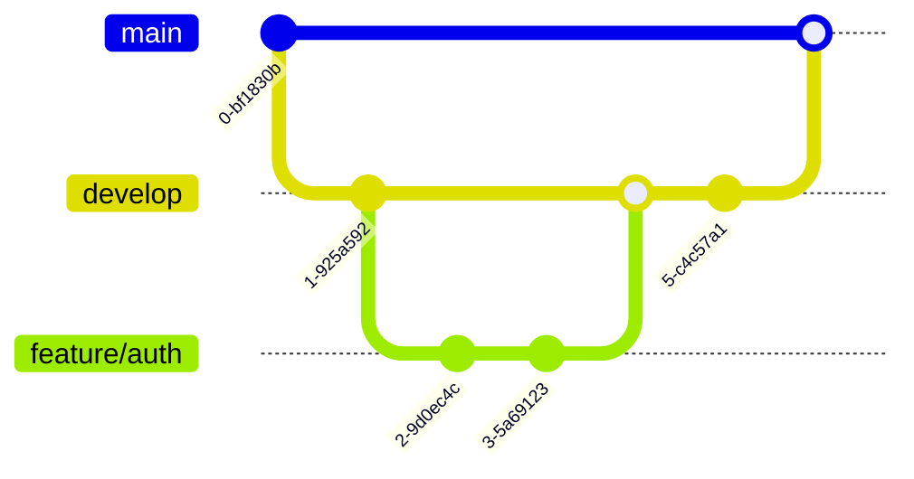

# QUY TRÌNH PHÁT TRIỂN & QUY ƯỚC LÀM VIỆC NHÓM
## Dự án Thương mại Điện tử Thời trang FoxStyle

Tài liệu này định nghĩa quy trình làm việc nhóm, tiêu chuẩn viết code, quy trình quản lý mã nguồn (Git) và các biểu mẫu đặc tả API, checklist kiểm thử nhằm giúp các thành viên phối hợp nhịp nhàng, đảm bảo chất lượng đồ án tốt nhất.

---

## PHẦN 1: QUY TRÌNH LÀM VIỆC VỚI GIT (GIT WORKFLOW)

Để tránh xung đột code (conflict) khi nhiều người cùng làm việc trên một kho lưu trữ (repository), nhóm cần tuân thủ mô hình phân nhánh Git sau:

### 1.1. Sơ đồ các nhánh Git
*   `main` (hoặc `master`): Nhánh chứa mã nguồn chạy ổn định nhất (Production-ready). Chỉ merge từ nhánh `develop` sau khi đã kiểm thử kỹ càng. Không thành viên nào được phép code trực tiếp trên nhánh này.
*   `develop`: Nhánh tích hợp chính của nhóm phát triển. Tất cả các nhánh tính năng sẽ được gộp về đây.
*   `feature/tên-tính-năng`: Nhánh được tạo ra từ `develop` để phát triển một tính năng cụ thể (ví dụ: `feature/auth-login`, `feature/cart-management`).
*   `bugfix/tên-lỗi`: Nhánh sửa lỗi phát sinh trong quá trình kiểm thử (ví dụ: `bugfix/checkout-total-price`).
*   `hotfix/tên-lỗi-gấp`: Nhánh sửa lỗi nghiêm trọng trực tiếp từ nhánh `main` khi dự án đã triển khai chạy thực tế.



---

### 1.2. Quy trình đẩy code lên Repository
1.  **Cập nhật code mới nhất trước khi làm việc:**
    ```bash
    git checkout develop
    git pull origin develop
    ```
2.  **Tạo nhánh mới từ `develop` để làm tính năng:**
    ```bash
    git checkout -b feature/auth-login
    ```
3.  **Lập trình và Commit cục bộ (Local Commit):**
    Hãy commit thường xuyên theo từng phần nhỏ hoàn thiện thay vì dồn tất cả code vào một commit lớn.
4.  **Kéo code mới nhất từ Remote và xử lý xung đột (nếu có):**
    Trước khi đẩy code lên, hãy đảm bảo nhánh của bạn không bị lệch so với `develop`:
    ```bash
    git pull origin develop
    ```
    *Nếu có xung đột (Conflict), các thành viên liên quan phải ngồi lại giải quyết trực tiếp trước khi ghi đè.*
5.  **Đẩy nhánh của bạn lên Remote Server:**
    ```bash
    git push origin feature/auth-login
    ```
6.  **Tạo Pull Request (PR):**
    *   Tạo PR trên GitHub/GitLab từ nhánh `feature/auth-login` sang `develop`.
    *   Chỉ định ít nhất 1 thành viên khác trong nhóm vào **Review Code**. Sau khi được đồng ý (Approve), PR mới được phép merge vào `develop`.

---

### 1.3. Quy ước viết thông điệp Commit (Commit Messages)
Nhóm thống nhất sử dụng chuẩn **Conventional Commits**:
> **Cấu trúc:** `loại(phạm vi): Mô tả ngắn bằng tiếng Việt không dấu hoặc tiếng Anh`

Các loại (type) commit được chấp nhận:
*   `feat`: Tính năng mới (ví dụ: `feat(auth): tích hợp đăng nhập bằng Google`)
*   `fix`: Sửa lỗi (ví dụ: `fix(cart): sửa lỗi tăng số lượng quá tồn kho`)
*   `docs`: Cập nhật tài liệu, hướng dẫn (ví dụ: `docs: cập nhật file readme cài đặt môi trường`)
*   `style`: Thay đổi giao diện, định dạng code mà không ảnh hưởng logic (ví dụ: `style(product-card): sửa lại viền button`)
*   `refactor`: Cơ cấu, tối ưu hóa lại mã nguồn (ví dụ: `refactor(order): tối ưu hàm tính tổng tiền đơn hàng`)
*   `test`: Viết thêm unit test hoặc kiểm thử tự động
*   `chore`: Các thay đổi nhỏ khác (ví dụ: cấu hình build, thêm thư viện vào package.json)

---

## PHẦN 2: QUY ƯỚC VIẾT CODE (CODING CONVENTIONS)

### 2.1. Quy ước viết code Backend (Java / Spring Boot)
*   **Quy tắc đặt tên:**
    *   **Class/Interface:** Viết theo dạng `UpperCamelCase` (ví dụ: `ProductVariantService`, `OrderRepository`).
    *   **Method/Variable:** Viết theo dạng `lowerCamelCase` (ví dụ: `calculateTotalPrice()`, `createdDate`).
    *   **Constant (Hằng số):** Viết theo dạng `UPPER_SNAKE_CASE` (ví dụ: `DEFAULT_PAGE_SIZE`, `JWT_EXPIRATION_TIME`).
*   **Quản lý ngoại lệ (Exception Handling):**
    *   Không được trả về lỗi hệ thống thô (Stack Trace) cho người dùng.
    *   Sử dụng `@RestControllerAdvice` và `@ExceptionHandler` để bắt tất cả các lỗi và trả về định dạng JSON chuẩn:
        ```json
        {
          "status": 400,
          "error": "Bad Request",
          "message": "Mã giảm giá đã hết hạn sử dụng",
          "timestamp": "2026-06-17T10:45:00"
        }
        ```
*   **Ghi log (Logging):** Không dùng `System.out.println()` để debug trên server. Hãy sử dụng annotation `@Slf4j` của Lombok và dùng các hàm `log.info()`, `log.warn()`, `log.error()` tương ứng.

---

### 2.2. Quy ước viết code Frontend (React / TypeScript)
*   **Không sử dụng kiểu dữ liệu `any`:** Luôn khai báo `interface` hoặc `type` cụ thể cho Props, State và dữ liệu trả về từ API.
*   **Tổ chức Components:** Mỗi Component nên nằm trong một thư mục riêng cùng với file style của nó (nếu có). Tránh viết các component quá dài (quá 300 dòng), hãy tách nhỏ thành các sub-components.
*   **Đặt tên file:**
    *   Các component dùng chung, trang: `UpperCamelCase` (ví dụ: `Header.tsx`, `CartPage.tsx`).
    *   Các hàm helper, API service: `lowerCamelCase` (ví dụ: `formatCurrency.ts`, `productApi.ts`).

---

## PHẦN 3: TÀI LIỆU MẪU ĐẶC TẢ CHI TIẾT REST API

Khi xây dựng API, bên viết Backend và bên viết Frontend cần thống nhất trước cấu trúc dữ liệu truyền nhận. Dưới đây là 2 biểu mẫu đặc tả API cốt lõi nhất của dự án:

### 3.1. API Đăng nhập hệ thống (Authentication)
*   **URL:** `/api/auth/login`
*   **Method:** `POST`
*   **Mô tả:** Người dùng gửi tên đăng nhập và mật khẩu để lấy mã thông báo JWT.
*   **Dữ liệu gửi lên (Request Body):**
    ```json
    {
      "username": "customer_demo",
      "password": "my_secure_password"
    }
    ```
*   **Dữ liệu trả về khi thành công (Response Body - 200 OK):**
    ```json
    {
      "status": "success",
      "message": "Đăng nhập thành công",
      "accessToken": "eyJhbGciOiJIUzI1NiIsInR5cCI6IkpXVCJ9.eyJ1c2VySWQi...",
      "user": {
        "userId": 3,
        "username": "customer_demo",
        "fullName": "Nguyễn Văn Khách Hàng",
        "role": "ROLE_CUSTOMER"
      }
    }
    ```
*   **Lỗi thường gặp (Response - 401 Unauthorized):**
    ```json
    {
      "status": "error",
      "message": "Tên đăng nhập hoặc mật khẩu không chính xác"
    }
    ```

### 3.2. API Tạo liên kết thanh toán PayOS (Checkout)
*   **URL:** `/api/orders/checkout`
*   **Method:** `POST`
*   **Mô tả:** Tạo đơn hàng và sinh link quét mã QR PayOS để khách chuyển khoản ngân hàng.
*   **Dữ liệu gửi lên (Request Body):**
    ```json
    {
      "recipientName": "Nguyễn Văn Khách Hàng",
      "recipientPhone": "0334455667",
      "shippingAddress": "123 Đường Nguyễn Huệ, Phường Bến Nghé, Quận 1, TP Hồ Chí Minh",
      "couponCode": "FOXSTYLE50",
      "cartItems": [
        {
          "variantId": 2,
          "quantity": 2
        }
      ]
    }
    ```
*   **Dữ liệu trả về thành công (Response Body - 201 Created):**
    ```json
    {
      "status": "success",
      "orderId": 1,
      "totalAmount": 378000.00,
      "paymentUrl": "https://pay.payos.vn/web/a1b2c3d4e5f6..." -- Link FE dùng để chuyển hướng khách quét mã QR
    }
    ```

---

## PHẦN 4: CHECKLIST KIỂM THỬ HỆ THỐNG (TEST CASES)

Tất cả các thành viên phải tự kiểm thử tính năng của mình theo checklist này trước khi báo cáo kết quả tiến độ trong các buổi họp nhóm:

| ID | Chức năng kiểm thử | Các bước thực hiện | Kết quả mong đợi |
|---|---|---|---|
| **TC-01** | Đăng ký tài khoản mới | 1. Vào trang đăng ký.<br>2. Nhập thông tin hợp lệ.<br>3. Bấm Đăng ký. | Tài khoản được lưu vào database với mật khẩu đã mã hóa Bcrypt. Chuyển hướng sang trang Login. |
| **TC-02** | Ràng buộc trùng lặp | Đăng ký với Email đã tồn tại trong DB. | Hệ thống báo lỗi "Email này đã được sử dụng" (Mã lỗi 400). |
| **TC-03** | Bảo vệ Route Admin | Truy cập trực tiếp link `/admin/products` khi chưa đăng nhập hoặc đăng nhập bằng tài khoản Customer. | Chuyển hướng về trang `/login` hoặc báo lỗi không đủ quyền truy cập (Mã lỗi 403). |
| **TC-04** | Thêm biến thể vào giỏ | 1. Vào chi tiết sản phẩm.<br>2. Chọn Màu sắc, Size.<br>3. Bấm Thêm giỏ hàng. | Icon giỏ hàng trên Header tự động tăng số lượng. Tải lại giỏ hàng thấy đúng Màu và Size đã chọn. |
| **TC-05** | Áp dụng Coupon | Nhập mã `FOXSTYLE50` cho đơn hàng 100k (Dưới giá trị đơn tối thiểu 200k). | Hệ thống thông báo lỗi "Đơn hàng chưa đạt giá trị tối thiểu". Tổng tiền giữ nguyên. |
| **TC-06** | Thanh toán tự động | 1. Điền thông tin giao hàng.<br>2. Bấm Đặt hàng.<br>3. Chuyển khoản qua mã QR PayOS. | Nhận tín hiệu Webhook từ PayOS. Đơn hàng tự động chuyển từ trạng thái "Chờ duyệt" sang "Đã duyệt/Đã thanh toán". |
