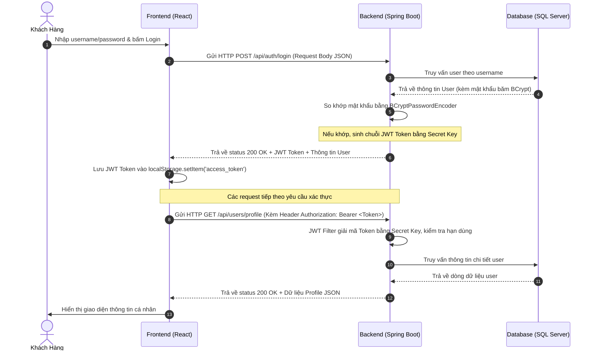
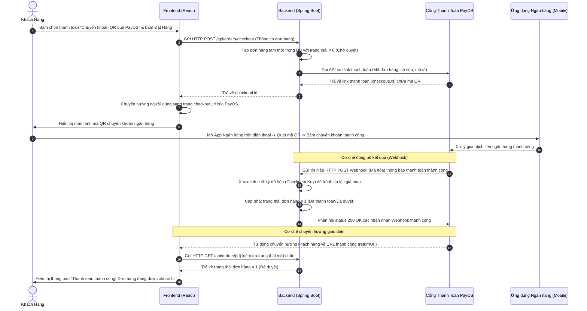

# ĐẶC TẢ THIẾT KẾ KỸ THUẬT HỆ THỐNG FOXSTYLE
## Kiến trúc Hệ thống, Từ điển Dữ liệu & Luồng Nghiệp vụ Cốt lõi

Tài liệu này đặc tả chi tiết kiến trúc phần mềm, cấu trúc dữ liệu vật lý dưới dạng từ điển dữ liệu (Data Dictionary), và các luồng xử lý kỹ thuật quan trọng của hệ thống **FoxStyle**. Tài liệu được chuẩn hóa để sử dụng trực tiếp trong cuốn báo cáo Đồ án tốt nghiệp (DATN).

---

## PHẦN 1: KIẾN TRÚC HỆ THỐNG (SYSTEM ARCHITECTURE)

Hệ thống được thiết kế theo mô hình **Kiến trúc 3 lớp (Three-Tier Architecture)** kết hợp cơ chế giao tiếp qua **RESTful Web API** nhằm đảm bảo tính độc lập, dễ bảo trì và mở rộng:

```
┌────────────────────────────────────────────────────────┐
│           CLIENT TIER / PRESENTATION LAYER             │
│   (React SPA, Vite, Axios Client, Tailwind CSS)        │
└──────────────────────────┬─────────────────────────────┘
                           │ Requests (HTTP/JSON + JWT)
                           ▼ Responses (JSON Data)
┌────────────────────────────────────────────────────────┐
│           APPLICATION TIER / BUSINESS LOGIC            │
│   (Spring Boot, Spring Security, Data JPA, Lombok)      │
└──────────────────────────┬─────────────────────────────┘
                           │ SQL Queries / Entity Mapping
                           ▼ Data Rows
┌────────────────────────────────────────────────────────┐
│                DATABASE TIER / DATA LAYER              │
│                 (Microsoft SQL Server)                 │
└────────────────────────────────────────────────────────┘
```

1.  **Presentation Layer (Frontend):** Ứng dụng Single Page Application (SPA) xây dựng trên nền tảng **React**, kết hợp thư viện styling **Tailwind CSS** để mang lại giao diện tối ưu. Sử dụng **Axios** làm HTTP Client giao tiếp bất đồng bộ với Backend.
2.  **Business Logic Layer (Backend):** Sử dụng framework **Spring Boot** (Java). Tầng này chịu trách nhiệm xử lý logic nghiệp vụ, quản lý phiên làm việc thông qua **Spring Security + JWT**, kiểm tra ràng buộc nghiệp vụ và điều phối thanh toán.
3.  **Data Layer (Database):** Hệ quản trị cơ sở dữ liệu quan hệ **Microsoft SQL Server**, lưu trữ toàn bộ thông tin người dùng, sản phẩm, giỏ hàng, đơn hàng và các giao dịch.

---

## PHẦN 2: TỪ ĐIỂN DỮ LIỆU CHI TIẾT (DATA DICTIONARY)

Dưới đây là mô tả chi tiết kiểu dữ liệu, các khóa, ràng buộc và ý nghĩa của toàn bộ 17 bảng trong cơ sở dữ liệu `foxstyle_db`:

### 2.1. Bảng `roles` (Quyền hạn)
| Tên cột | Kiểu dữ liệu | Khóa | Ràng buộc | Ý nghĩa |
| :--- | :--- | :---: | :--- | :--- |
| `role_id` | `INT` | PK | IDENTITY(1,1), NOT NULL | Mã định danh quyền hạn hệ thống |
| `role_name` | `VARCHAR(50)` | | UNIQUE, NOT NULL | Tên quyền (ROLE_ADMIN, ROLE_CUSTOMER...) |
| `description` | `NVARCHAR(255)` | | NULL | Mô tả chi tiết vai trò bằng tiếng Việt |

### 2.2. Bảng `users` (Tài khoản người dùng)
| Tên cột | Kiểu dữ liệu | Khóa | Ràng buộc | Ý nghĩa |
| :--- | :--- | :---: | :--- | :--- |
| `user_id` | `INT` | PK | IDENTITY(1,1), NOT NULL | Mã định danh người dùng |
| `role_id` | `INT` | FK | REFERENCES roles(role_id), NOT NULL | Liên kết nhóm quyền hạn |
| `username` | `VARCHAR(50)` | | UNIQUE, NOT NULL | Tên đăng nhập hệ thống |
| `password` | `VARCHAR(255)` | | NOT NULL | Mật khẩu (đã mã hóa BCrypt) |
| `full_name` | `NVARCHAR(100)` | | NOT NULL | Họ và tên người dùng |
| `email` | `VARCHAR(100)` | | UNIQUE, NOT NULL | Địa chỉ Email đăng ký |
| `phone` | `VARCHAR(15)` | | NULL | Số điện thoại liên lạc |
| `status` | `TINYINT` | | DEFAULT 1, CHECK (0, 1), NOT NULL | Trạng thái (0: Bị khóa, 1: Hoạt động) |

### 2.3. Bảng `user_addresses` (Sổ địa chỉ giao hàng)
| Tên cột | Kiểu dữ liệu | Khóa | Ràng buộc | Ý nghĩa |
| :--- | :--- | :---: | :--- | :--- |
| `address_id` | `INT` | PK | IDENTITY(1,1), NOT NULL | Mã định danh địa chỉ nhận hàng |
| `user_id` | `INT` | FK | REFERENCES users(user_id) ON DELETE CASCADE | Chủ sở hữu địa chỉ |
| `recipient_name`| `NVARCHAR(100)`| | NOT NULL | Tên người nhận hàng |
| `phone` | `VARCHAR(15)` | | NOT NULL | Số điện thoại nhận hàng |
| `province` | `NVARCHAR(100)`| | NOT NULL | Tỉnh/Thành phố |
| `district` | `NVARCHAR(100)`| | NOT NULL | Quận/Huyện |
| `ward` | `NVARCHAR(100)`| | NOT NULL | Phường/Xã |
| `detail_address`| `NVARCHAR(255)`| | NOT NULL | Số nhà, ngõ ngách, tên đường cụ thể |
| `is_default` | `BIT` | | DEFAULT 0, NOT NULL | Đánh dấu địa chỉ mặc định (1: Đúng, 0: Sai) |

### 2.4. Bảng `categories` (Danh mục thời trang)
| Tên cột | Kiểu dữ liệu | Khóa | Ràng buộc | Ý nghĩa |
| :--- | :--- | :---: | :--- | :--- |
| `category_id` | `INT` | PK | IDENTITY(1,1), NOT NULL | Mã định danh danh mục |
| `category_name`| `NVARCHAR(100)`| | NOT NULL | Tên danh mục (Áo thun, Quần Jeans...) |
| `description` | `NVARCHAR(MAX)`| | NULL | Mô tả thêm về danh mục |
| `status` | `TINYINT` | | DEFAULT 1, CHECK (0, 1), NOT NULL | Trạng thái (0: Ẩn, 1: Hiển thị trên menu) |

### 2.5. Bảng `products` (Thông tin cơ bản sản phẩm)
| Tên cột | Kiểu dữ liệu | Khóa | Ràng buộc | Ý nghĩa |
| :--- | :--- | :---: | :--- | :--- |
| `product_id` | `INT` | PK | IDENTITY(1,1), NOT NULL | Mã định danh sản phẩm |
| `category_id` | `INT` | FK | REFERENCES categories(category_id), NOT NULL | Thuộc danh mục thời trang nào |
| `product_name` | `NVARCHAR(150)`| | NOT NULL | Tên đầy đủ của sản phẩm |
| `price` | `DECIMAL(12,2)`| | CHECK (>= 0), NOT NULL | Giá bán thực tế hiện tại |
| `original_price`| `DECIMAL(12,2)`| | CHECK (>= 0), NULL | Giá bán gốc ban đầu chưa giảm |
| `description` | `NVARCHAR(MAX)`| | NULL | Bài viết chi tiết mô tả sản phẩm |
| `image_url` | `VARCHAR(255)` | | NULL | Đường dẫn ảnh đại diện sản phẩm |
| `material` | `NVARCHAR(100)`| | NULL | Chất liệu vải |
| `origin` | `NVARCHAR(100)`| | NULL | Xuất xứ sản xuất |
| `status` | `TINYINT` | | DEFAULT 1, CHECK (0, 1), NOT NULL | Trạng thái kinh doanh (0: Ngừng, 1: Đang bán) |

### 2.6. Bảng `product_variants` (Biến thể sản phẩm: Màu sắc & Kích thước)
| Tên cột | Kiểu dữ liệu | Khóa | Ràng buộc | Ý nghĩa |
| :--- | :--- | :---: | :--- | :--- |
| `variant_id` | `INT` | PK | IDENTITY(1,1), NOT NULL | Mã định danh biến thể sản phẩm |
| `product_id` | `INT` | FK | REFERENCES products(product_id) ON DELETE CASCADE | Thuộc sản phẩm chính nào |
| `color` | `NVARCHAR(50)` | | NOT NULL | Tên màu sắc (Đen, Trắng...) |
| `size` | `VARCHAR(20)` | | NOT NULL | Kích thước/Size (S, M, L, XL, 30, 31...) |
| `quantity` | `INT` | | DEFAULT 0, CHECK (>= 0), NOT NULL | Số lượng tồn kho của biến thể cụ thể này |
| `sku` | `VARCHAR(100)` | | NULL | Mã định danh tồn kho (SKU) để quét mã vạch |

### 2.7. Bảng `product_images` (Bộ sưu tập hình ảnh sản phẩm)
| Tên cột | Kiểu dữ liệu | Khóa | Ràng buộc | Ý nghĩa |
| :--- | :--- | :---: | :--- | :--- |
| `image_id` | `INT` | PK | IDENTITY(1,1), NOT NULL | Mã định danh hình ảnh phụ |
| `product_id` | `INT` | FK | REFERENCES products(product_id) ON DELETE CASCADE | Thuộc sản phẩm chính nào |
| `image_url` | `VARCHAR(255)` | | NOT NULL | Đường dẫn URL hình ảnh chi tiết |
| `is_primary` | `BIT` | | DEFAULT 0, NOT NULL | 1: Ảnh đại diện chính, 0: Ảnh chi tiết phụ |
| `display_order`| `INT` | | DEFAULT 1, NOT NULL | Thứ tự sắp xếp hiển thị ảnh trên UI |

### 2.8. Bảng `carts` (Giỏ hàng người dùng)
| Tên cột | Kiểu dữ liệu | Khóa | Ràng buộc | Ý nghĩa |
| :--- | :--- | :---: | :--- | :--- |
| `cart_id` | `INT` | PK | IDENTITY(1,1), NOT NULL | Mã định danh giỏ hàng |
| `user_id` | `INT` | FK | REFERENCES users(user_id) ON DELETE CASCADE, UNIQUE | Chủ sở hữu giỏ hàng |

### 2.9. Bảng `cart_details` (Chi tiết giỏ hàng)
| Tên cột | Kiểu dữ liệu | Khóa | Ràng buộc | Ý nghĩa |
| :--- | :--- | :---: | :--- | :--- |
| `cart_detail_id`| `INT` | PK | IDENTITY(1,1), NOT NULL | Mã định danh dòng giỏ hàng |
| `cart_id` | `INT` | FK | REFERENCES carts(cart_id) ON DELETE CASCADE | Thuộc giỏ hàng của ai |
| `variant_id` | `INT` | FK | REFERENCES product_variants(variant_id) ON DELETE CASCADE | Biến thể sản phẩm cụ thể chọn mua |
| `quantity` | `INT` | | CHECK (> 0), NOT NULL | Số lượng chọn mua |

### 2.10. Bảng `coupons` (Mã giảm giá/Khuyến mãi)
| Tên cột | Kiểu dữ liệu | Khóa | Ràng buộc | Ý nghĩa |
| :--- | :--- | :---: | :--- | :--- |
| `coupon_id` | `INT` | PK | IDENTITY(1,1), NOT NULL | Mã định danh coupon |
| `coupon_code` | `VARCHAR(50)` | | UNIQUE, NOT NULL | Mã chữ áp dụng (VD: FOXSTYLE50) |
| `discount_type`| `TINYINT` | | CHECK (1, 2), NOT NULL | Loại giảm: 1-Số tiền cố định, 2-Phần trăm (%) |
| `discount_value`| `DECIMAL(12,2)`| | CHECK (> 0), NOT NULL | Giá trị giảm |
| `min_order_value`| `DECIMAL(12,2)`| | DEFAULT 0, CHECK (>= 0), NOT NULL | Giá trị đơn tối thiểu để dùng mã |
| `max_discount_value`| `DECIMAL(12,2)`| | CHECK (>= 0), NULL | Số tiền giảm tối đa (nếu giảm theo %) |
| `start_date` | `DATETIME` | | NOT NULL | Ngày bắt đầu áp dụng mã |
| `end_date` | `DATETIME` | | CHECK (>= start_date), NOT NULL | Ngày hết hạn mã |
| `usage_limit` | `INT` | | DEFAULT 100, CHECK (>= 0), NOT NULL | Tổng lượt dùng tối đa phát hành |
| `used_count` | `INT` | | DEFAULT 0, CHECK (<= usage_limit), NOT NULL | Số lượng đã thực tế được sử dụng |
| `status` | `TINYINT` | | DEFAULT 1, CHECK (0, 1), NOT NULL | Trạng thái: 0-Khóa/Hết hạn, 1-Hoạt động |

### 2.11. Bảng `orders` (Quản lý đơn đặt hàng)
| Tên cột | Kiểu dữ liệu | Khóa | Ràng buộc | Ý nghĩa |
| :--- | :--- | :---: | :--- | :--- |
| `order_id` | `INT` | PK | IDENTITY(1,1), NOT NULL | Mã hóa đơn/đơn hàng |
| `user_id` | `INT` | FK | REFERENCES users(user_id), NOT NULL | Tài khoản đặt hàng |
| `order_date` | `DATETIME` | | DEFAULT GETDATE(), NOT NULL | Ngày giờ đặt mua |
| `total_amount` | `DECIMAL(12,2)`| | CHECK (>= 0), NOT NULL | Số tiền thực tế khách phải trả cuối cùng |
| `discount_amount`| `DECIMAL(12,2)`| | DEFAULT 0, CHECK (>= 0), NOT NULL | Số tiền được giảm giá |
| `shipping_fee` | `DECIMAL(12,2)`| | DEFAULT 0, CHECK (>= 0), NOT NULL | Chi phí vận chuyển |
| `recipient_name`| `NVARCHAR(100)`| | NOT NULL | Tên người nhận |
| `recipient_phone`| `VARCHAR(15)` | | NOT NULL | SĐT người nhận |
| `shipping_address`| `NVARCHAR(255)`| | NOT NULL | Địa chỉ nhận hàng chi tiết |
| `status` | `TINYINT` | | DEFAULT 0, CHECK (0->4), NOT NULL | Trạng thái: 0-Chờ, 1-Duyệt, 2-Giao, 3-Đã giao, 4-Hủy |
| `coupon_id` | `INT` | FK | REFERENCES coupons(coupon_id), NULL | Mã giảm giá được áp dụng |

### 2.12. Bảng `order_details` (Chi tiết đơn hàng)
| Tên cột | Kiểu dữ liệu | Khóa | Ràng buộc | Ý nghĩa |
| :--- | :--- | :---: | :--- | :--- |
| `order_detail_id`| `INT` | PK | IDENTITY(1,1), NOT NULL | Mã chi tiết dòng hóa đơn |
| `order_id` | `INT` | FK | REFERENCES orders(order_id) ON DELETE CASCADE | Thuộc hóa đơn nào |
| `variant_id` | `INT` | FK | REFERENCES product_variants(variant_id), NOT NULL | Biến thể sản phẩm được mua |
| `quantity` | `INT` | | CHECK (> 0), NOT NULL | Số lượng chốt mua |
| `price` | `DECIMAL(12,2)`| | CHECK (>= 0), NOT NULL | Đơn giá bán tại thời điểm chốt đơn |

### 2.13. Bảng `payments` (Thông tin thanh toán hóa đơn)
| Tên cột | Kiểu dữ liệu | Khóa | Ràng buộc | Ý nghĩa |
| :--- | :--- | :---: | :--- | :--- |
| `payment_id` | `INT` | PK | IDENTITY(1,1), NOT NULL | Mã định danh giao dịch thanh toán |
| `order_id` | `INT` | FK | REFERENCES orders(order_id) ON DELETE CASCADE | Thanh toán cho đơn hàng nào |
| `payment_method`| `NVARCHAR(50)`| | NOT NULL | Ví dụ: COD, VNPay, MoMo, PayOS |
| `payment_status`| `TINYINT` | | DEFAULT 0, CHECK (0->2), NOT NULL | Trạng thái: 0-Chưa trả, 1-Đã trả, 2-Hoàn tiền/Lỗi |
| `transaction_id`| `VARCHAR(100)` | | NULL | Mã tham chiếu giao dịch cổng thanh toán đối tác |
| `payment_date` | `DATETIME` | | DEFAULT GETDATE(), NOT NULL | Thời điểm thanh toán |
| `amount` | `DECIMAL(12,2)`| | CHECK (>= 0), NOT NULL | Số tiền thanh toán |

### 2.14. Bảng `wishlists` (Sản phẩm yêu thích)
| Tên cột | Kiểu dữ liệu | Khóa | Ràng buộc | Ý nghĩa |
| :--- | :--- | :---: | :--- | :--- |
| `wishlist_id` | `INT` | PK | IDENTITY(1,1), NOT NULL | Mã yêu thích |
| `user_id` | `INT` | FK | REFERENCES users(user_id) ON DELETE CASCADE | Người dùng thả tim |
| `product_id` | `INT` | FK | REFERENCES products(product_id) ON DELETE CASCADE | Sản phẩm chính được yêu thích |
| `added_date` | `DATETIME` | | DEFAULT GETDATE(), NOT NULL | Ngày thêm vào mục yêu thích |

### 2.15. Bảng `reviews` (Đánh giá nhận xét)
| Tên cột | Kiểu dữ liệu | Khóa | Ràng buộc | Ý nghĩa |
| :--- | :--- | :---: | :--- | :--- |
| `review_id` | `INT` | PK | IDENTITY(1,1), NOT NULL | Mã đánh giá |
| `user_id` | `INT` | FK | REFERENCES users(user_id) ON DELETE CASCADE | Khách hàng viết nhận xét |
| `product_id` | `INT` | FK | REFERENCES products(product_id) ON DELETE CASCADE | Sản phẩm nhận đánh giá |
| `rating` | `TINYINT` | | CHECK (1 BETWEEN 5), NOT NULL | Điểm số sao đánh giá (1-5 sao) |
| `comment` | `NVARCHAR(MAX)`| | NULL | Nội dung đánh giá |
| `review_date` | `DATETIME` | | DEFAULT GETDATE(), NOT NULL | Ngày viết đánh giá |

### 2.16. Bảng `banners` (Ảnh slide trang chủ)
| Tên cột | Kiểu dữ liệu | Khóa | Ràng buộc | Ý nghĩa |
| :--- | :--- | :---: | :--- | :--- |
| `banner_id` | `INT` | PK | IDENTITY(1,1), NOT NULL | Mã quản lý banner |
| `title` | `NVARCHAR(150)`| | NOT NULL | Tiêu đề chiến dịch banner |
| `image_url` | `VARCHAR(255)` | | NOT NULL | Đường link dẫn ảnh thiết kế |
| `link_url` | `VARCHAR(255)` | | NULL | Đường dẫn khi khách click vào banner |
| `position` | `INT` | | DEFAULT 1, NOT NULL | Vị trí thứ tự hiển thị ưu tiên |
| `status` | `TINYINT` | | DEFAULT 1, CHECK (0, 1), NOT NULL | Trạng thái hiển thị (0: Ẩn, 1: Hiện) |

### 2.17. Bảng `user_coupons` (Lịch sử sử dụng Coupon của User)
| Tên cột | Kiểu dữ liệu | Khóa | Ràng buộc | Ý nghĩa |
| :--- | :--- | :---: | :--- | :--- |
| `user_id` | `INT` | PK, FK | REFERENCES users(user_id) ON DELETE CASCADE | Khách hàng áp dụng mã |
| `coupon_id` | `INT` | PK, FK | REFERENCES coupons(coupon_id) ON DELETE CASCADE | Mã giảm giá đã dùng |
| `used_at` | `DATETIME` | | DEFAULT GETDATE(), NOT NULL | Thời điểm dùng mã |
| `order_id` | `INT` | FK | REFERENCES orders(order_id), NOT NULL | Áp dụng cho đơn hàng nào |

---

## PHẦN 3: ĐẶC TẢ LUỒNG NGHIỆP VỤ CỐT LÕI (CORE BUSINESS FLOWS)

### 3.1. Luồng Xác thực & Cấp quyền với JWT (Authentication & Authorization Flow)
Mô tả quy trình người dùng gửi thông tin đăng nhập, nhận JWT Token và sử dụng Token đó để truy cập các tài nguyên được bảo mật (Ví dụ: xem thông tin tài khoản):



---

### 3.2. Luồng Thanh toán quét mã VietQR tự động qua PayOS (PayOS QR Flow)
Mô tả quy trình khách hàng thực hiện thanh toán trực tuyến bằng quét mã QR của ngân hàng. Hệ thống tự động đồng bộ trạng thái đơn thông qua cổng thanh toán PayOS:



---

## PHẦN 4: PHƯƠNG ÁN TRIỂN KHAI HỆ THỐNG (DEPLOYMENT STRATEGY)

Để chạy thử nghiệm thực tế phục vụ buổi bảo vệ đồ án tốt nghiệp, nhóm có thể tham khảo mô hình phân tách hạ tầng hoàn toàn miễn phí sau:

1.  **Frontend (React):** Triển khai lên dịch vụ **Vercel** hoặc **Netlify**.
    *   *Cách làm:* Liên kết dự án GitHub của bạn trực tiếp với Vercel, cấu hình biến môi trường `VITE_API_URL` trỏ về API Backend của bạn trên cloud. Vercel sẽ tự động build mỗi khi bạn push code mới lên nhánh `main`.
2.  **Backend (Spring Boot Web API):** Triển khai lên cloud hosting như **Railway**, **Render**, hoặc **VPS cá nhân**.
    *   *Cách làm:* Đóng gói dự án Spring Boot thành file `.jar` hoặc viết file `Dockerfile` để deploy. Cung cấp các biến môi trường cấu hình DB và PayOS tương ứng.
3.  **Database (SQL Server):** Triển khai lên dịch vụ hosting SQL Server đám mây (ví dụ: Azure SQL Database bản free trial, hoặc cài đặt trực tiếp SQL Server trên máy chủ ảo VPS Linux/Windows chạy Docker).
