# TÀI LIỆU THIẾT KẾ CẤU TRÚC PHẦN MỀM (SOFTWARE ARCHITECTURE DESIGN)
## Dự án: Hệ thống Thương mại Điện tử Thời trang FoxStyle
**Mã dự án:** FOXSTYLE-DATN  
**Ngày cập nhật:** 31/07/2026  
**Trạng thái:** TÀI LIỆU CHÍNH THỨC  

---

## MỤC LỤC
- [CHƯƠNG 1: MÔ HÌNH KIẾN TRÚC PHẦN MỀM TỔNG THỂ (OVERALL SOFTWARE ARCHITECTURE)](#chương-1-mô-hình-kiến-trúc-phần-mềm-tổng-thể-overall-software-architecture)
  - [1.1. Kiến trúc Tách biệt (Decoupled System Architecture)](#11-kiến-trúc-tách-biệt-decoupled-system-architecture)
  - [1.2. Sơ đồ Kiến trúc Phần mềm Tổng thể](#12-sơ-đồ-kiến-trúc-phần-mềm-tổng-thể)
- [CHƯƠNG 2: CẤU TRÚC MÃ NGUỒN VÀ PHÂN CẤP MODULE (PROJECT MODULE STRUCTURE)](#chương-2-cấu-trúc-mã-nguồn-và-phân-cấp-module-project-module-structure)
  - [2.1. Cấu trúc Thư mục Backend Java Spring Boot (`DATN-BE`)](#21-cấu-trúc-thư-mục-backend-java-spring-boot-datn-be)
  - [2.2. Cấu trúc Thư mục Frontend React SPA (`DATN-FE`)](#22-cấu-trúc-thư-mục-frontend-react-spa-datn-fe)
- [CHƯƠNG 3: MÔ HÌNH THIẾT KẾ VÀ QUY TRÌNH LUÂN CHUYỂN DỮ LIỆU (DESIGN PATTERNS & DFD)](#chương-3-mô-hình-thiết-kế-và-quy-trình-luân-chuyển-dữ-liệu-design-patterns--dfd)
  - [3.1. Các Mẫu Thiết kế Phần mềm Áp dụng (Design Patterns)](#31-các-mẫu-thiết-kế-phần-mềm-áp-dụng-design-patterns)
  - [3.2. Sơ đồ Luồng Dữ liệu Hệ thống (Data Flow Diagram - DFD Level 0 & Level 1)](#32-sơ-đồ-luồng-dữ-liệu-hệ-thống-data-flow-diagram---dfd-level-0--level-1)
- [CHƯƠNG 4: TIÊU CHUẨN THIẾT KẾ RESTFUL API & XỬ LÝ LỖI (API STANDARDS & EXCEPTION HANDLING)](#chương-4-tiêu-chuẩn-thiết-kế-restful-api--xử-lý-lỗi-api-standards--exception-handling)
  - [4.1. Tiêu chuẩn Thiết kế RESTful API (REST API Guidelines)](#41-tiêu-chuẩn-thiết-kế-restful-api-rest-api-guidelines)
  - [4.2. Cơ chế Xử lý Ngoại lệ Tập trung (Global Exception Handling)](#42-cơ-chế-xử-lý-ngoại-lệ-tập-trung-global-exception-handling)

---

## CHƯƠNG 1: MÔ HÌNH KIẾN TRÚC PHẦN MỀM TỔNG THỂ (OVERALL SOFTWARE ARCHITECTURE)

### 1.1. Kiến trúc Tách biệt (Decoupled System Architecture)

Dự án **FoxStyle Fashion Store** được thiết kế theo mô hình kiến trúc phần mềm tách biệt hoàn toàn (**Decoupled Architecture / Headless Frontend & RESTful Backend**). Mô hình này chia ứng dụng thành 3 thành phần chính hoạt động độc lập:

1. **Frontend Client App (Single Page Application - SPA):**
   - Xây dựng trên nền **React 18 / Vite 6 / TailwindCSS 4 / Radix UI**.
   - Chạy hoàn toàn trên trình duyệt người dùng, chịu trách nhiệm render giao diện động, quản lý State và thực hiện gọi HTTP RESTful API bất đồng bộ (Asynchronous AJAX/Fetch API).

2. **Backend API Service (RESTful Micro-service ready):**
   - Xây dựng trên nền **Java 17 / Spring Boot 3.2.5 / Spring Security**.
   - Cung cấp các Endpoint RESTful phản hồi dữ liệu dạng JSON. Đảm nhận toàn bộ nghiệp vụ kiểm tra tồn kho, tính toán tiền hàng, quản lý giao dịch `@Transactional`, phát hành JWT Token và xử lý Webhook.

3. **Database & External Services (Tầng Dữ liệu & Dịch vụ ngoài):**
   - CSDL **Microsoft SQL Server** với 43 bảng dữ liệu chuẩn hóa 3NF.
   - Các dịch vụ tích hợp bên ngoài: Cổng thanh toán **PayOS** (Mã QR VietQR & Webhook đối soát), **Google OAuth2** (Đăng nhập SSO), **Gmail SMTP** (Gửi mail xác nhận đơn/OTP) và **Cloudinary** (Lưu trữ hình ảnh cloud).

---

### 1.2. Sơ đồ Kiến trúc Phần mềm Tổng thể

```mermaid
flowchart TD
    subgraph FrontendApp ["🖥️ FRONTEND CLIENT (React 18 / Vite 6)"]
        StorefrontUI["Storefront SPA (User / Customer)"]
        AdminPortalUI["Admin & Staff Portal SPA"]
        StateMgmt["React Context & State Management"]
        AxiosClient["Axios HTTP Client / REST Service"]
        
        StorefrontUI --> StateMgmt
        AdminPortalUI --> StateMgmt
        StateMgmt --> AxiosClient
    end

    subgraph RESTBoundary ["🌐 RESTful API BOUNDARY (HTTPS / JSON)"]
        JWTSecurity["Spring Security & JWT Filter"]
        APIRouter["Spring Web REST Controllers"]
    end

    subgraph BackendApp ["⚙️ BACKEND SERVICE (Spring Boot 3.2.5 / Java 17)"]
        AuthModule["Auth & User Module"]
        ProductModule["Product & Variant Module"]
        OrderModule["Order & Cart Module"]
        PaymentModule["PayOS Payment Integration Module"]
        MailModule["Asynchronous Mail Notification Module"]

        JWTSecurity --> APIRouter
        APIRouter --> AuthModule
        APIRouter --> ProductModule
        APIRouter --> OrderModule
        APIRouter --> PaymentModule
        OrderModule --> MailModule
    end

    subgraph DataStore ["💾 DATA & EXTERNAL SERVICES"]
        MSSQLDB[("MS SQL Server (43 Tables)")]
        PayOSGateway["PayOS Payment Gateway"]
        GoogleOAuth["Google OAuth2 API"]
        CloudinaryCloud["Cloudinary Media Cloud"]
        SMTPMail["Gmail SMTP Mail Server"]
    end

    AxiosClient -->|JSON Payload / JWT Header| RESTBoundary
    
    AuthModule --> GoogleOAuth
    ProductModule --> CloudinaryCloud
    PaymentModule <--> PayOSGateway
    MailModule --> SMTPMail

    AuthModule --> MSSQLDB
    ProductModule --> MSSQLDB
    OrderModule --> MSSQLDB
    PaymentModule --> MSSQLDB
```



---

## CHƯƠNG 2: CẤU TRÚC MÃ NGUỒN VÀ PHÂN CẤP MODULE (PROJECT MODULE STRUCTURE)

### 2.1. Cấu trúc Thư mục Backend Java Spring Boot (`DATN-BE`)

Mã nguồn Backend được phân bổ theo quy chuẩn Java Package Naming Standard:

```
DATN-BE/src/main/java/com/foxstyle/api/
├── ApiApplication.java                # Main Spring Boot Application Entry Point
├── config/                            # Khai báo Spring Bean & Configuration
│   ├── CorsConfig.java                # Cấu hình CORS Whitelist Domains
│   ├── OpenApiConfig.java             # Cấu hình Swagger / Springdoc UI
│   ├── PayOSConfig.java               # Cấu hình PayOS Client ID & Checksum Key
│   ├── SecurityConfig.java            # Cấu hình Spring Security & Filter Chain
│   └── AsyncMailConfig.java           # Cấu hình ThreadPoolTaskExecutor cho Mail
├── controller/                        # 18 REST Controllers (API Endpoints)
│   ├── AuthController.java            # Đăng ký, Đăng nhập Local/Google, OTP
│   ├── ProductController.java         # Lọc, Tìm kiếm, Thêm/Sửa Sản phẩm
│   ├── OrderController.java           # Đặt hàng, Hủy đơn, Duyệt tiến trình
│   ├── PaymentController.java         # Thanh toán PayOS QR & Webhook Handler
│   ├── CartController.java            # Quản lý Giỏ hàng & Biến thể
│   ├── CouponController.java          # Áp dụng & Quản lý Coupon
│   └── UserController.java            # Quản lý Hồ sơ, Sổ địa chỉ, Khóa User
├── dto/                               # Data Transfer Objects (Request/Response)
│   ├── request/                       # DTOs chứa dữ liệu đầu vào từ Client
│   └── response/                      # DTOs chứa dữ liệu đầu ra JSON
├── entity/                            # 30 JPA Entities ánh xạ CSDL SQL Server
│   ├── User.java                      # Bảng users
│   ├── Product.java                   # Bảng products
│   ├── ProductVariant.java            # Bảng product_variants (Size/Màu/SKU/Tồn)
│   ├── Order.java                     # Bảng orders
│   └── Payment.java                   # Bảng payments
├── exception/                         # Xử lý Ngoại lệ Tập trung
│   ├── GlobalExceptionHandler.java    # Controller Advice bắt ngoại lệ tự động
│   └── ResourceNotFoundException.java # Ngoại lệ Custom lỗi 404
├── repository/                        # 30 JPA Data Repositories
│   ├── UserRepository.java            # Truy vấn User & Role
│   ├── ProductRepository.java         # Truy vấn lọc sản phẩm
│   └── OrderRepository.java           # Truy vấn đơn hàng
├── security/                          # Thành phần An ninh JWT
│   ├── JwtTokenProvider.java          # Sinh & Giải mã JWT Token HMAC-SHA512
│   ├── JwtAuthenticationFilter.java   # Filter kiểm tra Token trên từng Request
│   └── UserDetailsServiceImpl.java    # Tải thông tin UserDetails cho Spring Security
├── service/                           # Business Services Interfaces & Impl
│   ├── AuthService.java / AuthServiceImpl.java
│   ├── ProductService.java / ProductServiceImpl.java
│   ├── OrderService.java / OrderServiceImpl.java
│   └── PaymentService.java / PaymentServiceImpl.java
└── util/                              # Thư viện Helper Utilities
    ├── DateUtils.java                 # Định dạng thời gian
    └── SignatureUtils.java            # Băm HMAC SHA256 kiểm tra Webhook
```

---

### 2.2. Cấu trúc Thư mục Frontend React SPA (`DATN-FE`)

Mã nguồn Frontend React SPA được tổ chức mô-đun hóa cao:

```
DATN-FE/src/
├── api/                               # Http Client API Services (Axios)
│   ├── axiosClient.ts                 # Cấu hình Axios Base URL & JWT Interceptors
│   ├── authApi.ts                     # Gọi API Đăng nhập, Đăng ký, OAuth2
│   ├── productApi.ts                  # Gọi API Lọc sản phẩm, Chi tiết biến thể
│   ├── orderApi.ts                    # Gọi API Đặt hàng, Lịch sử đơn
│   └── paymentApi.ts                  # Gọi API Sinh mã PayOS QR Code
├── components/                        # Thư viện UI Components tái sử dụng
│   ├── ui/                            # Radix / Shadcn primitives (Button, Modal...)
│   ├── common/                        # Header, Footer, Sidebar, Navigation
│   ├── product/                       # ProductCard, VariantSelector, ImageGallery
│   └── order/                         # OrderStatusBadge, CheckoutSummary
├── context/                           # Context API State Management
│   ├── AuthContext.tsx                # Quản lý Trạng thái Đăng nhập & JWT Session
│   └── CartContext.tsx                # Quản lý Trạng thái Giỏ hàng Realtime
├── layouts/                           # Khung Layout Giao diện
│   ├── MainLayout.tsx                 # Layout mặc định Storefront Khách hàng
│   └── AdminLayout.tsx                # Layout Quản trị Admin & Staff Portal
├── pages/                             # Màn hình Giao diện Chính (Views)
│   ├── storefront/                    # HomePage, ProductCatalog, CartPage, Checkout
│   └── admin/                         # Dashboard, ManageProducts, ManageOrders
├── routes/                            # Định tuyến Trang (React Router v7)
│   ├── AppRoutes.tsx                  # Định nghĩa toàn bộ Route trong ứng dụng
│   └── ProtectedRoute.tsx             # Chặn quyền truy cập Route Admin/Staff
└── styles/                            # File Định kiểu CSS & Tailwind
    └── globals.css                    # Master Stylesheet & Tailwind v4 Utilities
```

---

## CHƯƠNG 3: MÔ HÌNH THIẾT KẾ VÀ QUY TRÌNH LUÂN CHUYỂN DỮ LIỆU (DESIGN PATTERNS & DFD)

### 3.1. Các Mẫu Thiết kế Phần mềm Áp dụng (Design Patterns)

1. **Repository Pattern:**
   - Tách biệt hoàn toàn logic truy vấn CSDL khỏi Service bằng tầng Interface `JpaRepository`. Giúp dễ dàng bảo trì và viết Unit Test Mock Data.

2. **DTO (Data Transfer Object) Pattern:**
   - Sử dụng các đối tượng DTOs chuyên biệt cho Request và Response. Đảm bảo an toàn dữ liệu, tránh rò rỉ thông tin nhạy cảm (như mật khẩu băm BCrypt) ra ngoài Frontend.

3. **Singleton Pattern:**
   - Áp dụng trong Spring IoC Container để quản lý các Spring Beans (`Services`, `Repositories`, `SecurityConfig`, `JwtTokenProvider`) duy nhất một Instance trong bộ nhớ.

4. **Strategy / Adapter Pattern:**
   - Tích hợp linh hoạt các phương thức thanh toán khác nhau (Thanh toán COD hoặc Thanh toán qua Cổng PayOS QR) qua giao diện định chuẩn chung.

5. **Observer / Asynchronous Event Listener Pattern:**
   - Khi đơn hàng tạo thành công, hệ thống phát sự kiện gửi Email xác nhận bất đồng bộ `@Async` thông qua Spring TaskExecutor mà không làm nghẽn luồng xử lý chính.

---

### 3.2. Sơ đồ Luồng Dữ liệu Hệ thống (Data Flow Diagram - DFD)

#### Sơ đồ DFD Cấp 0 (Context DFD):

```mermaid
graph TD
    UserCustomer((Khách hàng))
    AdminStaff((Admin / Staff))
    PayOSSystem((PayOS Gateway))
    
    subgraph FoxStyleSystem ["🌐 HỆ THỐNG THƯƠNG MẠI ĐIỆN TỬ FOXSTYLE"]
        MainSystem[Ứng dụng Web FoxStyle]
    end

    UserCustomer -->|1. Yêu cầu Đăng ký / Đăng nhập / Tim kiếm / Lọc| MainSystem
    UserCustomer -->|2. Đặt hàng & Gửi thông tin Thanh toán| MainSystem
    MainSystem -->>|3. Trả về Danh sách Sản phẩm, Token JWT, QR PayOS| UserCustomer

    MainSystem -->|4. Gọi API sinh mã VietQR Payment Link| PayOSSystem
    PayOSSystem -->>|5. Gửi Webhook xác nhận Thanh toán thành công| MainSystem

    AdminStaff -->|6. Cập nhật Sản phẩm, Biến thể, Coupon, Duyệt đơn| MainSystem
    MainSystem -->>|7. Trả về Báo cáo Doanh thu, Danh sách Đơn| AdminStaff
```

#### Sơ đồ DFD Cấp 1 (Detailed Process DFD):

```mermaid
graph TD
    actorCust((Khách hàng))
    
    subgraph Processes ["CÁC TIẾN TRÌNH XỬ LÝ CHÍNH"]
        P1["1.0 Xác thực & Phân quyền (Auth Process)"]
        P2["2.0 Tìm kiếm & Duyệt Sản phẩm (Catalog Process)"]
        P3["3.0 Quản lý Giỏ hàng (Cart Process)"]
        P4["4.0 Xử lý Đặt hàng & Thanh toán (Order Process)"]
        P5["5.0 Quản trị & Duyệt đơn (Admin Process)"]
    end

    subgraph DataStores ["CÁC KHO DỮ LIỆU (DATABASE TABLES)"]
        D1[("D1: Bảng users & roles")]
        D2[("D2: Bảng products & product_variants")]
        D3[("D3: Bảng carts & cart_details")]
        D4[("D4: Bảng orders & order_details")]
        D5[("D5: Bảng payments")]
    end

    actorCust -->|Username/Password/OAuth2| P1
    P1 <-->|Đọc/Ghi User| D1

    actorCust -->|Từ khóa, Filter Size/Màu| P2
    P2 <-->|Đọc Sản phẩm & Tồn kho| D2

    actorCust -->|Thêm biến thể vào giỏ| P3
    P3 <-->|Đọc/Ghi Giỏ hàng| D3

    actorCust -->|Thông tin giao hàng & PayOS QR| P4
    P4 <-->|Đọc/Ghi Đơn hàng| D4
    P4 <-->|Ghi Lịch sử Giao dịch| D5
    P4 -->|Trừ tồn kho| D2

    P5 <-->|Cập nhật Đơn & Quản lý Kho| D4
    P5 <-->|Cập nhật Tồn kho Biến thể| D2
```



---

## CHƯƠNG 4: TIÊU CHUẨN THIẾT KẾ RESTFUL API & XỬ LÝ LỖI (API STANDARDS & EXCEPTION HANDLING)

### 4.1. Tiêu chuẩn Thiết kế RESTful API (REST API Guidelines)

1. **Đường dẫn URIs Chuẩn hóa (Resource-Oriented URIs):**
   - Sử dụng danh từ số nhiều: `/api/v1/products`, `/api/v1/orders`, `/api/v1/categories`.
   - Phân cấp mối quan hệ tài nguyên: `/api/v1/products/{id}/variants`, `/api/v1/users/{id}/addresses`.

2. **Phương thức HTTP Verbs Chuẩn:**
   - `GET`: Tra cứu đọc dữ liệu (Không làm thay đổi trạng thái server).
   - `POST`: Thêm mới tài nguyên (Tạo đơn hàng, Tạo sản phẩm, Đăng nhập).
   - `PUT`: Cập nhật toàn bộ thông tin tài nguyên (Sửa sản phẩm, Sửa địa chỉ).
   - `PATCH`: Cập nhật một phần tài nguyên (Cập nhật trạng thái đơn hàng).
   - `DELETE`: Xóa tài nguyên (Xóa khỏi giỏ hàng, Xóa sản phẩm).

3. **Mã Trạng thái Phản hồi HTTP Status Codes:**
   - `200 OK`: Xử lý yêu cầu thành công.
   - `201 Created`: Tạo mới tài nguyên thành công.
   - `400 Bad Request`: Dữ liệu gửi lên sai định dạng hoặc vi phạm quy tắc Validation.
   - `401 Unauthorized`: Chưa đăng nhập hoặc Token JWT không hợp lệ / hết hạn.
   - `403 Forbidden`: Đã đăng nhập nhưng không có đủ quyền truy cập (`ROLE_CUSTOMER` cố vào API Admin).
   - `404 Not Found`: Không tìm thấy tài nguyên trong CSDL.
   - `500 Internal Server Error`: Lỗi phát sinh từ Server Backend.

---

### 4.2. Cơ chế Xử lý Ngoại lệ Tập trung (Global Exception Handling)

Spring Boot Backend triển khai lớp `@RestControllerAdvice` bắt và chuẩn hóa toàn bộ lỗi ngoại lệ phát sinh trong hệ thống về một định dạng JSON thống nhất:

```json
{
  "timestamp": "2026-07-31T14:37:16+07:00",
  "status": 400,
  "error": "Bad Request",
  "message": "Sản phẩm biến thể Áo thun Đen Size L đã hết hàng trong kho!",
  "path": "/api/v1/orders"
}
```

---

## LỜI KẾT & LIÊN KẾT TÀI LIỆU

Tài liệu **Thiết kế Cấu trúc Phần mềm FoxStyle** xác lập mô hình kiến trúc phân tầng, sơ đồ luồng dữ liệu DFD và tiêu chuẩn mã nguồn cho toàn bộ dự án.

Tài liệu này được đồng bộ liên kết với:
- [Đặc tả Yêu cầu Hệ thống SRS](./yeu_cau_he_thong.md)
- [Sơ đồ Use Case & Sequence Diagrams](./so_do_use_case.md)
- [Đặc tả Chi tiết 20 Ca sử dụng](./dac_ta_use_case_chi_tiet.md)
- [Mô tả Chi tiết Các Chức năng Hệ thống](./mo_ta_chi_tiet_chuc_nang.md)
- [Báo cáo Mô tả Cơ sở Dữ liệu 43 Bảng](./BAO_CAO_MO_TA_CSDL_FOXSTYLE.md)
- [Thiết kế Lớp Mã nguồn Java (Class Diagrams)](./thiet_ke_lop_class_diagrams.md)
- [Thiết kế Hạ tầng Mạng & Chính sách Hệ thống](./thiet_ke_ha_tang_mang_va_chinh_sach.md)
