# TÀI LIỆU THIẾT KẾ CƠ SỞ DỮ LIỆU (DATABASE DESIGN SPECIFICATION)
## Dự án: Hệ thống Thương mại Điện tử Thời trang FoxStyle
**Mã dự án:** FOXSTYLE-DATN  
**Ngày cập nhật:** 31/07/2026  
**Trạng thái:** TÀI LIỆU CHÍNH THỨC  

---

## MỤC LỤC
- [CHƯƠNG 1: QUY CHUẨN VÀ TIÊU CHUẨN THIẾT KẾ CSDL](#chương-1-quy-chuẩn-và-tiêu-chuẩn-thiết-kế-csdl)
  - [1.1. Hệ quản trị & Chuẩn hóa Dữ liệu (RDBMS & 3NF)](#11-hệ-quản-trị--chuẩn-hóa-dữ-liệu-rdbms--3nf)
  - [1.2. Quy tắc Đặt tên (Database Naming Conventions)](#12-quy-tắc-đặt-tên-database-naming-conventions)
- [CHƯƠNG 2: SƠ ĐỒ QUAN HỆ THỰC THỂ TỔNG THỂ (MERMAID ERD DIAGRAM)](#chương-2-sơ-đồ-quan-hệ-thực-thể-tổng-thể-mermaid-erd-diagram)
- [CHƯƠNG 3: ĐẶC TẢ CHI TIẾT 43 BẢNG CƠ SỞ DỮ LIỆU THEO 9 PHÂN HỆ](#chương-3-đặc-tả-chi-tiết-43-bảng-cơ-sở-dữ-liệu-theo-9-phân-hệ)
  - [3.1. Phân hệ 1: Tài khoản & Định danh (5 Bảng)](#31-phân-hệ-1-tài-khoản--định-danh-5-bảng)
  - [3.2. Phân hệ 2: Danh mục & Sản phẩm (7 Bảng)](#32-phân-hệ-2-danh-mục--sản-phẩm-7-bảng)
  - [3.3. Phân hệ 3: Giỏ hàng & Khuyến mãi (6 Bảng)](#33-phân-hệ-3-giỏ-hàng--khuyến-mãi-6-bảng)
  - [3.4. Phân hệ 4: Đơn hàng & Thanh toán (5 Bảng)](#34-phân-hệ-4-đơn-hàng--thanh-toán-5-bảng)
  - [3.5. Phân hệ 5: Tương tác Khách hàng & Hỗ trợ (6 Bảng)](#35-phân-hệ-5-tương-tác-khách-hàng--hỗ-trợ-6-bảng)
  - [3.6. Phân hệ 6: Nội dung & Bài viết Blog (3 Bảng)](#36-phân-hệ-6-nội-dung--bài-viết-blog-3-bảng)
  - [3.7. Phân hệ 7: Bảo hành (2 Bảng)](#37-phân-hệ-7-bảo-hành-2-bảng)
  - [3.8. Phân hệ 8: Vận chuyển & Cấu hình (4 Bảng)](#38-phân-hệ-8-vận-chuyển--cấu-hình-4-bảng)
  - [3.9. Phân hệ 9: Bảo mật, Nhật ký & CRM (5 Bảng)](#39-phân-hệ-9-bảo-mật-nhật-ký--crm-5-bảng)
- [CHƯƠNG 4: CHỈ MỤC (INDEXES), RÀNG BUỘC (CONSTRAINTS) & HIỆU NĂNG GIAO DỊCH](#chương-4-chỉ-mục-indexes-ràng-buộc-constraints--hiệu-năng-giao-dịch)

---

## CHƯƠNG 1: QUY CHUẨN VÀ TIÊU CHUẨN THIẾT KẾ CSDL

### 1.1. Hệ quản trị & Chuẩn hóa Dữ liệu (RDBMS & 3NF)
- **Hệ quản trị CSDL chính:** Microsoft SQL Server 2019 / 2022.
- **Chuẩn hóa Dữ liệu:** Tất cả các bảng được thiết kế tuân thủ nghiêm ngặt **Chuẩn hóa 3NF (Third Normal Form)**, triệt tiêu phụ thuộc bắc cầu và dư thừa dữ liệu.
- **Quy chuẩn Kiểu dữ liệu (Data Types Standard):**
  - Tiếng Việt Unicode: Dùng `NVARCHAR(n)` hoặc `NVARCHAR(MAX)` với ký tự tiền tố `N'...'`.
  - Mật khẩu băm: Dùng `VARCHAR(255)` chứa chuỗi băm BCrypt.
  - Tiền tệ & Giá cả: Dùng `DECIMAL(18,2)` để tránh sai số làm tròn số thực.
  - Thời gian: Dùng `DATETIME2` với giá trị mặc định `SYSDATETIME()`.
  - Trạng thái Cờ: Dùng `TINYINT` (`1`: Hoạt động/Hiển thị, `0`: Ngừng/Khóa/Ẩn) hoặc `BIT` (`1`/`0`).

### 1.2. Quy tắc Đặt tên (Database Naming Conventions)
- **Tên Bảng (Table Names):** Danh từ số nhiều viết thường phân cách bởi dấu gạch dưới (`snake_case`): `users`, `product_variants`, `order_details`, `user_addresses`.
- **Tên Cột (Column Names):** Danh từ viết thường (`snake_case`): `user_id`, `product_name`, `created_at`.
- **Khóa chính (Primary Key - PK):** Đặt tên `[tên_bảng_số_ít]_id` với thuộc tính `IDENTITY(1,1)` tự tăng (ví dụ: `user_id`, `product_id`).
- **Khóa ngoại (Foreign Key - FK):** Đặt tên trùng với tên cột khóa chính của bảng được tham chiếu (ví dụ: `users.role_id -> roles.role_id`).

---

## CHƯƠNG 2: SƠ ĐỒ QUAN HỆ THỰC THỂ TỔNG THỂ (MERMAID ERD DIAGRAM)

```mermaid
erDiagram
    %% Nhóm 1: Tài khoản & Định danh
    roles ||--o{ users : "phân quyền"
    users ||--o{ user_addresses : "sở hữu địa chỉ"
    users ||--o{ otp_verifications : "nhận mã OTP"
    users ||--o{ newsletter_subscriptions : "đăng ký tin"

    %% Nhóm 2: Sản phẩm & Thương hiệu
    brands ||--o{ products : "thuộc thương hiệu"
    categories ||--o{ products : "phân loại"
    products ||--o{ product_variants : "chứa SKU size/màu"
    products ||--o{ product_images : "thư viện ảnh"
    products ||--o{ product_combo_items : "sản phẩm combo"
    products ||--o{ product_price_audit_logs : "lịch sử giá"

    %% Nhóm 3: Giỏ hàng & Khuyến mãi
    users ||--o{ carts : "sở hữu"
    carts ||--o{ cart_details : "chứa"
    product_variants ||--o{ cart_details : "biến thể giỏ"
    users ||--o{ saved_for_later : "lÆ°u mua sau"
    coupons ||--o{ orders : "áp dụng mã"
    flash_sales ||--o{ flash_sale_products : "chương trình sale"
    products ||--o{ flash_sale_products : "sản phẩm sale"

    %% Nhóm 4: Đơn hàng & Thanh toán
    users ||--o{ orders : "đặt hàng"
    orders ||--o{ order_details : "chi tiết món"
    product_variants ||--o{ order_details : "chốt bán"
    orders ||--o{ payments : "đối soát thanh toán"
    payments ||--o{ payment_reconciliations : "kết quả đối soát"
    users ||--o{ user_coupons : "sở hữu mã"

    %% Nhóm 5: Tương tác Khách hàng
    users ||--o{ wishlists : "yêu thích"
    products ||--o{ wishlists : "được thích"
    users ||--o{ reviews : "viết đánh giá"
    products ||--o{ reviews : "được đánh giá"
    users ||--o{ chat_messages : "hội thoại CSKH"
    users ||--o{ notifications : "nhận thông báo"

    %% Nhóm 6: Bài viết Content
    article_topics ||--o{ articles : "chủ đề"
    articles ||--o{ article_products : "gắn sản phẩm"

    %% Nhóm 7: Bảo hành
    warranty_policies ||--o{ warranty_claims : "chính sách bảo hành"
    orders ||--o{ warranty_claims : "yêu cầu bảo hành"
```

---

## CHƯƠNG 3: ĐẶC TẢ CHI TIẾT 43 BẢNG CƠ SỞ DỮ LIỆU THEO 9 PHÂN HỆ

### 3.1. Phân hệ 1: Tài khoản & Định danh (5 Bảng)

#### 1. Bảng `roles` (Vai trò người dùng)
| Tên Cột | Kiểu Dữ Liệu | Ràng Buộc | Giá Trị Mặc Định | Diễn Giải Nghiệp Vụ | Ánh Xạ JPA Entity |
|---|---|---|---|---|---|
| `role_id` | `INT` | PK, IDENTITY | Auto | Mã định danh vai trò | `@Id @GeneratedValue roleId` |
| `role_name` | `VARCHAR(50)` | UNIQUE, NOT NULL | None | Tên vai trò (`ROLE_ADMIN`, `ROLE_STAFF`, `ROLE_CUSTOMER`) | `roleName` |
| `description` | `NVARCHAR(255)` | NULL | NULL | Mô tả chi tiết quyền hạn | `description` |

#### 2. Bảng `users` (Tài khoản người dùng)
| Tên Cột | Kiểu Dữ Liệu | Ràng Buộc | Giá Trị Mặc Định | Diễn Giải Nghiệp Vụ | Ánh Xạ JPA Entity |
|---|---|---|---|---|---|
| `user_id` | `INT` | PK, IDENTITY | Auto | Mã định danh người dùng | `@Id userId` |
| `username` | `VARCHAR(50)` | UNIQUE, NOT NULL | None | Tên đăng nhập hệ thống | `username` |
| `password` | `VARCHAR(255)` | NOT NULL | None | Mật khẩu đã mã hóa băm BCrypt | `password` |
| `full_name` | `NVARCHAR(100)` | NOT NULL | None | Họ và tên đầy đủ | `fullName` |
| `email` | `VARCHAR(100)` | UNIQUE, NOT NULL | None | Địa chỉ Email nhận OTP/giao dịch | `email` |
| `phone` | `VARCHAR(20)` | NULL | NULL | Số điện thoại nhận hàng | `phone` |
| `status` | `TINYINT` | NOT NULL | `1` | Trạng thái (`1`: Active, `0`: Blocked) | `status` |
| `role_id` | `INT` | FK -> roles | `3` | Mã vai trò người dùng | `@ManyToOne Role role` |
| `created_at` | `DATETIME2` | NOT NULL | `SYSDATETIME()` | Ngày giờ khởi tạo tài khoản | `createdAt` |

#### 3. Bảng `user_addresses` (Sổ địa chỉ nhận hàng)
- **Cấu trúc:** `address_id` (PK), `user_id` (FK), `recipient_name` (NVARCHAR(100)), `phone` (VARCHAR(20)), `province` (NVARCHAR(100)), `district` (NVARCHAR(100)), `ward` (NVARCHAR(100)), `detail_address` (NVARCHAR(255)), `is_default` (BIT, Default 0).

#### 4. Bảng `otp_verifications` (Xác minh OTP qua Email)
- **Cấu trúc:** `otp_id` (PK), `user_id` (FK), `otp_code` (VARCHAR(10)), `expiration_time` (DATETIME2), `is_used` (BIT, Default 0).

#### 5. Bảng `newsletter_subscriptions` (Đăng ký nhận tin)
- **Cấu trúc:** `subscription_id` (PK), `email` (VARCHAR(100), UNIQUE), `subscribed_at` (DATETIME2), `status` (TINYINT).

---

### 3.2. Phân hệ 2: Danh mục & Sản phẩm (7 Bảng)

#### 6. Bảng `brands` (Thương hiệu thời trang)
- **Cấu trúc:** `brand_id` (PK), `brand_name` (NVARCHAR(100), UNIQUE), `logo_url` (VARCHAR(255)), `description` (NVARCHAR(500)), `status` (TINYINT).

#### 7. Bảng `categories` (Danh mục thời trang)
- **Cấu trúc:** `category_id` (PK), `category_name` (NVARCHAR(100), UNIQUE), `description` (NVARCHAR(500)), `status` (TINYINT).

#### 8. Bảng `products` (Thông tin sản phẩm chính & Combo)
| Tên Cột | Kiểu Dữ Liệu | Ràng Buộc | Giá Trị Mặc Định | Diễn Giải Nghiệp Vụ | Ánh Xạ JPA Entity |
|---|---|---|---|---|---|
| `product_id` | `INT` | PK, IDENTITY | Auto | Mã sản phẩm | `@Id productId` |
| `product_name` | `NVARCHAR(150)` | NOT NULL | None | Tên sản phẩm thời trang | `productName` |
| `category_id` | `INT` | FK -> categories | NOT NULL | Mã danh mục sản phẩm | `@ManyToOne Category` |
| `brand_id` | `INT` | FK -> brands | NULL | Mã thương hiệu | `@ManyToOne Brand` |
| `price` | `DECIMAL(18,2)` | NOT NULL | `0.00` | Giá bán hiện tại | `price` |
| `original_price` | `DECIMAL(18,2)` | NULL | NULL | Giá niêm yết (nếu giảm giá) | `originalPrice` |
| `description` | `NVARCHAR(MAX)`| NULL | NULL | Mô tả bài viết chi tiết | `description` |
| `is_combo` | `BIT` | NOT NULL | `0` | Đánh dấu sản phẩm Combo | `isCombo` |
| `status` | `TINYINT` | NOT NULL | `1` | `1`: Hiển thị bán, `0`: Ẩn | `status` |

#### 9. Bảng `product_variants` (Biến thể Kho Size/Màu/SKU/Tồn kho)
| Tên Cột | Kiểu Dữ Liệu | Ràng Buộc | Giá Trị Mặc Định | Diễn Giải Nghiệp Vụ | Ánh Xạ JPA Entity |
|---|---|---|---|---|---|
| `variant_id` | `INT` | PK, IDENTITY | Auto | Mã biến thể sản phẩm | `@Id variantId` |
| `product_id` | `INT` | FK -> products | NOT NULL | Mã sản phẩm chính | `@ManyToOne Product` |
| `color` | `NVARCHAR(50)` | NOT NULL | None | Màu sắc (Đen, Trắng, Be...) | `color` |
| `size` | `VARCHAR(20)` | NOT NULL | None | Kích thước (S, M, L, XL) | `size` |
| `quantity` | `INT` | CHECK (>=0) | `0` | Số lượng tồn kho khả dụng | `quantity` |
| `sku` | `VARCHAR(100)` | UNIQUE, NOT NULL| None | Mã SKU duy nhất quản lý kho | `sku` |

#### 10. Bảng `product_images` (Thư viện ảnh sản phẩm)
- **Cấu trúc:** `image_id` (PK), `product_id` (FK), `image_url` (VARCHAR(255)), `is_primary` (BIT, Default 0), `display_order` (INT, Default 1).

#### 11. Bảng `product_combo_items` (Sản phẩm con trong Combo)
- **Cấu trúc:** `combo_item_id` (PK), `parent_product_id` (FK -> products), `child_product_id` (FK -> products), `quantity` (INT).

#### 12. Bảng `product_price_audit_logs` (Nhật ký thay đổi giá)
- **Cấu trúc:** `log_id` (PK), `product_id` (FK), `old_price` (DECIMAL(18,2)), `new_price` (DECIMAL(18,2)), `changed_by` (FK -> users), `changed_at` (DATETIME2).

---

### 3.3. Phân hệ 3: Giỏ hàng & Khuyến mãi (6 Bảng)

#### 13. Bảng `carts` (Giỏ hàng người dùng)
- **Cấu trúc:** `cart_id` (PK), `user_id` (FK -> users, UNIQUE), `created_at` (DATETIME2).

#### 14. Bảng `cart_details` (Chi tiết mặt hàng giỏ)
- **Cấu trúc:** `cart_detail_id` (PK), `cart_id` (FK -> carts), `variant_id` (FK -> product_variants), `quantity` (INT).

#### 15. Bảng `saved_for_later` (Sản phẩm lưu mua sau)
- **Cấu trúc:** `saved_id` (PK), `user_id` (FK -> users), `variant_id` (FK -> product_variants), `created_at` (DATETIME2).

#### 16. Bảng `coupons` (Mã giảm giá)
- **Cấu trúc:** `coupon_id` (PK), `code` (VARCHAR(50), UNIQUE), `discount_type` (VARCHAR(20): FIXED/PERCENTAGE), `discount_value` (DECIMAL(18,2)), `max_discount_value` (DECIMAL(18,2)), `min_order_value` (DECIMAL(18,2)), `usage_limit` (INT), `used_count` (INT, Default 0), `start_date` (DATETIME2), `end_date` (DATETIME2), `status` (TINYINT).

#### 17. Bảng `flash_sales` (Chương trình Flash Sale)
- **Cấu trúc:** `flash_sale_id` (PK), `title` (NVARCHAR(150)), `start_time` (DATETIME2), `end_time` (DATETIME2), `status` (TINYINT).

#### 18. Bảng `flash_sale_products` (Sản phẩm trong Flash Sale)
- **Cấu trúc:** `flash_sale_product_id` (PK), `flash_sale_id` (FK), `product_id` (FK), `sale_price` (DECIMAL(18,2)), `stock_quantity` (INT).

---

### 3.4. Phân hệ 4: Đơn hàng & Thanh toán (5 Bảng)

#### 19. Bảng `orders` (Thông tin đơn hàng)
| Tên Cột | Kiểu Dữ Liệu | Ràng Buộc | Giá Trị Mặc Định | Diễn Giải Nghiệp Vụ |
|---|---|---|---|---|
| `order_id` | `INT` | PK, IDENTITY | Auto | Mã định danh đơn hàng |
| `order_code` | `VARCHAR(50)` | UNIQUE, NOT NULL | None | Mã hiển thị (ví dụ: `ORD-20260731-01`) |
| `user_id` | `INT` | FK -> users | NOT NULL | Mã khách hàng đặt |
| `total_amount` | `DECIMAL(18,2)` | NOT NULL | `0.00` | Tổng giá trị hàng tạm tính |
| `discount_amount`| `DECIMAL(18,2)` | NOT NULL | `0.00` | Tiền giảm giá từ Coupon |
| `shipping_fee` | `DECIMAL(18,2)` | NOT NULL | `0.00` | Phí vận chuyển giao hàng |
| `final_amount` | `DECIMAL(18,2)` | NOT NULL | `0.00` | Tổng tiền thanh toán cuối |
| `payment_method` | `VARCHAR(30)` | NOT NULL | None | Phương thức (`COD` / `PAYOS`) |
| `payment_status` | `VARCHAR(30)` | NOT NULL | `UNPAID` | Trạng thái thanh toán (`UNPAID`/`PAID`) |
| `status` | `VARCHAR(30)` | NOT NULL | `PENDING` | Tiến trình (`PENDING`/`CONFIRMED`/`SHIPPING`/`DELIVERED`/`CANCELLED`) |

#### 20. Bảng `order_details` (Chi tiết sản phẩm mua)
- **Cấu trúc:** `order_detail_id` (PK), `order_id` (FK -> orders), `variant_id` (FK -> product_variants), `quantity` (INT), `unit_price` (DECIMAL(18,2)).

#### 21. Bảng `payments` (Giao dịch thanh toán PayOS/COD)
- **Cấu trúc:** `payment_id` (PK), `order_id` (FK -> orders), `transaction_code` (VARCHAR(100)), `payment_gateway` (VARCHAR(50)), `amount` (DECIMAL(18,2)), `status` (VARCHAR(30)), `paid_at` (DATETIME2).

#### 22. Bảng `payment_reconciliations` (Đối soát thanh toán ngân hàng)
- **Cấu trúc:** `reconciliation_id` (PK), `payment_id` (FK -> payments), `bank_reference` (VARCHAR(100)), `reconciled_amount` (DECIMAL(18,2)), `status` (VARCHAR(30)), `reconciled_at` (DATETIME2).

#### 23. Bảng `user_coupons` (Lịch sử sử dụng Coupon)
- **Cấu trúc:** `user_id` (FK -> users), `coupon_id` (FK -> coupons), `used_at` (DATETIME2), PK (`user_id`, `coupon_id`).

---

### 3.5. Phân hệ 5: Tương tác Khách hàng & Hỗ trợ (6 Bảng)

#### 24. Bảng `wishlists` (Sản phẩm yêu thích)
- **Cấu trúc:** `wishlist_id` (PK), `user_id` (FK -> users), `product_id` (FK -> products), `created_at` (DATETIME2).

#### 25. Bảng `reviews` (Đánh giá & Chấm sao)
- **Cấu trúc:** `review_id` (PK), `user_id` (FK), `product_id` (FK), `rating` (INT: 1-5), `comment` (NVARCHAR(1000)), `status` (TINYINT: 1=Approved, 0=Hidden), `created_at` (DATETIME2).

#### 26. Bảng `banners` (Banner quảng cáo)
- **Cấu trúc:** `banner_id` (PK), `title` (NVARCHAR(150)), `image_url` (VARCHAR(255)), `link_url` (VARCHAR(255)), `display_order` (INT), `status` (TINYINT).

#### 27. Bảng `notifications` (Thông báo hệ thống)
- **Cấu trúc:** `notification_id` (PK), `user_id` (FK), `title` (NVARCHAR(150)), `message` (NVARCHAR(500)), `is_read` (BIT), `created_at` (DATETIME2).

#### 28. Bảng `chat_messages` (Tin nhắn Livechat CSKH)
- **Cấu trúc:** `message_id` (PK), `sender_id` (FK -> users), `receiver_id` (FK -> users), `message_text` (NVARCHAR(MAX)), `sent_at` (DATETIME2).

#### 29. Bảng `contact_messages` (Nội dung liên hệ)
- **Cấu trúc:** `contact_id` (PK), `full_name` (NVARCHAR(100)), `email` (VARCHAR(100)), `phone` (VARCHAR(20)), `subject` (NVARCHAR(200)), `message` (NVARCHAR(MAX)), `status` (TINYINT).

---

### 3.6. Phân hệ 6: Nội dung & Bài viết Blog (3 Bảng)

#### 30. Bảng `article_topics` (Chủ đề bài viết Blog)
- **Cấu trúc:** `topic_id` (PK), `topic_name` (NVARCHAR(100), UNIQUE), `description` (NVARCHAR(255)).

#### 31. Bảng `articles` (Bài viết thời trang)
- **Cấu trúc:** `article_id` (PK), `title` (NVARCHAR(255)), `topic_id` (FK), `author_id` (FK -> users), `thumbnail_url` (VARCHAR(255)), `content` (NVARCHAR(MAX)), `status` (TINYINT), `published_at` (DATETIME2).

#### 32. Bảng `article_products` (Sản phẩm đính kèm bài viết)
- **Cấu trúc:** `article_id` (FK), `product_id` (FK), PK (`article_id`, `product_id`).

---

### 3.7. Phân hệ 7: Bảo hành (2 Bảng)

#### 33. Bảng `warranty_policies` (Chính sách bảo hành)
- **Cấu trúc:** `policy_id` (PK), `policy_name` (NVARCHAR(150)), `warranty_months` (INT), `terms_condition` (NVARCHAR(MAX)).

#### 34. Bảng `warranty_claims` (Yêu cầu bảo hành)
- **Cấu trúc:** `claim_id` (PK), `order_id` (FK), `product_id` (FK), `issue_description` (NVARCHAR(MAX)), `status` (VARCHAR(30)), `created_at` (DATETIME2).

---

### 3.8. Phân hệ 8: Vận chuyển & Cấu hình (4 Bảng)

#### 35. Bảng `districts` (Phí giao hàng theo Quận/Huyện)
- **Cấu trúc:** `district_id` (PK), `district_name` (NVARCHAR(100)), `province_name` (NVARCHAR(100)), `shipping_fee` (DECIMAL(18,2)).

#### 36. Bảng `store_branches` (Showroom/Chi nhánh cửa hàng)
- **Cấu trúc:** `branch_id` (PK), `branch_name` (NVARCHAR(150)), `address` (NVARCHAR(255)), `phone` (VARCHAR(20)), `latitude` (FLOAT), `longitude` (FLOAT).

#### 37. Bảng `shipping_carriers` (Đơn vị vận chuyển)
- **Cấu trúc:** `carrier_id` (PK), `carrier_name` (NVARCHAR(100)), `contact_phone` (VARCHAR(20)), `status` (TINYINT).

#### 38. Bảng `settings` (Cấu hình hệ thống Key-Value)
- **Cấu trúc:** `setting_key` (VARCHAR(100), PK), `setting_value` (NVARCHAR(MAX)), `description` (NVARCHAR(255)).

---

### 3.9. Phân hệ 9: Bảo mật, Nhật ký & CRM (5 Bảng)

#### 39. Bảng `blocked_contacts` (Danh sách bị chặn)
- **Cấu trúc:** `blocked_id` (PK), `contact_value` (VARCHAR(100)), `contact_type` (VARCHAR(20)), `reason` (NVARCHAR(255)), `blocked_at` (DATETIME2).

#### 40. Bảng `security_events` (Nhật ký an ninh)
- **Cấu trúc:** `event_id` (PK), `user_id` (FK), `event_type` (VARCHAR(50)), `ip_address` (VARCHAR(50)), `user_agent` (VARCHAR(255)), `created_at` (DATETIME2).

#### 41. Bảng `crm_templates` (Mẫu tin nhắn CRM)
- **Cấu trúc:** `template_id` (PK), `template_name` (NVARCHAR(100)), `channel` (VARCHAR(20)), `content` (NVARCHAR(MAX)).

#### 42. Bảng `crm_campaigns` (Chiến dịch CRM)
- **Cấu trúc:** `campaign_id` (PK), `campaign_name` (NVARCHAR(150)), `template_id` (FK), `scheduled_time` (DATETIME2), `status` (TINYINT).

#### 43. Bảng `crm_message_logs` (Nhật ký gửi tin CRM)
- **Cấu trúc:** `log_id` (PK), `campaign_id` (FK), `recipient_user_id` (FK), `status` (VARCHAR(20)), `sent_at` (DATETIME2).

---

## CHƯƠNG 4: CHỈ MỤC (INDEXES), RÀNG BUỘC (CONSTRAINTS) & HIỆU NĂNG GIAO DỊCH

### 4.1. Danh mục Chỉ mục Tối ưu Truy vấn (Performance Indexes)
Để tăng tốc độ truy vấn trên CSDL SQL Server với 43 bảng, các chỉ mục được đánh trên các cột thường xuyên lọc:
- `UK_users_email` (NONCLUSTERED INDEX trên `users.email`).
- `UK_users_username` (NONCLUSTERED INDEX trên `users.username`).
- `IX_products_category` (NONCLUSTERED INDEX trên `products.category_id`).
- `IX_variants_sku` (NONCLUSTERED INDEX trên `product_variants.sku`).
- `IX_orders_user` (NONCLUSTERED INDEX trên `orders.user_id`).
- `IX_orders_code` (NONCLUSTERED INDEX trên `orders.order_code`).

### 4.2. Ràng buộc Toàn vẹn Dữ liệu (Integrity Constraints)
- **CHECK Constraints:**
  - `CHK_product_variants_qty`: `quantity >= 0` (Không cho phép tồn kho âm).
  - `CHK_products_price`: `price >= 0` (Giá bán phải là số dương).
  - `CHK_reviews_rating`: `rating BETWEEN 1 AND 5` (Số sao từ 1 đến 5).
- **Foreign Key Cascade Policy:**
  - `ON DELETE CASCADE` được cấu hình đối với các bảng phụ con (ví dụ: Xóa `products` tự động xóa `product_images` và `product_variants`).

---

## LỜI KẾT & LIÊN KẾT TÀI LIỆU

Tài liệu **Thiết kế Cơ sở Dữ liệu FoxStyle** mô tả đầy đủ kiến trúc chuẩn hóa 3NF của 43 bảng CSDL trong `foxstyle_db.sql`.

Tài liệu này được đồng bộ liên kết với:
- [Đặc tả Yêu cầu Hệ thống SRS](./yeu_cau_he_thong.md)
- [Sơ đồ Use Case & Sequence Diagrams](./so_do_use_case.md)
- [Đặc tả Chi tiết 20 Ca sử dụng](./dac_ta_use_case_chi_tiet.md)
- [Ma trận Ánh xạ Use Case & Actor](./use_case_actor_mapping.md)
- [Thiết kế Cấu trúc Phần mềm (Software Architecture)](./thiet_ke_cau_truc_phan_mem.md)
- [Thiết kế Lớp Mã nguồn Java (Class Diagrams)](./thiet_ke_lop_class_diagrams.md)
- [Thiết kế Hạ tầng Mạng & Chính sách Hệ thống](./thiet_ke_ha_tang_mang_va_chinh_sach.md)
