# TÀI LIỆU THIẾT KẾ HẠ TẦNG MẠNG VÀ CHÍNH SÁCH HỆ THỐNG
## Dự án: Hệ thống Thương mại Điện tử Thời trang FoxStyle
**Mã dự án:** FOXSTYLE-DATN  
**Ngày cập nhật:** 31/07/2026  
**Trạng thái:** TÀI LIỆU CHÍNH THỨC  

---

## MỤC LỤC
- [CHƯƠNG 1: THIẾT KẾ HẠ TẦNG MẠNG (NETWORK INFRASTRUCTURE DESIGN)](#chương-1-thiết-kế-hạ-tầng-mạng-network-infrastructure-design)
  - [1.1. Mô hình Kiến trúc Phân vùng Mạng (Network Security Zones)](#11-mô-hình-kiến-trúc-phân-vùng-mạng-network-security-zones)
  - [1.2. Sơ đồ Hạ tầng Mạng Tổng thể (Network Topology Diagram)](#12-sơ-đồ-hạ-tầng-mạng-tổng-thể-network-topology-diagram)
  - [1.3. Luồng Luân chuyển Dữ liệu Mạng (Data Traffic Flow)](#13-luồng-luân-chuyển-dữ-liệu-mạng-data-traffic-flow)
  - [1.4. Bảng Cấu hình Cổng Mạng, Giao thức & Quy tắc Firewall](#14-bảng-cấu-hình-cổng-mạng-giao-thức--quy-tắc-firewall)
- [CHƯƠNG 2: BỘ CHÍNH SÁCH BẢO MẬT VÀ VẬN HÀNH HỆ THỐNG](#chương-2-bộ-chính-sách-bảo-mật-và-vận-hành-hệ-thống)
  - [2.1. Chính sách Xác thực & Kiểm soát Truy cập (Authentication & Access Control Policy)](#21-chính-sách-xác-thực--kiểm-soát-truy-cập-authentication--access-control-policy)
  - [2.2. Chính sách An toàn API & Phòng thủ Mạng (API & Network Defense Policy)](#22-chính-sách-an-toàn-api--phòng-thủ-mạng-api--network-defense-policy)
  - [2.3. Chính sách Quản lý & Bảo vệ Dữ liệu (Data Protection & Privacy Policy)](#23-chính-sách-quản-lý--bảo-vệ-dữ-liệu-data-protection--privacy-policy)
  - [2.4. Chính sách Sao lưu & Khôi phục Thảm họa (Backup & Disaster Recovery Policy)](#24-chính-sách-sao-lưu--khôi-phục-thảm-họa-backup--disaster-recovery-policy)
  - [2.5. Chính sách Nhật ký Vận hành & Giám sát (Logging & Audit Trail Policy)](#25-chính-sách-nhật-ký-vận-hành--giám-sát-logging--audit-trail-policy)
  - [2.6. Chính sách Bảo trì & Quản lý Sự cố (Maintenance & Incident Response Policy)](#26-chính-sách-bảo-trì--quản-lý-sự-cố-maintenance--incident-response-policy)

---

## CHƯƠNG 1: THIẾT KẾ HẠ TẦNG MẠNG (NETWORK INFRASTRUCTURE DESIGN)

### 1.1. Mô hình Kiến trúc Phân vùng Mạng (Network Security Zones)

Để đảm bảo tính an toàn cao nhất cho hệ thống **FoxStyle**, hạ tầng mạng được phân chia thành 4 vùng an ninh (Security Zones) tách biệt theo mô hình Defense-in-Depth (Phòng thủ chiều sâu):

1. **Public Edge Zone (Vùng Biên Internet Public):**
   - Tiếp nhận toàn bộ lưu lượng truy cập từ người dùng Internet (Khách mua hàng và Admin).
   - Tích hợp **Cloudflare CDN / WAF**: Đóng vai trò làm Tường lửa ứng dụng Web, mã hóa SSL/TLS Certificate, chống tấn công DDoS (Layer 3/4/7) và phân phối các tệp tĩnh (Static Assets: hình ảnh, CSS, JS).

2. **Ingress / DMZ Zone (Vùng Trung gian):**
   - Chứa máy chủ **Nginx Reverse Proxy / Load Balancer**.
   - Chịu trách nhiệm chấm dứt mã hóa SSL (SSL Termination), cân bằng tải request và thực hiện kiểm tra Rate Limiting trước khi chuyển tiếp yêu cầu vào vùng bên trong.

3. **Application Private Zone (Vùng Ứng dụng Nội bộ):**
   - Đặt trong mạng con riêng biệt (Private Subnet). Không thể truy cập trực tiếp từ Internet công cộng.
   - Chứa cluster dịch vụ **Spring Boot Backend RESTful API** (Java 17) chạy trong môi trường Docker Container cô lập.
   - Giao tiếp với Nginx qua cổng nội bộ 8080.

4. **Database & Data Storage Zone (Vùng Dữ liệu Bật cao):**
   - Đặt trong vùng mạng con được bảo vệ nghiêm ngặt nhất (Isolated Database Subnet). Chỉ chấp nhận kết nối từ IP của Backend API Server.
   - Chứa hệ quản trị cơ sở dữ liệu **Microsoft SQL Server** (Port 1433).
   - Kết nối với dịch vụ đám mây bên thứ ba: **Cloudinary Storage** (Lưu trữ ảnh sản phẩm) và **PayOS Payment Gateway** (Thanh toán tự động qua HTTPS RESTful/Webhook).

---

### 1.2. Sơ đồ Hạ tầng Mạng Tổng thể (Network Topology Diagram)

```mermaid
flowchart TD
    subgraph Internet ["🌐 INTERNET PUBLIC ZONE"]
        ClientUser["📱 Mobile / Desktop User"]
        ExternalPayOS["💳 PayOS Payment Gateway"]
        GoogleServer["🔑 Google OAuth2 Server"]
    end

    subgraph CloudEdge ["🛡️ EDGE SECURITY & CDN ZONE (Cloudflare / WAF)"]
        WAF["Tường lửa Cloudflare WAF<br>(DDoS Protection & SSL Certificate)"]
    end

    subgraph DMZZone ["🔒 DMZ / INGRESS ZONE (Port 80 / 443)"]
        NginxProxy["Nginx Reverse Proxy / Load Balancer<br>(Rate Limit & CORS Filtering)"]
    end

    subgraph AppZone ["📦 APPLICATION PRIVATE ZONE (Private Subnet)"]
        FrontendServer["React 18 SPA Server / CDN Asset Distribution"]
        BackendAPI["Spring Boot API Service (Java 17)<br>Docker Container (Port 8080)"]
    end

    subgraph DataZone ["💾 DATA SECURE ZONE (Isolated Subnet)"]
        MSSQLDB[("Microsoft SQL Server<br>(Database Storage - Port 1433)")]
        CloudinaryStorage["Cloudinary Image Cloud Repository"]
        SMTPServer["Gmail SMTP Mail Server (Port 587)"]
    end

    %% Luồng kết nối
    ClientUser -->|HTTPS Port 443| WAF
    ExternalPayOS -->|Webhook Callback HTTPS| WAF
    GoogleServer <-->|OAuth2 Token Verify| BackendAPI

    WAF -->|Traffic Cleaned| NginxProxy
    NginxProxy -->|HTTP Port 80| FrontendServer
    NginxProxy -->|Proxy Pass Port 8080| BackendAPI

    BackendAPI -->|JDBC Connection Port 1433| MSSQLDB
    BackendAPI -->|HTTPS Image Upload API| CloudinaryStorage
    BackendAPI -->|TLS Mail Delivery Port 587| SMTPServer
```

---

### 1.3. Luồng Luân chuyển Dữ liệu Mạng (Data Traffic Flow)

#### Luồng 1: Khách hàng truy cập & Thực hiện Giao dịch Mua hàng
1. Người dùng gửi yêu cầu HTTPS (`https://foxstyle.com`) ➔ Đi qua **Cloudflare WAF** để lọc mã độc và chống DDoS.
2. Request được chuyển về **Nginx Reverse Proxy**. Nginx kiểm tra tính hợp lệ của Header và cấu hình CORS.
3. Request được điều hướng vào **Spring Boot API Backend** (Port 8080).
4. Spring Boot Filter kiểm tra chuỗi **JWT Token** xác thực.
5. Backend khởi tạo kết nối JDBC bảo mật tới **MS SQL Server** (Port 1433) trong Isolated Subnet để cập nhật dữ liệu.

#### Luồng 2: Xử lý Webhook Thanh toán từ PayOS
1. PayOS hoàn tất giao dịch ngân hàng ➔ Phát tín hiệu HTTP POST Webhook tới URL `https://api.foxstyle.com/api/v1/payments/payos-webhook`.
2. Traffic Ä‘i qua WAF âž” Nginx âž” Backend API Handler.
3. Backend kiểm tra mã chữ ký **HMAC SHA256 Checksum Signature**.
4. Nếu chữ ký hợp lệ ➔ Backend cập nhật trạng thái đơn hàng trong SQL Server ➔ Gửi Email xác nhận qua **SMTP Mail Server** (Port 587).

---

### 1.4. Bảng Cấu hình Cổng Mạng, Giao thức & Quy tắc Firewall

| Vùng mạng (Zone) | Dịch vụ (Service) | Giao thức (Protocol) | Cổng (Port) | Nguồn (Source) | Đích (Destination) | Hành động (Rule) |
|---|---|---|---|---|---|---|
| Public Edge | HTTPS Web Access | TCP | 443 | Any (0.0.0.0/0) | Cloudflare WAF | ALLOW |
| DMZ / Ingress | Reverse Proxy Pass | TCP | 80 / 443 | Cloudflare IPs | Nginx Proxy | ALLOW |
| App Private | Backend Spring Boot | TCP | 8080 | Nginx Proxy IP | Backend Server IP | ALLOW |
| App Private | SSH Administration | TCP | 22 | Bastion Host IP | Backend Server IP | ALLOW (MFA required) |
| Data Zone | MS SQL Server DB | TCP | 1433 | Backend Server IP | SQL Server IP | ALLOW (Deny All Others) |
| External Outbound | Google OAuth2 Verify | TCP | 443 | Backend Server IP | Google OAuth API | ALLOW |
| External Outbound | PayOS Payment API | TCP | 443 | Backend Server IP | PayOS API | ALLOW |
| External Outbound | Mail Delivery | TCP | 587 | Backend Server IP | SMTP Server IP | ALLOW |

---

## CHƯƠNG 2: BỘ CHÍNH SÁCH BẢO MẬT VÀ VẬN HÀNH HỆ THỐNG

### 2.1. Chính sách Xác thực & Kiểm soát Truy cập (Authentication & Access Control Policy)

#### POL-01: Chính sách Quản lý Mật khẩu (Password Management Policy)
- **Độ phức tạp mật khẩu:** Độ dài tối thiểu 8 ký tự, bắt buộc chứa ít nhất 1 chữ cái viết hoa, 1 chữ cái viết thường, 1 chữ số.
- **Mã hóa lưu trữ:** Mật khẩu người dùng tuyệt đối không lưu dạng chữ thô (Plain-text). Bắt buộc được băm mã hóa bằng thuật toán `BCrypt` với cost factor = 10 trước khi lưu vào bảng `users`.
- **Phòng chống Brute Force:** Nhập sai mật khẩu liên tiếp `5 lần` trong vòng 15 phút sẽ tạm thời khóa chức năng đăng nhập của tài khoản đó trong `30 phút` hoặc yêu cầu xác thực OTP qua Email.

#### POL-02: Chính sách Phiên làm việc JWT Token (JWT Session Policy)
- **Access Token:** Có thời hạn hiệu lực tối đa `24 giờ`. Chứa thông tin User ID, Username và Danh sách Role (`ROLE_CUSTOMER`, `ROLE_STAFF`, `ROLE_ADMIN`). Được ký số bằng thuật toán HMAC-SHA512 với chuỗi mã secret mã hóa 512-bit.
- **Refresh Token:** Có thời hạn hiệu lực `7 ngày`, phục vụ cơ chế tự động gia hạn token mà không cần người dùng nhập lại mật khẩu.
- **Thu hồi phiên làm việc (Revocation):** Khi người dùng bấm **Đăng xuất** hoặc thực hiện **Đổi mật khẩu**, Token hiện tại lập tức bị đưa vào danh sách đen (Blacklist Redis/Cache) để vô hiệu hóa ngay lập tức.

#### POL-03: Chính sách Phân quyền RBAC (Role-Based Access Control)
- Phân định ranh giới phân quyền nghiêm ngặt trên Spring Security Filter Chain:
  - Tài khoản **Khách vãng lai / Khách hàng (`ROLE_CUSTOMER`)** tuyệt đối không được phép truy cập các URL API tiền tố `/api/v1/admin/**` hay `/api/v1/staff/**`. Nếu vi phạm, hệ thống tự động trả về lỗi `HTTP 403 Forbidden` và ghi vết Log cảnh báo bảo mật.

---

### 2.2. Chính sách An toàn API & Phòng thủ Mạng (API & Network Defense Policy)

#### POL-04: Chính sách Giới hạn Tần suất Truy cập (Rate Limiting Policy)
- Để ngăn chặn tấn công từ chối dịch vụ (DoS/DDoS) và bot cào dữ liệu, Nginx và Spring Boot API áp dụng quy tắc Rate Limit:
  - API Đọc dữ liệu công khai (Sản phẩm, Danh mục): Tối đa `100 requests / phút / IP`.
  - API Đăng ký / Đăng nhập / Khôi phục OTP: Tối đa `5 requests / phút / IP`.
  - API Đặt hàng & Thanh toán: Tối đa `10 requests / phút / User`.

#### POL-05: Chính sách Chia sẻ Tài nguyên Khác Nguồn (CORS Policy)
- Cấu hình chỉ chấp nhận các yêu cầu HTTP CORS từ danh sách tên miền Whitelist được chỉ định chính thức của Frontend (ví dụ: `https://foxstyle.com` hoặc `http://localhost:5173` trong môi trường Dev).
- Chặn tất cả các Request từ các Domain lạ không có trong danh mục Whitelist.

#### POL-06: Chính sách Phòng chống Tấn công OWAsản phẩm Top 10
- **SQL Injection:** Toàn bộ thao tác truy vấn CSDL bắt buộc sử dụng Hibernate JPA Parameterized Queries hoặc Prepared Statements. Không nối chuỗi SQL thủ công.
- **Cross-Site Scripting (XSS):** Sử dụng React JSX Auto-escaping trên Frontend và thực hiện lọc dữ liệu đầu vào (Input Sanitization) tại Backend.
- **Cross-Site Request Forgery (CSRF):** Sử dụng JWT Header-based authentication thay cho Cookie truyền thống để triệt tiêu nguy cơ tấn công CSRF.
- **Xác thực Webhook Signature:** Tất cả API nhận Webhook từ PayOS bắt buộc phải băm kiểm tra chữ ký `HMAC SHA256` trùng khớp với Secret Key được cấp trước khi chấp nhận xử lý đơn hàng.

---

### 2.3. Chính sách Quản lý & Bảo vệ Dữ liệu (Data Protection & Privacy Policy)

#### POL-07: Mã hóa Dữ liệu truyền tải & Lưu trữ (Data Encryption Standard)
- **Data in Transit (Dữ liệu đang truyền tải):** 100% lưu lượng mạng giữa Client ➔ Server ➔ Third-party phải được mã hóa qua giao thức `HTTPS (TLS 1.3)`.
- **Data at Rest (Dữ liệu lưu trữ):** Cơ sở dữ liệu MS SQL Server bật tính năng mã hóa Transparent Data Encryption (TDE) để bảo vệ toàn bộ tệp CSDL trên đĩa cứng.

#### POL-08: Chính sách Bảo mật Thông tin Cá nhân Khách hàng (PII Privacy Policy)
- Số điện thoại và địa chỉ giao hàng của khách hàng chỉ được hiển thị đầy đủ cho nhân viên phụ trách giao hàng.
- Không chia sẻ dữ liệu cá nhân của khách hàng cho bất kỳ bên thứ ba nào ngoài các đối tác vận chuyển và thanh toán được ủy quyền.

---

### 2.4. Chính sách Sao lưu & Khôi phục Thảm họa (Backup & Disaster Recovery Policy)

#### POL-09: Tần suất & Phương thức Sao lưu Dữ liệu (Database Backup Strategy)
- **Full Database Backup:** Thực hiện tự động lúc `02:00 sáng hàng ngày`. File backup được nén và đẩy về máy lưu trữ cất giữ độc lập.
- **Differential Backup:** Thực hiện tự động `4 tiếng một lần` trong ngày.
- **Transaction Log Backup:** Thực hiện `15 phút một lần` để đảm bảo thời điểm có thể khôi phục dữ liệu gần với thời điểm xảy ra sự cố nhất.
- **Thời gian lưu trữ (Retention Period):** Bản sao lưu Full lưu giữ tối thiểu `30 ngày`.

#### POL-10: Chỉ số Mục tiêu Khôi phục Thảm họa (RTO & RPO Objectives)
- **RPO (Recovery Point Objective - Giới hạn mất mát dữ liệu):** Tối đa `15 phút` (nhờ cơ chế Transaction Log Backup 15p/lần).
- **RTO (Recovery Time Objective - Thời gian khôi phục dịch vụ):** Tối đa `2 giờ` kể từ khi phát sinh sự cố phần cứng hoặc thảm họa hệ thống.

---

### 2.5. Chính sách Nhật ký Vận hành & Giám sát (Logging & Audit Trail Policy)

#### POL-11: Lưu vết Nhật ký Kiểm toán (Audit Trail Policy)
- Tất cả các thao tác thay đổi dữ liệu quan trọng thực hiện bởi vai trò Admin và Staff (Thêm/Sửa/Xóa sản phẩm, đổi trạng thái đơn hàng, đổi giá tiền, khóa tài khoản người dùng) bắt buộc phải được ghi vào bảng **`audit_logs`**.
- Thông tin nhật ký ghi nhận bao gồm: `user_id`, `action_type`, `target_table`, `old_value`, `new_value`, `ip_address`, `timestamp`.
- Nhật ký kiểm toán là dữ liệu **Chỉ đọc (Read-only)**, tuyệt đối không ai được phép sửa đổi hoặc xóa bỏ.

#### POL-12: Giám sát Hệ thống & Cảnh báo (System Monitoring & Alerting)
- Giám sát tự động các thông số phần cứng Server: Dung lượng CPU (>85%), RAM (>90%), Dung lượng đĩa cứng (>80%).
- Tự động phát cảnh báo Telegram / Email cho đội ngũ kỹ thuật khi phát sinh lỗi `HTTP 5xx` liên tục trên Backend API.

---

### 2.6. Chính sách Bảo trì & Quản lý Sự cố (Maintenance & Incident Response Policy)

#### POL-13: Quy trình Bảo trì Định kỳ (Scheduled Maintenance Policy)
- Mọi hoạt động nâng cấp hệ thống, vá lỗi bảo mật hoặc cập nhật phiên bản mới phải được lên kế hoạch trước và thực hiện vào khung giờ thấp điểm (từ `01:00 đến 04:00 sáng`).
- Phát thông báo bảo trì trên trang chủ trước thời điểm bảo trì ít nhất `24 giờ`.

#### POL-14: Quy trình 4 Bước Xử lý Sự cố An ninh Mạng (Incident Response Workflow)
1. **Phát hiện & Phân loại (Detection):** Tiếp nhận cảnh báo từ giám sát hệ thống hoặc phản ánh của người dùng. Phân loại mức độ nghiêm trọng (Thấp, Trung bình, Cao, Khẩn cấp).
2. **Cô lập Sự cố (Containment):** Tạm thời ngắt kết nối các Docker container hoặc địa chỉ IP bị tấn công để ngăn chặn sự cố lan rộng.
3. **Khắc phục & Xử lý (Remediation):** Vá lỗ hổng an ninh, khôi phục dữ liệu từ bản sao lưu an toàn gần nhất.
4. **Đánh giá & Rút kinh nghiệm (Post-Incident Review):** Lập báo cáo sự cố, phân tích nguyên nhân gốc rễ (Root Cause Analysis - RCA) và cập nhật bổ sung chính sách phòng thủ.

---

## LỜI KẾT & TÍNH PHÁP LÝ TÀI LIỆU

Tài liệu **Thiết kế Hạ tầng Mạng & Chính sách Hệ thống FoxStyle** thiết lập khung chuẩn mực về hạ tầng kỹ thuật, an ninh thông tin và quy trình vận hành an toàn. 

Tài liệu này được đồng bộ liên kết với:
- [Đặc tả Yêu cầu Hệ thống SRS](./yeu_cau_he_thong.md)
- [Mô tả Chi tiết Các Chức năng Hệ thống](./mo_ta_chi_tiet_chuc_nang.md)
- [Sơ đồ & Đặc tả Ca sử dụng Use Case](./so_do_use_case.md)
