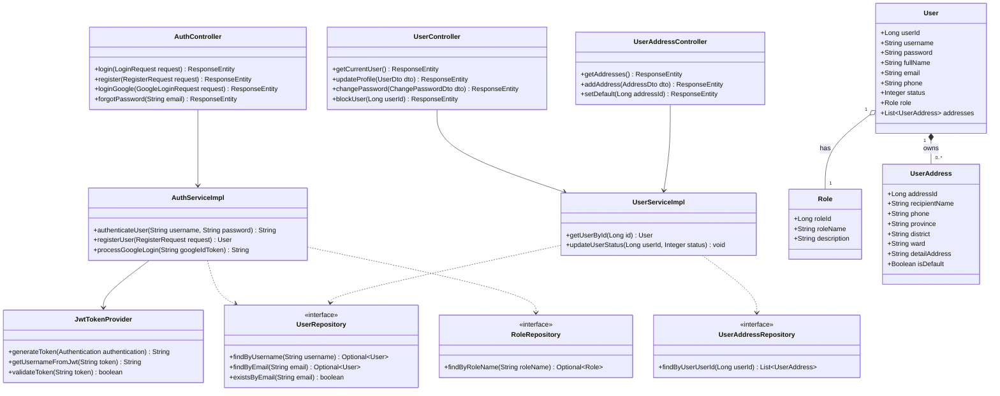
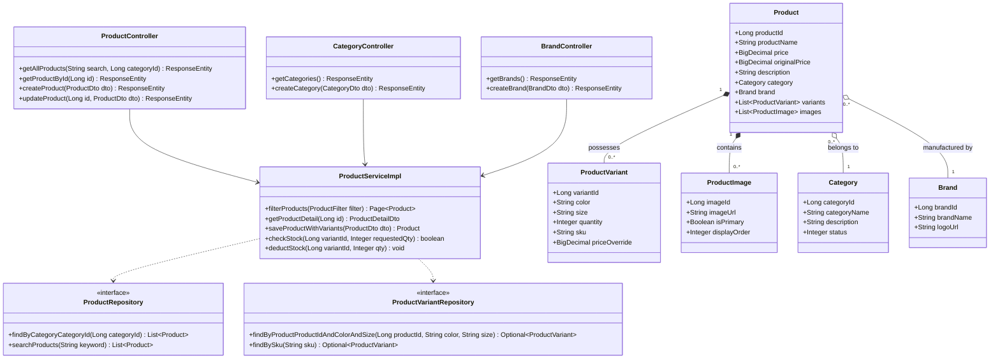
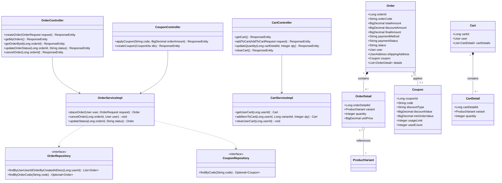
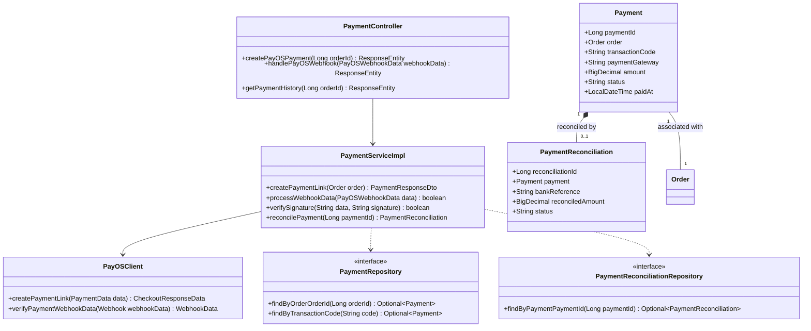
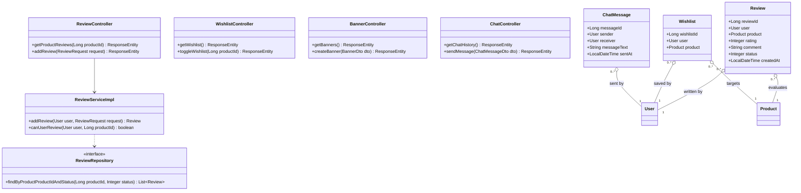
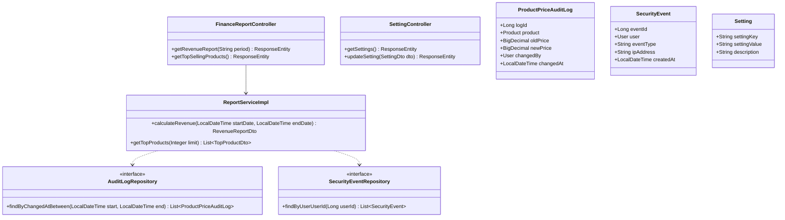

# TÀI LIỆU THIẾT KẾ LỚP CÁC PHÂN HỆ CHÍNH HỆ THỐNG FOXSTYLE
## Dự án: Hệ thống Thương mại Điện tử Thời trang FoxStyle
**Mã dự án:** FOXSTYLE-DATN  
**Ngày cập nhật:** 31/07/2026  
**Trạng thái:** TÀI LIỆU CHÍNH THỨC  

---

## MỤC LỤC
- [CHƯƠNG 1: QUY CHUẨN MÔ HÌNH HÓA THIẾT KẾ LỚP (UML CLASS MODELING STANDARDS)](#chương-1-quy-chuẩn-mô-hình-hóa-thiết-kế-lớp-uml-class-modeling-standards)
- [CHƯƠNG 2: THIẾT KẾ LỚP 6 PHÂN HỆ CHÍNH HỆ THỐNG (MERMAID CLASS DIAGRAMS)](#chương-2-thiết-kế-lớp-6-phân-hệ-chính-hệ-thống-mermaid-class-diagrams)
  - [2.1. Phân hệ 1: Xác thực & Quản lý Tài khoản (Authentication & User Subsystem)](#21-phân-hệ-1-xác-thực--quản-lý-tài-khoản-authentication--user-subsystem)
  - [2.2. Phân hệ 2: Quản lý Sản phẩm, Biến thể & Kho (Catalog & Inventory Subsystem)](#22-phân-hệ-2-quản-lý-sản-phẩm-biến-thể--kho-catalog--inventory-subsystem)
  - [2.3. Phân hệ 3: Giỏ hàng, Đặt hàng & Mã giảm giá (Cart, Order & Promotion Subsystem)](#23-phân-hệ-3-giỏ-hàng-đặt-hàng--mã-giảm-giá-cart-order--promotion-subsystem)
  - [2.4. Phân hệ 4: Thanh toán Tự động PayOS & Webhook (PayOS Payment Subsystem)](#24-phân-hệ-4-thanh-toán-tự-động-payos--webhook-payos-payment-subsystem)
  - [2.5. Phân hệ 5: Tương tác Khách hàng & Đánh giá (Customer Interaction Subsystem)](#25-phân-hệ-5-tương-tác-khách-hàng--đánh-giá-customer-interaction-subsystem)
  - [2.6. Phân hệ 6: Quản trị, Thống kê & Báo cáo (Admin Dashboard & Report Subsystem)](#26-phân-hệ-6-quản-trị-thống-kê--báo-cáo-admin-dashboard--report-subsystem)
- [CHƯƠNG 3: BẢNG MA TRẬN MỐI QUAN HỆ VÀ PHỤ THUỘC NHAU GIỮA CÁC LỚP (CLASS INTER-DEPENDENCY MATRIX)](#chương-3-bảng-ma-trận-mối-quan-hệ-và-phụ-thuộc-nhau-giữa-các-lớp-class-inter-dependency-matrix)

---

## CHƯƠNG 1: QUY CHUẨN MÔ HÌNH HÓA THIẾT KẾ LỚP (UML CLASS MODELING STANDARDS)

### 1.1. Các Tầng Lớp và Quy ước Ký hiệu UML
Mã nguồn Backend Java Spring Boot của **FoxStyle** được mô hình hóa theo 4 tầng chính với ký hiệu mối quan hệ UML chuẩn:
- **Association (`-->`):** Mối quan hệ gọi lẫn nhau giữa Controller ➔ Service ➔ Repository.
- **Realization (`..|>`):** Service Implementation thá»±c thi Service Interface.
- **Composition (`*--`):** Mối quan hệ sở hữu chặt chẽ (ví dụ: Order sở hữu OrderDetail, Cart sở hữu CartDetail).
- **Aggregation (`o--`):** Mối quan hệ gom tụ độc lập (ví dụ: Product chứa ProductVariant, Category chứa Product).

---

## CHƯƠNG 2: THIẾT KẾ LỚP 6 PHÂN HỆ CHÍNH HỆ THỐNG (MERMAID CLASS DIAGRAMS)

### 2.1. Phân hệ 1: Xác thực & Quản lý Tài khoản (Authentication & User Subsystem)

Phân hệ chịu trách nhiệm đăng ký, đăng nhập Local/Google OAuth2, mã hóa BCrypt, cấp Token JWT, quản lý hồ sơ và sổ địa chỉ giao hàng (`user_addresses`).

---

### 2.2. Phân hệ 2: Quản lý Sản phẩm, Biến thể & Kho (Catalog & Inventory Subsystem)

Phân hệ quản lý thông tin sản phẩm, thương hiệu, danh mục thời trang, bộ sưu tập ảnh góc phụ (`product_images`) và quản lý kho chi tiết theo biến thể Size/Màu sắc (`product_variants`).

---

### 2.3. Phân hệ 3: Giỏ hàng, Đặt hàng & Mã giảm giá (Cart, Order & Promotion Subsystem)

Phân hệ xử lý giỏ hàng realtime, tính toán tiền hàng, áp dụng mã Coupon giảm giá, khởi tạo đơn hàng `@Transactional` và quản lý tiến trình duyệt vận chuyển.

---

### 2.4. Phân hệ 4: Thanh toán Tự động PayOS & Webhook (PayOS Payment Subsystem)

Phân hệ tích hợp SDK PayOS, sinh mã VietQR Code chuyển khoản động, kiểm tra checksum HMAC SHA256 và nhận Webhook callback đối soát tự động.

---

### 2.5. Phân hệ 5: Tương tác Khách hàng & Đánh giá (Customer Interaction Subsystem)

Phân hệ xử lý danh sách yêu thích (Wishlist), đánh giá nhận xét chấm 1-5 sao, hội thoại CSkhách hàng (`chat_messages`) và thông báo cá nhân (`notifications`).

---

### 2.6. Phân hệ 6: Quản trị, Thống kê & Báo cáo (Admin Dashboard & Report Subsystem)

Phân hệ hỗ trợ Quản trị viên xem biểu đồ thống kê doanh thu Recharts, lịch sử thay đổi giá (`product_price_audit_logs`), nhật ký kiểm toán (`security_events`) và cấu hình hệ thống (`settings`).

---

## CHƯƠNG 3: BẢNG MA TRẬN MỐI QUAN HỆ VÀ PHỤ THUỘC NHAU GIỮA CÁC LỚP (CLASS INTER-DEPENDENCY MATRIX)

| Lớp gọi (Caller Class) | Lớp phụ thuộc (Dependent Class) | Mục đích Tương tác / Phụ thuộc | Kiểu Mối quan hệ UML |
|---|---|---|---|
| `AuthController` | `AuthServiceImpl`, `JwtTokenProvider` | Đăng nhập, băm mật khẩu, sinh JWT Token | Association (`-->`) |
| `OrderServiceImpl` | `ProductVariantRepository`, `PayOSClient` | Kiểm tra/trừ kho biến thể và khởi tạo VietQR Link | Association (`-->`) |
| `PaymentServiceImpl` | `PayOSClient`, `OrderRepository` | Xác minh Webhook signature & Cập nhật `PAID` | Association (`-->`) |
| `Order` | `User`, `UserAddress`, `Coupon`, `OrderDetail` | Đối tượng Đơn hàng chứa địa chỉ, coupon & món | Composition / Aggregation |
| `Product` | `Category`, `Brand`, `ProductVariant`, `ProductImage` | Đối tượng Sản phẩm chứa danh mục & các biến thể | Composition / Aggregation |
| `Cart` | `User`, `CartDetail` | Giỏ hàng sở hữu các mục mặt hàng giỏ | Composition (`*--`) |

---

## LỜI KẾT & LIÊN KẾT TÀI LIỆU

Tài liệu **Thiết kế Lớp các Phân hệ chính Hệ thống FoxStyle** đã chi tiết hóa kiến trúc Hướng đối tượng (OOP) cho 6 phân hệ cốt lõi.

Tài liệu này được đồng bộ liên kết với:
- [Đặc tả Yêu cầu Hệ thống SRS](./yeu_cau_he_thong.md)
- [Sơ đồ Use Case & Sequence Diagrams](./so_do_use_case.md)
- [Đặc tả Chi tiết 20 Ca sử dụng](./dac_ta_use_case_chi_tiet.md)
- [Ma trận Ánh xạ Use Case & Actor](./use_case_actor_mapping.md)
- [Báo cáo Mô tả Chi tiết Cơ sở Dữ liệu 43 Bảng](./BAO_CAO_MO_TA_CSDL_FOXSTYLE.md)
- [Thiết kế Cơ sở Dữ liệu 43 Bảng (Database Design)](./thiet_ke_co_so_du_lieu.md)
- [Thiết kế Lớp Mã nguồn Java (Class Diagrams)](./thiet_ke_lop_class_diagrams.md)
- [Thiết kế Cấu trúc Phần mềm (Software Architecture)](./thiet_ke_cau_truc_phan_mem.md)
- [Thiết kế Hạ tầng Mạng & Chính sách Hệ thống](./thiet_ke_ha_tang_mang_va_chinh_sach.md)
