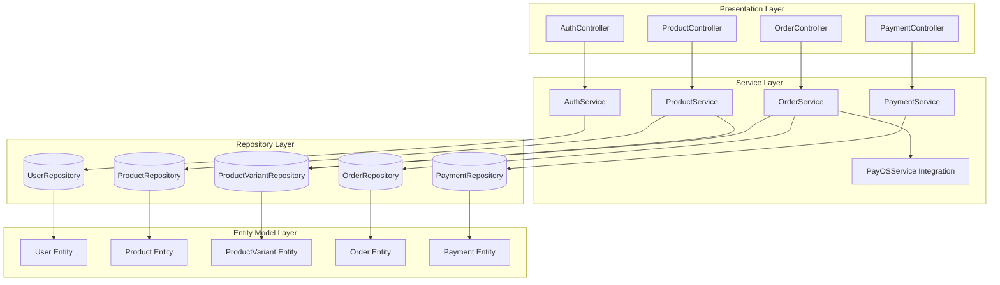
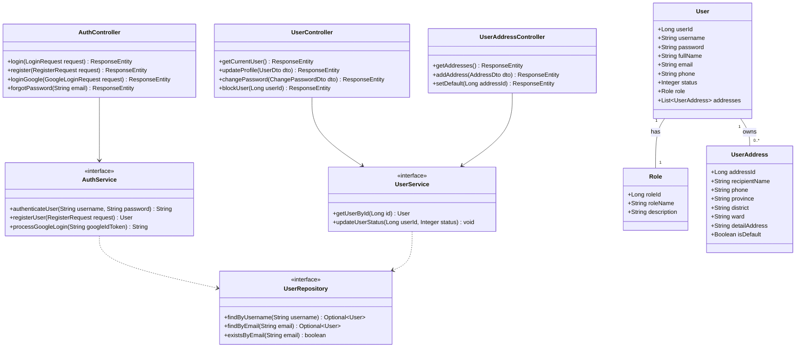
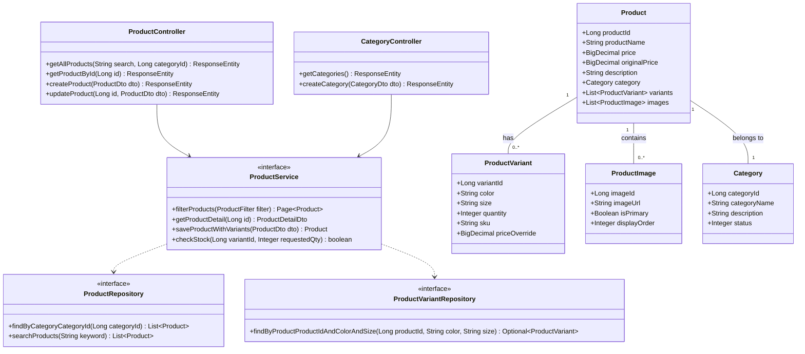
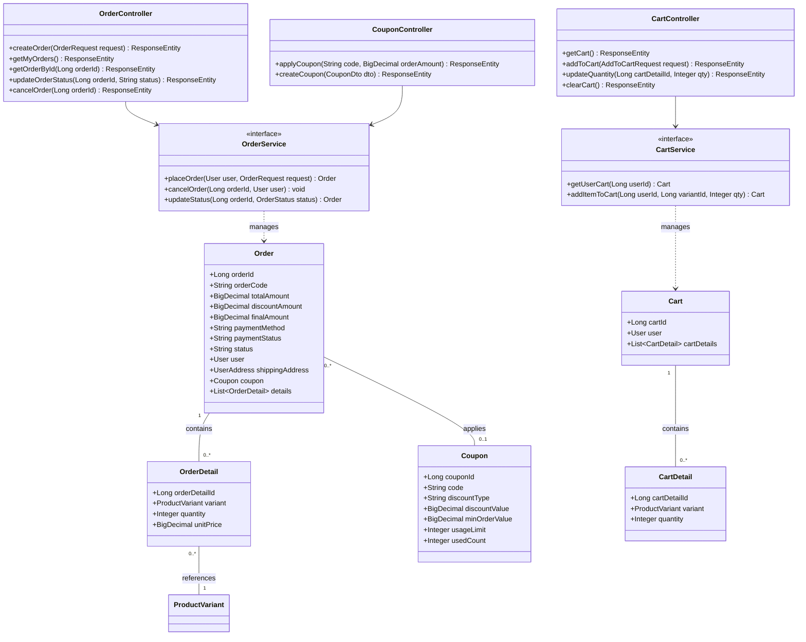
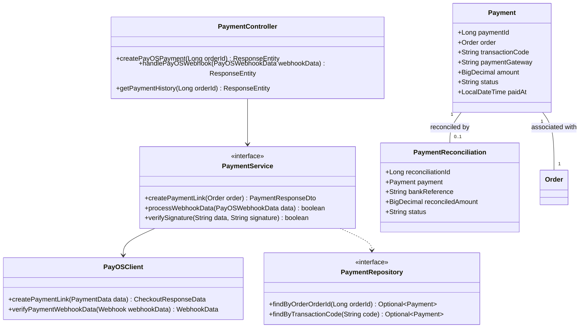
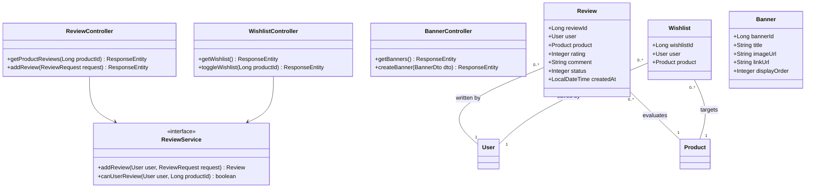

# TÀI LIỆU THIẾT KẾ LỚP MÃ NGUỒN (UML CLASS DIAGRAM SPECIFICATION)
## Dự án: Hệ thống Thương mại Điện tử Thời trang FoxStyle
**Mã dự án:** FOXSTYLE-DATN  
**Ngày cập nhật:** 31/07/2026  
**Trạng thái:** TÀI LIỆU CHÍNH THỨC  

---

## MỤC LỤC
- [CHƯƠNG 1: TỔNG QUAN KIẾN TRÚC PHÂN TẦNG LỚP (LAYERED CLASS ARCHITECTURE)](#chương-1-tổng-quan-kiến-trúc-phân-tầng-lớp-layered-class-architecture)
  - [1.1. Các Tầng Lớp Mã nguồn (Layered Architecture Breakdown)](#11-các-tầng-lớp-mã-nguồn-layered-architecture-breakdown)
  - [1.2. Sơ đồ Kiến trúc Phân tầng Lớp Tổng thể](#12-sơ-đồ-kiến-trúc-phân-tầng-lớp-tổng-thể)
- [CHƯƠNG 2: SƠ ĐỒ LỚP CHI TIẾT THEO CÁC PHÂN HỆ NGHIỆP VỤ (MERMAID CLASS DIAGRAMS)](#chương-2-sơ-đồ-lớp-chi-tiết-theo-các-phân-hệ-nghiệp-vụ-mermaid-class-diagrams)
  - [2.1. Phân hệ Xác thực & Quản lý Người dùng (Auth & User Domain)](#21-phân-hệ-xác-thực--quản-lý-người-dùng-auth--user-domain)
  - [2.2. Phân hệ Quản lý Sản phẩm, Biến thể & Danh mục (Product Domain)](#22-phân-hệ-quản-lý-sản-phẩm-biến-thể--danh-mục-product-domain)
  - [2.3. Phân hệ Giỏ hàng, Đặt hàng & Mã giảm giá (Order & Cart Domain)](#23-phân-hệ-giỏ-hàng-đặt-hàng--mã-giảm-giá-order--cart-domain)
  - [2.4. Phân hệ Thanh toán PayOS & Webhook (Payment Domain)](#24-phân-hệ-thanh-toán-payos--webhook-payment-domain)
  - [2.5. Phân hệ Tương tác Khách hàng & Đánh giá (Interaction Domain)](#25-phân-hệ-tương-tác-khách-hàng--đánh-giá-interaction-domain)
- [CHƯƠNG 3: ĐẶC TẢ CHI TIẾT THUỘC TÍNH VÀ PHƯƠNG THỨC CÁC LỚP TRỌNG TÂM](#chương-3-đặc-tả-chi-tiết-thuộc-tính-và-phương-thức-các-lớp-trọng-tâm)
  - [3.1. Các Lớp Controller (REST API Endpoints)](#31-các-lớp-controller-rest-api-endpoints)
  - [3.2. Các Lớp Service (Business Logic)](#32-các-lớp-service-business-logic)
  - [3.3. Các Lớp Repository (Data Access Object - DAO)](#33-các-lớp-repository-data-access-object---dao)

---

## CHƯƠNG 1: TỔNG QUAN KIẾN TRÚC PHÂN TẦNG LỚP (LAYERED CLASS ARCHITECTURE)

### 1.1. Các Tầng Lớp Mã nguồn (Layered Architecture Breakdown)

Mã nguồn Backend hệ thống **FoxStyle** được xây dựng trên nền tảng **Java 17 / Spring Boot 3.2.5** theo mô hình thiết kế chuẩn **Layered Architecture (Kiến trúc phân tầng)** kết hợp với môt hình **Repository - Service - Controller Pattern**:

```
┌────────────────────────────────────────────────────────────────────────┐
│ 1. PRESENTATION LAYER (RESTful Controllers)                            │
│    - Tiếp nhận HTTP Request, Validate DTOs, trả về ResponseEntity JSON │
└───────────────────────────────────┬────────────────────────────────────┘
                                    │ Calls Services
┌───────────────────────────────────▼────────────────────────────────────┐
│ 2. BUSINESS SERVICE LAYER (Services & Implementation)                  │
│    - Thực thi Business Rules, Transaction (@Transactional), PayOS API  │
└───────────────────────────────────┬────────────────────────────────────┘
                                    │ Calls Repositories
┌───────────────────────────────────▼────────────────────────────────────┐
│ 3. DATA ACCESS LAYER (JPA Repositories)                                │
│    - Kế thừa JpaRepository<T, ID>, thực hiện truy vấn MS SQL Server    │
└───────────────────────────────────┬────────────────────────────────────┘
                                    │ Maps Entities
┌───────────────────────────────────▼────────────────────────────────────┐
│ 4. DOMAIN / ENTITY LAYER (JPA Entities & DTOs)                         │
│    - Khai báo Object Model ánh xạ 1-1 với CSDL SQL Server              │
└────────────────────────────────────────────────────────────────────────┘
```

1. **Presentation Layer (`com.foxstyle.api.controller`):**
   - Gồm 18 REST Controllers: `AuthController`, `ProductController`, `OrderController`, `CartController`, `PaymentController`, `CouponController`, `UserController`...
   - Sử dụng `@RestController`, `@RequestMapping`, `@CrossOrigin` và `@PreAuthorize`.

2. **Business Service Layer (`com.foxstyle.api.service`):**
   - Gồm các Interface Service và Service Implementations: `AuthService`, `ProductService`, `OrderService`, `CartService`, `PaymentService`, `CouponService`...
   - Xử lý kiểm tra tồn kho biến thể, tính tiền coupon, gọi Webhook PayOS, gửi Email OTP bất đồng bộ (`@Async`).

3. **Data Access Layer (`com.foxstyle.api.repository`):**
   - Gồm 30 JPA Repositories kế thừa `JpaRepository<T, ID>`: `UserRepository`, `ProductRepository`, `ProductVariantRepository`, `OrderRepository`, `CartRepository`...

4. **Domain & Entity Layer (`com.foxstyle.api.entity` & `com.foxstyle.api.dto`):**
   - Gồm 30 JPA Entities ánh xạ CSDL và bộ đối tượng Data Transfer Objects (DTO) mã hóa trao đổi dữ liệu.

---

### 1.2. Sơ đồ Kiến trúc Phân tầng Lớp Tổng thể



---

## CHƯƠNG 2: SƠ ĐỒ LỚP CHI TIẾT THEO CÁC PHÂN HỆ NGHIỆP VỤ (MERMAID CLASS DIAGRAMS)

### 2.1. Phân hệ Xác thực & Quản lý Người dùng (Auth & User Domain)



---

### 2.2. Phân hệ Quản lý Sản phẩm, Biến thể & Danh mục (Product Domain)



---

### 2.3. Phân hệ Giỏ hàng, Đặt hàng & Mã giảm giá (Order & Cart Domain)



---

### 2.4. Phân hệ Thanh toán PayOS & Webhook (Payment Domain)



---

### 2.5. Phân hệ Tương tác Khách hàng & Đánh giá (Interaction Domain)



---

## CHƯƠNG 3: ĐẶC TẢ CHI TIẾT THUỘC TÍNH VÀ PHƯƠNG THỨC CÁC LỚP TRỌNG TÂM

### 3.1. Đặc tả các Lớp Controller Trọng tâm

| Tên Lớp (Controller) | Đường dẫn `@RequestMapping` | Các Phương thức Chính | Vai trò & An ninh |
|---|---|---|---|
| **`AuthController`** | `/api/v1/auth` | `login()`, `register()`, `loginGoogle()`, `forgotPassword()` | Công khai (Public Access), Trả về JWT Token |
| **`ProductController`** | `/api/v1/products` | `getAllProducts()`, `getProductById()`, `createProduct()`, `updateProduct()` | Xem công khai. Tạo/Sửa yêu cầu `ROLE_ADMIN` |
| **`OrderController`** | `/api/v1/orders` | `createOrder()`, `getMyOrders()`, `updateOrderStatus()`, `cancelOrder()` | Đặt/Xem đơn: `ROLE_CUSTOMER`. Duyệt đơn: `ROLE_STAFF`/`ROLE_ADMIN` |
| **`PaymentController`** | `/api/v1/payments` | `createPayOSPayment()`, `handlePayOSWebhook()` | Webhook endpoint công khai (Verify Checksum Signature) |
| **`CartController`** | `/api/v1/cart` | `getCart()`, `addToCart()`, `updateQuantity()`, `clearCart()` | Yêu cầu đăng nhập `ROLE_CUSTOMER` |

---

### 3.2. Đặc tả các Lớp Service Trọng tâm

#### 1. Lá»›p `OrderServiceImpl.java`
- **`placeOrder(User user, OrderRequest request)`:**
  - Mở Transaction `@Transactional`.
  - Kiểm tra số lượng tồn kho khả dụng của từng biến thể (`product_variants.quantity`).
  - Trừ kho tạm thời. Tính tiền coupon giảm giá (nếu có).
  - Khởi tạo đơn hàng `orders` với trạng thái `PENDING`.
- **`cancelOrder(Long orderId, User user)`:**
  - Kiểm tra đơn hàng có ở trạng thái `PENDING` hay không.
  - Cập nhật trạng thái đơn thành `CANCELLED`.
  - Cộng hoàn lại số lượng tồn kho cho các biến thể trong đơn.

#### 2. Lá»›p `PaymentServiceImpl.java`
- **`createPaymentLink(Order order)`:**
  - Khởi tạo đối tượng `PaymentData` chứa mã đơn hàng, số tiền và nội dung chuyển khoản.
  - Gọi SDK PayOS client tạo link QR Code VietQR.
- **`processWebhookData(PayOSWebhookData data)`:**
  - Băm mã hóa kiểm tra chữ ký `HMAC SHA256 Signature`.
  - Nếu hợp lệ ➔ Cập nhật `payment_status = PAID` và `orders.status = PROCESSING`.

---

### 3.3. Đặc tả các Lớp Repository Trọng tâm

| Tên JPA Repository | Entity đi kèm | Các Phương thức Custom Query Chính |
|---|---|---|
| **`UserRepository`** | `User` | `findByUsername()`, `findByEmail()`, `existsByEmail()` |
| **`ProductRepository`** | `Product` | `findByCategoryCategoryId()`, `searchProducts(String keyword)` |
| **`ProductVariantRepository`** | `ProductVariant` | `findByProductProductIdAndColorAndSize()`, `findBySku()` |
| **`OrderRepository`** | `Order` | `findByUserUserIdOrderByCreatedAtDesc()`, `findByStatus()` |
| **`PaymentRepository`** | `Payment` | `findByOrderOrderId()`, `findByTransactionCode()` |

---

## LỜI KẾT & LIÊN KẾT TÀI LIỆU

Tài liệu **Thiết kế Lớp Mã nguồn (UML Class Diagram Specification)** cung cấp bức tranh chi tiết về cấu trúc mã nguồn Backend Java Spring Boot của dự án FoxStyle.

Tài liệu này được đồng bộ liên kết với:
- [Đặc tả Yêu cầu Hệ thống SRS](./yeu_cau_he_thong.md)
- [Sơ đồ & Đặc tả Ca sử dụng Use Case](./so_do_use_case.md)
- [Mô tả Chi tiết Các Chức năng Hệ thống](./mo_ta_chi_tiet_chuc_nang.md)
- [Báo cáo Mô tả Chi tiết Cơ sở Dữ liệu](./BAO_CAO_MO_TA_CSDL_FOXSTYLE.md)
- [Thiết kế Hạ tầng Mạng & Chính sách Hệ thống](./thiet_ke_ha_tang_mang_va_chinh_sach.md)
