# TÀI LIỆU PHÂN TÍCH YÊU CẦU HỆ THỐNG (SYSTEM REQUIREMENTS SPECIFICATION)
## Dự án: Hệ thống Thương mại Điện tử Thời trang FoxStyle
**Mã dự án:** FOXSTYLE-DATN  
**Ngày cập nhật:** 31/07/2026  
**Trạng thái:** TÀI LIỆU CHÍNH THỨC  

> 📌 **Tài liệu liên quan:** 
> - Xem đầy đủ Sơ đồ và Đặc tả Chi tiết 10 Ca sử dụng tại **[docs/so_do_use_case.md](./so_do_use_case.md)**
> - Xem Bảng Đặc tả Chi tiết 20 Ca sử dụng đầy đủ tại **[docs/dac_ta_use_case_chi_tiet.md](./dac_ta_use_case_chi_tiet.md)**
> - Xem Ma trận Ánh xạ Use Case & Actor tại **[docs/use_case_actor_mapping.md](./use_case_actor_mapping.md)**
> - Xem Bộ 10 Sơ đồ Tuần tự (Sequence Diagrams) tại **[docs/so_do_tuan_tu_sequence_diagrams.md](./so_do_tuan_tu_sequence_diagrams.md)**
> - Xem Thiết kế Cơ sở Dữ liệu 43 Bảng tại **[docs/thiet_ke_co_so_du_lieu.md](./thiet_ke_co_so_du_lieu.md)**
> - Xem Thiết kế Cấu trúc Phần mềm (Software Architecture) tại **[docs/thiet_ke_cau_truc_phan_mem.md](./thiet_ke_cau_truc_phan_mem.md)**
> - Xem Thiết kế Lớp Mã nguồn Java (Class Diagrams) tại **[docs/thiet_ke_lop_class_diagrams.md](./thiet_ke_lop_class_diagrams.md)**
> - Xem Thiết kế Lớp 6 Phân hệ chính tại **[docs/thiet_ke_lop_cac_phan_he_chinh.md](./thiet_ke_lop_cac_phan_he_chinh.md)**
> - Xem Báo cáo Phần 4: Phát triển & Thực thi tại **[docs/bao_cao_phan_4_phat_trien_thuc_thi.md](./bao_cao_phan_4_phat_trien_thuc_thi.md)**
> - Xem Báo cáo Phần 5: Thử nghiệm, Đánh giá & Hướng phát triển tại **[docs/bao_cao_phan_5_tong_ket_danh_gia_huong_phat_trien.md](./bao_cao_phan_5_tong_ket_danh_gia_huong_phat_trien.md)**
> - Xem Báo cáo Phần 6: Hướng phát triển & Phạm vi Ứng dụng tại **[docs/bao_cao_phan_6_huong_phat_trien_va_ung_dung.md](./bao_cao_phan_6_huong_phat_trien_va_ung_dung.md)**
> - Xem Bảng Kiểm thử & Checklist tại **[docs/bang_kiem_thu_va_checklist.md](./bang_kiem_thu_va_checklist.md)** (Hoặc mở file Excel tại **[docs/BANG_KIEM_THU_FOXSTYLE.xlsx](./BANG_KIEM_THU_FOXSTYLE.xlsx)**)
> - Xem Phần Kết luận & Lời Cảm ơn tại **[docs/ket_luan_va_loi_cam_on.md](./ket_luan_va_loi_cam_on.md)**
> - Xem Danh mục Tài liệu Tham khảo tại **[docs/danh_muc_tai_lieu_tham_khao.md](./danh_muc_tai_lieu_tham_khao.md)**
> - Xem Phụ lục Báo cáo Đồ án tại **[docs/phu_luc_bao_cao_do_an.md](./phu_luc_bao_cao_do_an.md)**
> - Xem Mô tả Chi tiết từng Chức năng Hệ thống tại **[docs/mo_ta_chi_tiet_chuc_nang.md](./mo_ta_chi_tiet_chuc_nang.md)**
> - Xem Thiết kế Hạ tầng Mạng & Bộ Chính sách Hệ thống tại **[docs/thiet_ke_ha_tang_mang_va_chinh_sach.md](./thiet_ke_ha_tang_mang_va_chinh_sach.md)**

---

## MỤC LỤC
- [CHƯƠNG 1: TỔNG QUAN & PHẠM VI HỆ THỐNG](#chương-1-tổng-quan--phạm-vi-hệ-thống)
  - [1.1. Bối cảnh & Lý do thực hiện đề tài](#11-bối-cảnh--lý-do-thực-hiện-đề-tài)
  - [1.2. Mục tiêu của hệ thống](#12-mục-tiêu-của-hệ-thống)
  - [1.3. Phạm vi hệ thống](#13-phạm-vi-hệ-thống)
  - [1.4. Mô hình Kiến trúc Tổng thể](#14-mô-hình-kiến-trúc-tổng-thể)
- [CHƯƠNG 2: YÊU CẦU CHỨC NĂNG (FUNCTIONAL REQUIREMENTS)](#chương-2-yêu-cầu-chức-năng-functional-requirements)
  - [2.1. Danh mục Tác nhân (Actors)](#21-danh-mục-tác-nhân-actors)
  - [2.2. Phân hệ Khách hàng (Storefront User)](#22-phân-hệ-khách-hàng-storefront-user)
  - [2.3. Phân hệ Quản trị & Nhân viên (Admin & Staff Portal)](#23-phân-hệ-quản-trị--nhân-viên-admin--staff-portal)
  - [2.4. Phân hệ Tự động & Xử lý Ngầm (Background & Integration)](#24-phân-hệ-tự-động--xử-lý-ngầm-background--integration)
  - [2.5. Ma trận Phân quyền Tác vụ (RBAC Matrix)](#25-ma-trận-phân-quyền-tác-vụ-rbac-matrix)
- [CHƯƠNG 3: YÊU CẦU PHI CHỨC NĂNG (NON-FUNCTIONAL REQUIREMENTS)](#chương-3-yêu-cầu-phi-chức-năng-non-functional-requirements)
  - [3.1. Hiệu năng & Khả năng mở rộng (Performance & Scalability)](#31-hiệu-năng--khả-năng-mở-rộng-performance--scalability)
  - [3.2. Bảo mật & Mật mã (Security & Cryptography)](#32-bảo-mật--mật-mã-security--cryptography)
  - [3.3. Độ tin cậy & Tính sẵn sàng (Reliability & Availability)](#33-độ-tin-cậy--tính-sẵn-sàng-reliability--availability)
  - [3.4. Trải nghiệm người dùng & Giao diện (Usability & UX)](#34-trải-nghiệm-người-dùng--giao-diện-usability--ux)
  - [3.5. Tính bảo trì & Cấu trúc Mã nguồn (Maintainability)](#35-tính-bảo-trì--cấu-trúc-mã-nguồn-maintainability)
- [CHƯƠNG 4: RÀNG BUỘC KỸ THUẬT & TÍCH HỢP HỆ THỐNG](#chương-4-ràng-buộc-kỹ-thuật--tích-hợp-hệ-thống)
  - [4.1. Công nghệ & Môi trường Triển khai](#41-công-nghệ--môi-trường-triển-khai)
  - [4.2. Tích hợp Cổng Thanh toán PayOS API](#42-tích-hợp-cổng-thanh-toán-payos-api)
  - [4.3. Tích hợp Xác thực Google OAuth2](#43-tích-hợp-xác-thực-google-oauth2)
  - [4.4. Tích hợp Dịch vụ Email (Spring Mail / SMTP)](#44-tích-hợp-dịch-vụ-email-spring-mail--smtp)
- [CHƯƠNG 5: QUY TRÌNH NGHIỆP VỤ QUAN TRỌNG](#chương-5-quy-trình-nghiệp-vụ-quan-trọng)
  - [5.1. Quy trình Đặt hàng & Thanh toán PayOS QR Code](#51-quy-trình-đặt-hàng--thanh-toán-payos-qr-code)
  - [5.2. Quy trình Kiểm tra & Cập nhật Tồn kho Biến thể](#52-quy-trình-kiểm-tra--cập-nhat-tồn-kho-biến-thể)

---

## CHƯƠNG 1: TỔNG QUAN & PHẠM VI HỆ THỐNG

### 1.1. Bối cảnh & Lý do thực hiện đề tài
Trong ngành bán lẻ thời trang hiện đại, nhu cầu mua sắm trực tuyến đòi hỏi hệ thống phải đáp ứng nhanh chóng các tiêu chí: trải nghiệm giao diện người dùng mượt mà, khả năng quản lý biến thể sản phẩm chi tiết (kích cỡ, màu sắc, tồn kho theo biến thể), tự động hóa thanh toán và xử lý đơn hàng chính xác. 

Hệ thống **FoxStyle** được xây dựng nhằm giải quyết bài toán kinh doanh thực tế của thương hiệu thời trang, kết hợp công nghệ kiến trúc tách biệt (Decoupled Architecture) giữa RESTful Backend Service và React Single Page Application (SPA).

### 1.2. Mục tiêu của hệ thống
1. **Đối với Khách hàng:** Cung cấp trải nghiệm mua sắm trực quan, hỗ trợ tìm kiếm/lọc nhanh sản phẩm, đặt hàng linh hoạt với nhiều phương thức thanh toán (COD hoặc quét mã QR PayOS tự động khớp lệnh), theo dõi đơn hàng và tương tác đánh giá sản phẩm.
2. **Đối với Quản trị viên / Nhân viên:** Cung cấp công cụ quản trị tập trung (Admin Portal) giúp quản lý danh mục, chi tiết biến thể sản phẩm, bộ sưu tập hình ảnh, mã giảm giá, theo dõi trạng thái đơn hàng và phân tích doanh thu bằng biểu đồ trực quan.
3. **Đối với Hệ thống Kỹ thuật:** Đảm bảo khả năng mở rộng, bảo mật cao bằng JWT Token & Spring Security, ACID compliance cho giao dịch đơn hàng và tích hợp linh hoạt với các dịch vụ bên thứ ba (PayOS, Google OAuth2, Cloudinary, Mail Server).

### 1.3. Phạm vi hệ thống
- **Phân hệ Storefront (Khách hàng):** Chạy trên nền tảng Web App (Responsive Web), hỗ trợ khách vãng lai và người dùng đã đăng nhập.
- **Phân hệ Admin & Staff Portal (Quản trị & Nhân viên):** Giao diện quản trị riêng biệt phân quyền theo vai trò (ADMIN, STAFF).
- **Hệ thống Backend API:** Chuẩn RESTful API phản hồi JSON, đóng gói độc lập.

### 1.4. Mô hình Kiến trúc Tổng thể
Hệ thống FoxStyle được thiết kế theo kiến trúc 3 lớp decoupled:

```
┌────────────────────────────────────────────────────────────────────────┐
│                        FRONTEND CLIENT (React 18 / Vite)              │
│  ┌───────────────────────────────┐   ┌───────────────────────────────┐ │
│  │   Storefront Web (Customer)   │   │  Admin Portal (Admin/Staff)   │ │
│  └──────────────┬────────────────┘   └──────────────┬────────────────┘ │
└─────────────────┼───────────────────────────────────┼──────────────────┘
                  │  HTTPS / RESTful JSON / JWT       │
┌─────────────────▼───────────────────────────────────▼──────────────────┐
│                   BACKEND API (Spring Boot 3.2.5 / Java 17)            │
│  ┌──────────────────┐ ┌──────────────────┐ ┌─────────────────────────┐  │
│  │ Security (JWT)   │ │ Business Logic   │ │ JPA Data Access Layer   │  │
│  └──────────────────┘ └──────────────────┘ └─────────────────────────┘  │
└────────┬─────────────────────────┬─────────────────────────┬───────────┘
         │ SQL (JDBC)              │ Webhook / REST          │ SMTP / Cloud
┌────────▼───────────────┐ ┌───────▼───────────────┐ ┌───────▼───────────┐
│ Database (MS SQL Server)│ │  PayOS Payment Gateway│ │ Google OAuth2/Mail│
└────────────────────────┘ └───────────────────────┘ └───────────────────┘
```

---

## CHƯƠNG 2: YÊU CẦU CHỨC NĂNG (FUNCTIONAL REQUIREMENTS)

### 2.1. Danh mục Tác nhân (Actors)
| STT | Tác nhân (Actor) | Mô tả vai trò & Quyền hạn |
|---|---|---|
| 1 | **Khách vãng lai (Guest)** | Người dùng truy cập hệ thống chưa đăng nhập. Có quyền xem danh sách sản phẩm, tìm kiếm, lọc, xem chi tiết và thêm vào giỏ hàng tạm thời. |
| 2 | **Khách hàng (Customer)** | Khách đã đăng ký/đăng nhập tài khoản. Có đầy đủ quyền mua hàng, quản lý sổ địa chỉ, đặt hàng PayOS/COD, xem lịch sử đơn, quản lý wishlist và đánh giá sản phẩm. |
| 3 | **Nhân viên (Staff)** | Nhân viên cửa hàng có tài khoản thuộc vai trò ROLE_STAFF. Có quyền xem đơn hàng, cập nhật trạng thái vận chuyển, kiểm tra tồn kho và hỗ trợ khách hàng. |
| 4 | **Quản trị viên (Admin)** | Quyền hạn cao nhất (ROLE_ADMIN). Quản lý toàn bộ danh mục, sản phẩm, biến thể, hình ảnh, mã giảm giá, banner, phân quyền tài khoản người dùng và xem báo cáo doanh thu. |
| 5 | **Hệ thống bên thứ 3 (External Systems)** | Cổng thanh toán PayOS (gửi Webhook thanh toán), Google OAuth2 (xác thực đăng nhập), SMTP Server (gửi mail). |

---

### 2.2. Phân hệ Khách hàng (Storefront User)

#### FR-01: Đăng ký & Đăng nhập Tài khoản
- **Đăng ký nội bộ (Local Signup):** Người dùng nhập Username, Email, Mật khẩu, Họ tên. Hệ thống kiểm tra trùng lặp Email và Username trong DB, băm mật khẩu bằng thuật toán BCrypt trước khi lưu.
- **Đăng nhập nội bộ (Local Login):** Xác thực Username/Email và Password. Trả về mã JWT Token chứa thông tin User ID, Username và Roles.
- **Đăng nhập Google OAuth2:** Người dùng đăng nhập qua tài khoản Google. Hệ thống tự động lấy Email & thông tin hồ sơ Google, tạo tài khoản mới nếu chưa có trong DB và phát hành JWT Token.
- **Đổi mật khẩu / Khôi phục mật khẩu:** Yêu cầu nhập mật khẩu cũ để đổi mật khẩu mới. Hỗ trợ gửi OTP khôi phục mật khẩu qua Email (SMTP).

#### FR-02: Tìm kiếm & Lọc Sản phẩm
- **Tìm kiếm từ khóa (Full-Text Search):** Tìm kiếm theo tên sản phẩm (`product_name`), mã SKU hoặc bài mô tả (`description`).
- **Lọc đa tiêu chí (Dynamic Filter):**
  - Lọc theo Danh mục thời trang (`category_id`).
  - Lọc theo Kích thước (Size: S, M, L, XL, XXL...).
  - Lọc theo Màu sắc (Đen, Trắng, Be, Xanh, Red...).
  - Lọc theo Khoảng giá (Giá tối thiểu - Giá tối đa).
  - Lọc theo Sản phẩm đang Giảm giá (có `original_price > price`).
- **Sắp xếp (Sorting):** Sắp xếp theo Giá tăng/giảm dần, Sản phẩm mới nhất, Sản phẩm bán chạy nhất.

#### FR-03: Chi tiết Sản phẩm & Quản lý Biến thể
- Hiển thị đầy đủ thông tin: Tên sản phẩm, Giá bán hiện tại, Giá gốc, Mô tả chi tiết, Chất liệu, Hướng dẫn bảo quản.
- Hiển thị thư viện ảnh phụ (`product_images`) dạng Slide Carousel / Thumbnails.
- Chọn biến thể động: Khi khách chọn Màu sắc & Size, hệ thống tự động kiểm tra số lượng tồn kho khả dụng (`quantity` trong `product_variants`). Nếu tồn kho = 0, hiển thị trạng thái "Hết hàng" và vô hiệu hóa nút Thêm vào giỏ.

#### FR-04: Quản lý Giỏ hàng (Shopping Cart)
- Thêm biến thể sản phẩm (Product Variant ID + Số lượng) vào giỏ hàng.
- Cập nhật số lượng mặt hàng trực tiếp trong giỏ (tự động kiểm tra giới hạn tồn kho tối đa).
- Xóa từng mặt hàng hoặc Xóa toàn bộ giỏ hàng (Clear Cart).
- Tính toán tổng tiền hàng, tiền giảm giá từ Coupon và tạm tính phí giao hàng.

#### FR-05: Quản lý Sổ địa chỉ Nhận hàng (`user_addresses`)
- Cho phép lưu trữ nhiều địa chỉ nhận hàng cho mỗi tài khoản.
- Thông tin địa chỉ gồm: Tên người nhận, Số điện thoại, Tỉnh/Thành phố, Quận/Huyện, Phường/Xã, Địa chỉ chi tiết.
- Cho phép chọn 1 địa chỉ làm **Địa chỉ mặc định (`is_default = 1`)** để tự động điền khi thanh toán.

#### FR-06: Đặt hàng & Thanh toán Đa phương thức
- **Thanh toán COD (Cash on Delivery):** Tạo đơn hàng với trạng thái `PENDING` (Chờ duyệt), phương thức `COD`.
- **Thanh toán Tự động PayOS (QR Code Banking):**
  - Hệ thống gọi PayOS API sinh mã QR thanh toán động chứa đúng số tiền đơn hàng và nội dung chuyển khoản mã đơn (`ORDER_XXXX`).
  - Khách hàng thực hiện quét mã QR qua ứng dụng Ngân hàng (VietQR / Mobile Banking).
  - Webhook Backend nhận callback từ PayOS -> Tự động xác thực chữ ký bảo mật (Checksum Signature) -> Chuyển trạng thái đơn hàng sang `PAID` / `PROCESSING` mà không cần duyệt thủ công.

#### FR-07: Lịch sử Đơn hàng & Đánh giá Sản phẩm
- Theo dõi danh sách đơn hàng đã đặt theo các trạng thái: *Chờ duyệt, Đã xác nhận, Đang giao hàng, Đã giao thành công, Đã hủy*.
- Cho phép Khách hàng **Hủy đơn hàng** nếu đơn hàng đang ở trạng thái `PENDING` (Chờ duyệt).
- **Đánh giá sản phẩm:** Khách hàng chỉ được phép đánh giá (1-5 sao kèm nội dung nhận xét) cho các sản phẩm thuộc đơn hàng đã ở trạng thái `DELIVERED` (Đã giao thành công).

#### FR-08: Danh sách Sản phẩm Yêu thích (Wishlist)
- Thêm/Xóa sản phẩm khỏi danh sách yêu thích bằng biểu tượng trái tim.
- Xem danh sách sản phẩm yêu thích và chuyển nhanh vào giỏ hàng.

---

### 2.3. Phân hệ Quản trị & Nhân viên (Admin & Staff Portal)

#### FR-09: Quản lý Sản phẩm & Thư viện Ảnh
- **CRUD Sản phẩm:** Thêm mới, chỉnh sửa thông tin, ẩn/hiện sản phẩm hoặc xóa sản phẩm.
- **Quản lý Thư viện ảnh phụ (`product_images`):** Tải lên nhiều ảnh chụp góc chi tiết của sản phẩm, đánh dấu ảnh chính (`is_primary`) và sắp xếp thứ tự hiển thị (`display_order`).

#### FR-10: Quản lý Biến thể Sản phẩm (`product_variants`)
- Quản lý chi tiết từng biến thể Màu sắc - Kích thước (ví dụ: Áo sơ mi Trắng - Size L - SKU: SOMI-TRANG-L).
- Cập nhật số lượng tồn kho (`quantity`) cho từng biến thể cụ thể.
- Kiểm soát cảnh báo sản phẩm sắp hết hàng trong kho.

#### FR-11: Quản lý Danh mục & Banners Quảng cáo
- Tạo mới, sửa, xóa danh mục thời trang (Áo, Quần, Váy, Phụ kiện...).
- Quản lý danh sách Banner hình ảnh trên trang chủ, thiết lập liên kết điều hướng và thứ tự xuất hiện.

#### FR-12: Quản lý Mã giảm giá (Coupons)
- Tạo mã giảm giá theo Số tiền cố định (Fixed Amount) hoặc Theo phần trăm (Percentage - kèm số tiền giảm tối đa).
- Thiết lập điều kiện áp dụng: Giá trị đơn hàng tối thiểu, Số lần sử dụng tối đa của mã (`usage_limit`), Thời hạn hiệu lực (Ngày bắt đầu - Ngày kết thúc).

#### FR-13: Quản lý & Duyệt Đơn hàng
- Xem danh sách tất cả đơn hàng phát sinh trên toàn hệ thống kèm bộ lọc trạng thái và lọc theo ngày.
- Cập nhật tiến trình đơn hàng: `PENDING` ➔ `CONFIRMED` ➔ `SHIPPING` ➔ `DELIVERED` (hoặc `CANCELLED`).
- Xem chi tiết đơn hàng (Sản phẩm đặt, biến thể size/màu, địa chỉ nhận hàng, lịch sử thanh toán PayOS/COD).

#### FR-14: Quản lý Khách hàng & Phân quyền
- Xem danh sách các tài khoản trong hệ thống.
- Thực hiện Khóa tài khoản (`status = 0`) hoặc Mở khóa tài khoản đối với người dùng vi phạm điều khoản.

#### FR-15: Báo cáo Thống kê Doanh thu & Kinh doanh
- Biểu đồ doanh thu theo thời gian (Ngày, Tuần, Tháng, Năm) sử dụng thư viện Recharts.
- Thống kê tổng số đơn hàng, số đơn hủy, tổng số khách hàng mới.
- Thống kê Top sản phẩm bán chạy nhất và thống kê tồn kho theo danh mục.

---

### 2.4. Phân hệ Tự động & Xử lý Ngầm (Background & Integration)

#### FR-16: Xử lý Webhook PayOS Tự động
- Lắng nghe sự kiện thanh toán từ PayOS Webhook endpoint.
- Kiểm tra tính hợp lệ của Webhook Data bằng `HMAC SHA256 Signature`.
- Tự động cập nhật `payment_status = PAID` và đẩy đơn hàng sang tiến trình xử lý tự động.

#### FR-17: Dịch vụ Email Thông báo (SMTP Service)
- Tự động gửi Email xác nhận thông tin đơn hàng tới khách hàng ngay sau khi đặt hàng thành công.
- Gửi Email mã OTP khôi phục mật khẩu khi người dùng yêu cầu.

---

### 2.5. Ma trận Phân quyền Tác vụ (RBAC Matrix)

| Chức năng / Hành động | Guest | Customer | Staff | Admin |
|---|:---:|:---:|:---:|:---:|
| Xem danh sách & Chi tiết sản phẩm | ✔ | ✔ | ✔ | ✔ |
| Tìm kiếm & Lọc sản phẩm | ✔ | ✔ | ✔ | ✔ |
| Thêm sản phẩm vào Giỏ hàng | ✔ | ✔ | ✔ | ✔ |
| Đăng ký & Đăng nhập (Local/Google) | ✔ | ✔ | ✔ | ✔ |
| Quản lý Hồ sơ & Sổ địa chỉ cá nhân | ❌ | ✔ | ✔ | ✔ |
| Đặt hàng & Thanh toán (COD / PayOS) | ❌ | ✔ | ✔ | ✔ |
| Xem Lịch sử & Hủy đơn hàng cá nhân | ❌ | ✔ | ✔ | ✔ |
| Viết Đánh giá / Chấm sao sản phẩm | ❌ | ✔ (Đã mua) | ❌ | ❌ |
| Thêm/Xóa danh sách Yêu thích (Wishlist) | ❌ | ✔ | ✔ | ✔ |
| Xem danh sách đơn hàng toàn hệ thống | ❌ | ❌ | ✔ | ✔ |
| Duyệt & Cập nhật trạng thái đơn hàng | ❌ | ❌ | ✔ | ✔ |
| Quản lý Sản phẩm, Biến thể & Danh mục | ❌ | ❌ | ❌ | ✔ |
| Quản lý Mã giảm giá (Coupons) & Banners | ❌ | ❌ | ❌ | ✔ |
| Khóa/Mở khóa Tài khoản người dùng | ❌ | ❌ | ❌ | ✔ |
| Xem Báo cáo & Thống kê Doanh thu | ❌ | ❌ | ❌ | ✔ |

---

## CHƯƠNG 3: YÊU CẦU PHI CHỨC NĂNG (NON-FUNCTIONAL REQUIREMENTS)

### 3.1. Hiệu năng & Khả năng mở rộng (Performance & Scalability)
- **Thời gian phản hồi API (Latency):** 95% các yêu cầu truy vấn API đọc (Read Operations: lấy danh sách sản phẩm, chi tiết sản phẩm) đạt thời gian phản hồi `< 150ms`. Yêu cầu ghi (Write Operations: đặt hàng, thanh toán) đạt `< 300ms`.
- **Tải trang Frontend (Page Load Time):** Trang chủ và trang danh mục tải mượt mà dưới `1.5 giây` nhờ cơ chế Code-Splitting và Lazy Loading trong Vite / React.
- **Khả năng chịu tải (Concurrency):** Hệ thống đáp ứng tối thiểu `500 người dùng truy cập đồng thời` (Concurrent Users) mà không gặp lỗi nghẽn giao dịch.

### 3.2. Bảo mật & Mật mã (Security & Cryptography)
- **Xác thực & Phân quyền:** Sử dụng chuẩn `JSON Web Token (JWT)` ngẫu nhiên ký theo thuật toán HMAC-SHA512. Phân quyền chặt chẽ trên Spring Security Filter Chain.
- **Mã hóa mật khẩu:** Mật khẩu người dùng bắt buộc được băm bằng thuật toán `BCrypt` với độ dài Salt chuẩn trước khi lưu trữ dưới CSDL SQL Server.
- **Bảo vệ Dữ liệu API:** Chống các nguy cơ tấn công nguy hiểm:
  - *SQL Injection:* Sử dụng Hibernate JPA Parameterized Queries.
  - *Cross-Site Scripting (XSS):* Sanitization dữ liệu đầu vào và React JSX Auto-Escaping.
  - *CORS (Cross-Origin Resource Sharing):* Cấu hình chỉ cho phép các Domain chỉ định của Frontend gọi API.
- **Checksum Webhook:** Xác minh chữ ký bảo mật (HMAC SHA256) trên các dữ liệu nhận từ PayOS Webhook.

### 3.3. Độ tin cậy & Tính sẵn sàng (Reliability & Availability)
- **Uptime:** Đảm bảo hệ thống đạt độ sẵn sàng `99.5%` thời gian hoạt động.
- **Toàn vẹn Giao dịch (Transaction Integrity):** Tất cả các thao tác Đặt hàng ➔ Trừ tồn kho biến thể ➔ Áp mã giảm giá được bọc trong `@Transactional` của Spring Boot, tuân thủ nguyên tắc **ACID**. Nếu phát sinh lỗi ở bất kỳ bước nào, toàn bộ giao dịch sẽ tự động Rollback.
- **Xử lý ngoại lệ tập trung (Global Exception Handling):** Sử dụng `@RestControllerAdvice` trong Spring Boot để bắt mọi ngoại lệ và trả về phản hồi lỗi chuẩn dạng JSON format (`timestamp`, `status`, `message`, `details`), tránh rò rỉ StackTrace kỹ thuật ra bên ngoài.

### 3.4. Trải nghiệm người dùng & Giao diện (Usability & UX)
- **Thiết kế Responsive:** Giao diện tương thích hoàn hảo trên các thiết bị Mobile (iOS/Android), Tablet và Desktop PC.
- **Thiết kế Hiện đại (Modern UI Aesthetics):** Sử dụng bảng màu phối hợp hài hòa, icon Lucide trực quan, animation mượt mà từ Framer Motion / Motion.
- **Phản hồi tức thì (Instant Feedback):** Tất cả hành động của người dùng (thêm giỏ hàng thành công, báo lỗi hết hàng, thanh toán thành công) đều hiển thị thông báo Sonner Toast trực quan.

### 3.5. Tính bảo trì & Cấu trúc Mã nguồn (Maintainability)
- **Kiến trúc phân tầng rõ ràng (Layered Architecture):** Mã nguồn Backend chia thành Controller - Service - Repository - DTO - Entity.
- **Tài liệu hóa API tự động:** Tích hợp `Springdoc OpenAPI 3 / Swagger UI` tại đường dẫn `/swagger-ui.html` giúp lập trình viên dễ dàng thử nghiệm API.
- **Quản lý phiên bản mã nguồn:** Sử dụng Git theo mô hình phân nhánh chuẩn (GitFlow / Feature Branch).

---

## CHƯƠNG 4: RÀNG BUỘC KỸ THUẬT & TÍCH HỢP HỆ THỐNG

### 4.1. Công nghệ & Môi trường Triển khai

#### Backend Tech Stack:
- **Ngôn ngữ & Framework:** Java 17, Spring Boot 3.2.5
- **Security & Token:** Spring Security, io.jsonwebtoken (JJWT 0.11.5)
- **Data Access:** Spring Data JPA, Hibernate ORM
- **Mô hình CSDL:** Microsoft SQL Server chuẩn hóa **43 bảng dữ liệu** thuộc 9 phân hệ nghiệp vụ (Tài khoản, Sản phẩm & Biến thể, Giỏ hàng, Đơn hàng & PayOS, Tương tác & Livechat, Content Blog, Bảo hành, Vận chuyển & GPS, Bảo mật & CRM).

#### Frontend Tech Stack:
- **Framework & Build tool:** React 18, Vite 6
- **Styling:** TailwindCSS 4, Radix UI / Shadcn Components
- **Icons & Motion:** Lucide-React, Framer Motion
- **Biểu đồ:** Recharts
- **State & Routing:** React Router v7, React Hook Form

### 4.2. Tích hợp Cổng Thanh toán PayOS API
- **Chuẩn tích hợp:** RESTful API & Webhook Service của PayOS.
- **Quy trình:**
  1. Frontend gọi Backend tạo đơn hàng (`POST /api/v1/orders`).
  2. Backend khởi tạo giao dịch PayOS qua API, nhận về `checkoutUrl` và chuỗi `qrCode`.
  3. Frontend hiển thị mã QR cho khách quét tiền.
  4. Ngân hàng xác nhận ➔ PayOS đẩy HTTP POST Webhook về Backend (`POST /api/v1/payments/payos-webhook`).
  5. Backend kiểm tra chữ ký ➔ Cập nhật trạng thái đơn hàng.

### 4.3. Tích hợp Xác thực Google OAuth2
- Sử dụng Google OAuth2 Client ID & Client Secret.
- Client React mở hộp thoại đăng nhập Google ➔ Lấy `id_token` / `access_token` ➔ Gửi về Backend (`POST /api/v1/auth/google`).
- Backend xác thực token với Google Server, kiểm tra/tạo thông tin người dùng trong CSDL và trả về JWT Session của hệ thống.

### 4.4. Tích hợp Dịch vụ Email (Spring Mail / SMTP)
- Sử dụng Gmail SMTP / Mailtrap Server để gửi email HTML định dạng đẹp.
- Email được gửi bất đồng bộ (Asynchronous processing `@Async`) để không làm gián đoạn luồng phản hồi API đến khách hàng.

---

## CHƯƠNG 5: QUY TRÌNH NGHIỆP VỤ QUAN TRỌNG

### 5.1. Quy trình Đặt hàng & Thanh toán PayOS QR Code

```mermaid
sequenceDiagram
    autonumber
    actor Customer as Khách hàng
    participant FE as React Frontend
    participant BE as Spring Boot API
    participant DB as MS SQL Server
    participant PayOS as PayOS Gateway

    Customer->>FE: Bấm "Đặt hàng & Thanh toán QR"
    FE->>BE: POST /api/v1/orders (Địa chỉ, Mã Coupon, Danh sách biến thể)
    BE->>DB: Kiểm tra tồn kho từng biến thể trong product_variants
    alt Hết hàng
        BE-->>FE: Trả lỗi 400 (Sản phẩm X hết hàng)
        FE-->>Customer: Hiển thị thông báo Toast lỗi
    else Còn đủ hàng
        BE->>DB: Bắt đầu Transaction: Tạo Order + OrderDetails
        BE->>PayOS: Gọi API tạo Payment Link (Số tiền, Mã đơn)
        PayOS-->>BE: Trả về qrCode & checkoutUrl
        BE->>DB: Commit Transaction (Trạng thái đơn PENDING)
        BE-->>FE: Trả về thông tin đơn hàng + mã QR
        FE-->>Customer: Hiển thị Modal Quét mã QR Banking
        
        Customer->>PayOS: Chuyển khoản ngân hàng qua mã QR
        PayOS->>BE: Gá»­i Webhook callback (Data + Signature)
        BE->>BE: Xác minh Checksum Signature
        BE->>DB: Update status Order = PAID / PROCESSING
        BE-->>PayOS: Trả về HTTP 200 OK
        FE->>BE: Polling / Websocket kiểm tra trạng thái đơn
        BE-->>FE: Trạng thái Đã thanh toán!
        FE-->>Customer: Chuyển hướng sang trang Thành công (Order Success)
    end
```



---

### 5.2. Quy trình Kiểm tra & Cập nhật Tồn kho Biến thể

```mermaid
flowchart TD
    A[Khách hàng thêm sản phẩm vào Giỏ / Đặt hàng] --> B{Kiểm tra variant_id}
    B -->|Truy vấn CSDL| C[Lấy quantity trong product_variants]
    C --> D{Số lượng yêu cầu <= Tồn kho?}
    D -- Không --> E[Từ chối giao dịch & Báo lỗi quá số lượng cho phép]
    D -- Có --> F[Khởi tạo Transaction Đặt hàng]
    F --> G[Tạm trừ tồn kho: quantity = quantity - requested_qty]
    G --> H{Thanh toán / Đặt đơn thành công?}
    H -- Có --> I[Xác nhận trừ kho vĩnh viễn & Chuyển đơn sang Processing]
    H -- Hủy đơn / Quá giờ thanh toán --> J[Hoàn trả tồn kho: quantity = quantity + requested_qty]
```



---

## LỜI KẾT & ĐÁNH GIÁ TÍNH KHẢ THI

Tài liệu **Phân tích Yêu cầu Hệ thống FoxStyle** này cung cấp góc nhìn toàn diện, chặt chẽ và chuẩn hóa từ mức độ tổng quan đến đặc tả chi tiết từng chức năng nghiệp vụ, ma trận phân quyền, yêu cầu phi chức năng và kiến trúc kỹ thuật tích hợp. 

Tài liệu phục vụ làm cơ sở đối chiếu cho quá trình phát triển mã nguồn, kiểm thử hệ thống (Test Cases) cũng như viết báo cáo Đồ án Tốt nghiệp chuyên nghiệp.
